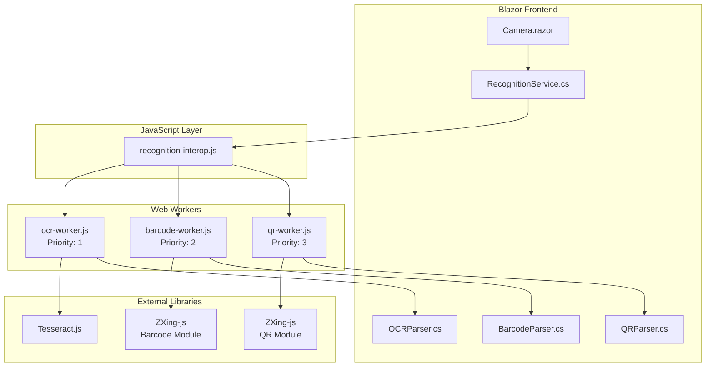
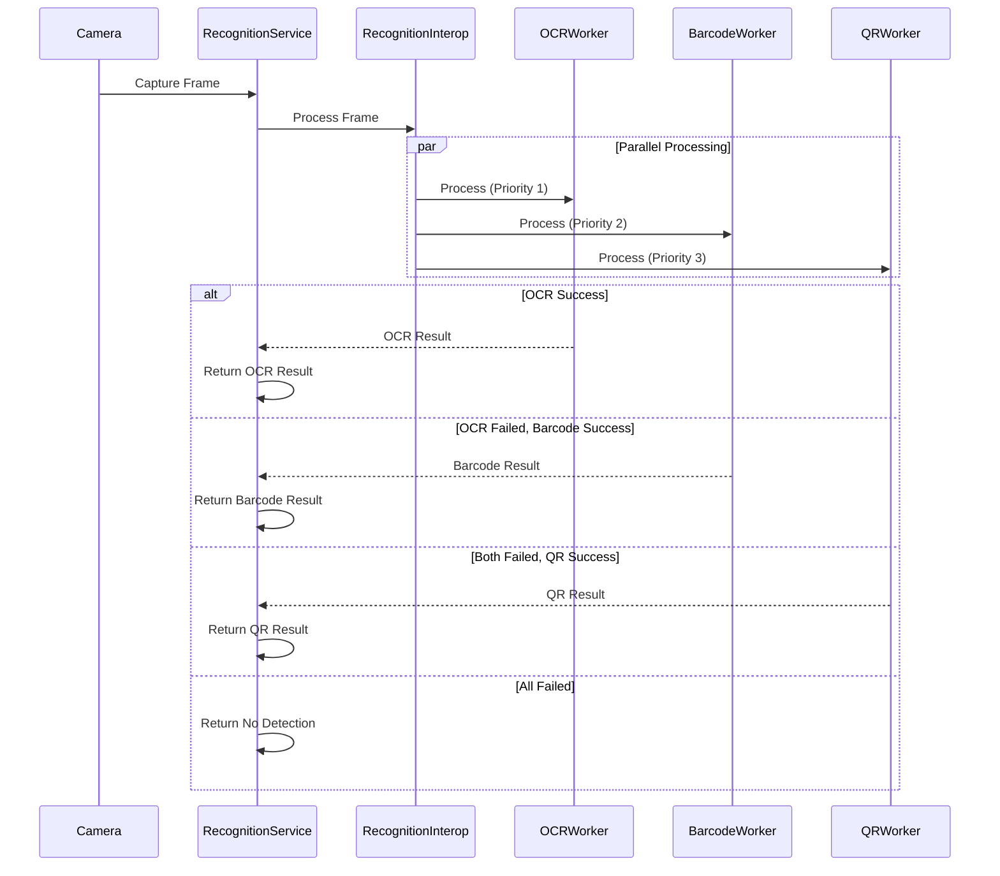
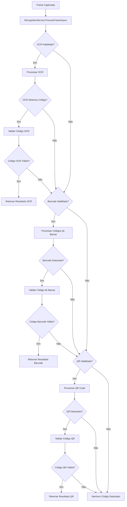
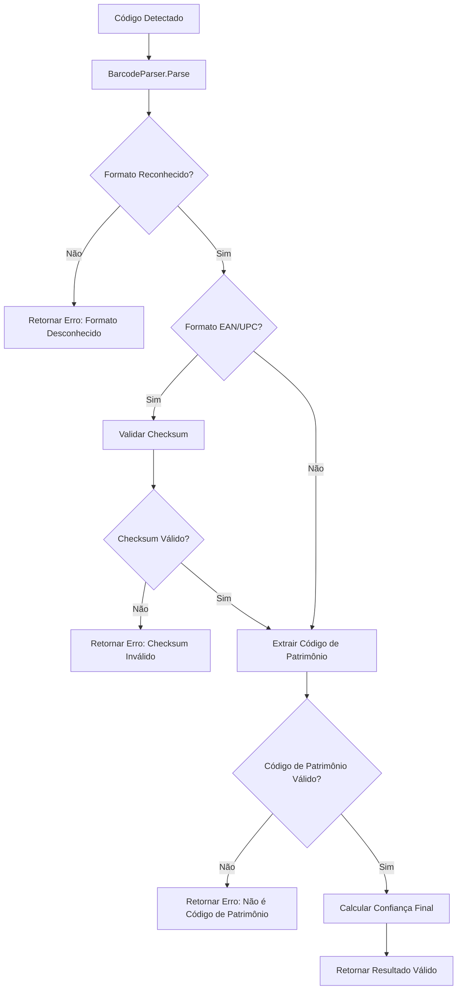
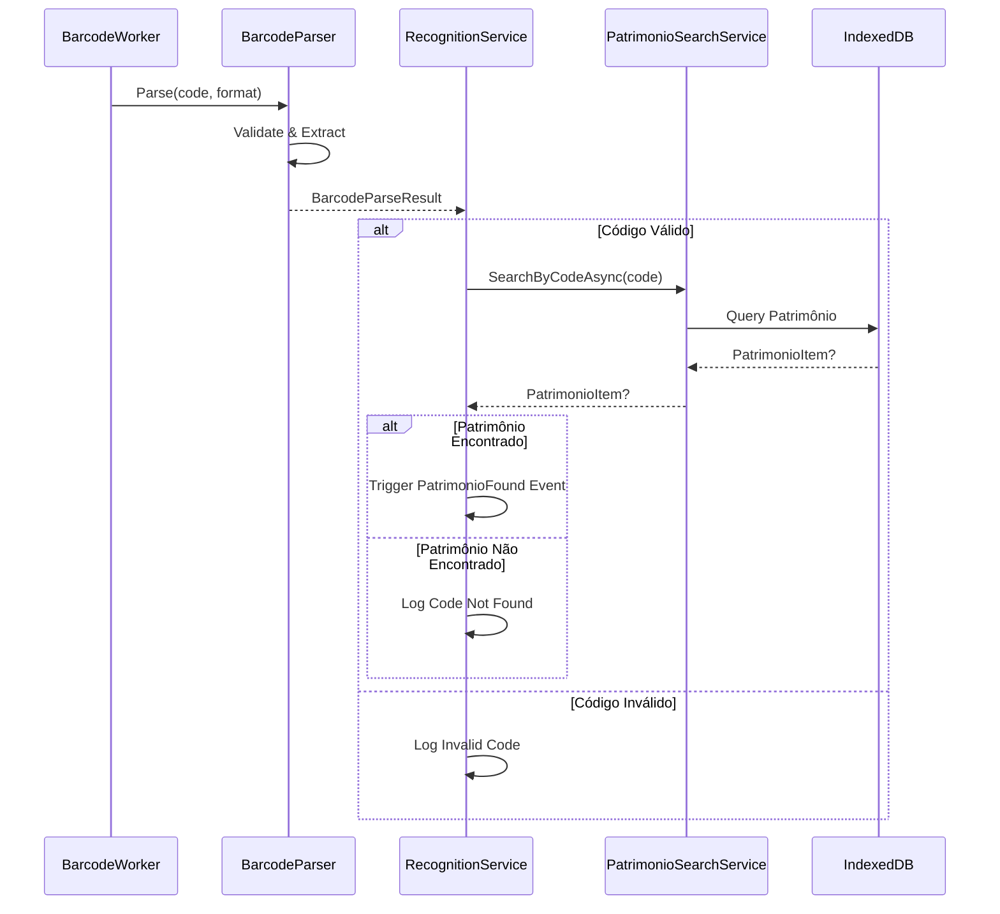

# Documento de Design Técnico - Suporte a Códigos de Barras

## Visão Geral

Este documento define a arquitetura técnica para implementar suporte a códigos de barras lineares (1D) no sistema de reconhecimento automático do PWA Blazor Aspec Captura. A implementação manterá total compatibilidade com o sistema existente (QR Code e OCR) enquanto adiciona capacidades de detecção para formatos CODE 128, CODE 39, EAN-13, EAN-8, UPC-A e UPC-E.

### Objetivos Técnicos

- Integrar detecção de códigos de barras 1D usando ZXing-js expandido
- Implementar nova priorização: OCR > Códigos de Barras > QR Code  
- Manter arquitetura de Web Workers para performance
- Preservar compatibilidade total com funcionalidades existentes
- Garantir performance adequada em dispositivos móveis

### Contexto Arquitetural

O sistema atual utiliza uma arquitetura baseada em Web Workers com dois componentes principais:
- **QR Worker**: Processamento de QR codes usando ZXing-js
- **OCR Worker**: Extração de texto usando Tesseract.js

A nova implementação adicionará um terceiro worker dedicado aos códigos de barras, seguindo os mesmos padrões arquiteturais.

## Arquitetura

### Diagrama de Componentes



### Fluxo de Processamento com Nova Priorização


## Componentes e Interfaces

### 1. BarcodeWorker (Novo Componente)

**Localização**: `wwwroot/js/workers/barcode-worker.js`

**Responsabilidades**:
- Inicializar biblioteca ZXing-js com módulos de códigos de barras 1D
- Processar frames de ImageData para detecção de códigos de barras
- Retornar resultados com código, confiança, formato e posição
- Implementar tratamento de erros e timeouts

**Interface de Mensagens**:
```javascript
// Entrada
{
  type: 'initialize' | 'process-frame' | 'terminate',
  data?: {
    imageData: ImageData,
    options?: BarcodeDetectionOptions
  }
}

// Saída
{
  type: 'initialized' | 'barcode-result' | 'error',
  success: boolean,
  result?: {
    code: string,
    confidence: number,
    format: string, // 'CODE_128', 'CODE_39', 'EAN_13', etc.
    boundingBox: Rectangle,
    timestamp: number
  },
  error?: string
}
```

**Configurações de Detecção**:
```javascript
const BarcodeDetectionOptions = {
  formats: ['CODE_128', 'CODE_39', 'EAN_13', 'EAN_8', 'UPC_A', 'UPC_E'],
  tryHarder: true,
  maxRetries: 3,
  timeout: 2000
}
```

### 2. BarcodeParser (Novo Componente)

**Localização**: `Services/Recognition/Parsers/BarcodeParser.cs`

**Responsabilidades**:
- Validar códigos de barras detectados
- Extrair códigos de patrimônio de diferentes formatos
- Implementar validação de checksum para EAN/UPC
- Sanitizar e normalizar códigos detectados

**Interface Principal**:
```csharp
public static class BarcodeParser
{
    public static BarcodeParseResult Parse(string barcodeData, string format);
    private static bool ValidateChecksum(string code, BarcodeFormat format);
    private static string ExtractPatrimonioCode(string rawCode, BarcodeFormat format);
    private static float CalculateConfidence(string code, BarcodeFormat format);
}

public class BarcodeParseResult
{
    public bool Success { get; set; }
    public string? ErrorMessage { get; set; }
    public string? PatrimonioCode { get; set; }
    public BarcodeFormat Format { get; set; }
    public float Confidence { get; set; }
    public bool ChecksumValid { get; set; }
    public string? RawData { get; set; }
}

public enum BarcodeFormat
{
    CODE_128,
    CODE_39,
    EAN_13,
    EAN_8,
    UPC_A,
    UPC_E,
    Unknown
}
```

### 3. RecognitionService (Modificações)

**Alterações Necessárias**:

1. **Adição de Propriedades**:
```csharp
public class RecognitionSettings
{
    // Existentes
    public bool QREnabled { get; set; } = true;
    public bool OCREnabled { get; set; } = true;
    
    // Novos
    public bool BarcodeEnabled { get; set; } = true;
    public BarcodeFormat[] EnabledBarcodeFormats { get; set; } = 
    {
        BarcodeFormat.CODE_128,
        BarcodeFormat.CODE_39,
        BarcodeFormat.EAN_13,
        BarcodeFormat.EAN_8,
        BarcodeFormat.UPC_A,
        BarcodeFormat.UPC_E
    };
    public float MinBarcodeConfidence { get; set; } = 0.7f;
}
```

2. **Novo Método de Callback**:
```csharp
[JSInvokable]
public async Task OnBarcodeDetectedAsync(string barcodeDataJson)
{
    try
    {
        if (string.IsNullOrEmpty(barcodeDataJson)) return;
        
        var barcodeData = JsonSerializer.Deserialize<BarcodeDetectionResult>(barcodeDataJson);
        if (barcodeData?.Code != null)
        {
            var result = await ProcessDetectedCode(barcodeData.Code, RecognitionSource.Barcode, barcodeData.Confidence);
            if (result.Success)
            {
                CodeDetected?.Invoke(this, new RecognitionEventArgs(result));
            }
        }
    }
    catch (Exception ex)
    {
        RecognitionError?.Invoke(this, new RecognitionErrorEventArgs(
            $"Erro ao processar código de barras detectado: {ex.Message}", 
            RecognitionSource.Barcode, ex));
    }
}
```

3. **Atualização do Processamento com Priorização**:
```csharp
public async Task<RecognitionResult> ProcessFrameAsync(byte[] imageData)
{
    if (!await _processingSemaphore.WaitAsync(10))
    {
        return new RecognitionResult { Success = false, ErrorMessage = "Processamento em andamento" };
    }

    try
    {
        var result = new RecognitionResult();

        // Priority 1: OCR
        if (Settings.OCREnabled)
        {
            var ocrResult = await _ocrService.ExtractTextAsync(imageData, new OCROptions
            {
                Language = Settings.Language,
                CharWhitelist = "0123456789ABCDEFGHIJKLMNOPQRSTUVWXYZ-"
            });

            if (ocrResult.ExtractedCodes.Length > 0)
            {
                var bestCode = ocrResult.ExtractedCodes.First();
                result = await ProcessDetectedCode(bestCode, RecognitionSource.OCR, ocrResult.Confidence);
                if (result.Success) return result;
            }
        }

        // Priority 2: Barcode (NOVO)
        if (Settings.BarcodeEnabled)
        {
            var barcodeResults = await _barcodeService.DetectBarcodesAsync(imageData);
            if (barcodeResults.Length > 0)
            {
                var bestBarcode = barcodeResults.OrderByDescending(r => r.Confidence).First();
                result = await ProcessDetectedCode(bestBarcode.Code, RecognitionSource.Barcode, bestBarcode.Confidence);
                if (result.Success) return result;
            }
        }

        // Priority 3: QR Code
        if (Settings.QREnabled)
        {
            var qrResults = await _qrService.DetectQRCodesAsync(imageData);
            if (qrResults.Length > 0)
            {
                var bestQR = qrResults.OrderByDescending(r => r.Confidence).First();
                result = await ProcessDetectedCode(bestQR.Code, RecognitionSource.QR, bestQR.Confidence);
                if (result.Success) return result;
            }
        }

        return new RecognitionResult { Success = false, ErrorMessage = "Nenhum código detectado" };
    }
    finally
    {
        _processingSemaphore.Release();
    }
}
```

### 4. RecognitionInterop (Modificações)

**Alterações em `recognition-interop.js`**:

1. **Adição do Barcode Worker**:
```javascript
window.recognitionInterop = {
    qrWorker: null,
    ocrWorker: null,
    barcodeWorker: null, // NOVO
    // ... resto das propriedades
    
    async initialize() {
        try {
            // Criar workers existentes
            this.qrWorker = new Worker('/js/workers/qr-worker.js');
            this.ocrWorker = new Worker('/js/workers/ocr-worker.js');
            this.barcodeWorker = new Worker('/js/workers/barcode-worker.js'); // NOVO
            
            // Setup message handlers
            this.setupQRWorkerHandlers();
            this.setupOCRWorkerHandlers();
            this.setupBarcodeWorkerHandlers(); // NOVO
            
            // Initialize all workers
            const initPromises = [
                this.initializeWorkerWithTimeout(this.qrWorker, 'QR'),
                this.initializeWorkerWithTimeout(this.ocrWorker, 'OCR'),
                this.initializeWorkerWithTimeout(this.barcodeWorker, 'Barcode') // NOVO
            ];
            
            const results = await Promise.allSettled(initPromises);
            return results.every(r => r.status === 'fulfilled' && r.value);
        } catch (error) {
            console.error('Error initializing recognition workers:', error);
            return false;
        }
    }
}
```

2. **Handler para Barcode Worker**:
```javascript
setupBarcodeWorkerHandlers() {
    this.barcodeWorker.onmessage = (e) => {
        const { type, success, result, error } = e.data;
        
        if (type === 'barcode-result' && success && result && this.recognitionServiceRef) {
            this.recognitionServiceRef.invokeMethodAsync('OnBarcodeDetectedAsync', JSON.stringify(result))
                .catch(err => console.error('Error calling OnBarcodeDetectedAsync:', err));
        } else if (type === 'initialized') {
            console.log('Barcode Worker initialized:', success);
        } else if (error) {
            console.error('Barcode Worker error:', error);
        }
    };
    
    this.barcodeWorker.onerror = (error) => {
        console.error('Barcode Worker runtime error:', error);
    };
}
```

3. **Processamento de Frame com Priorização**:
```javascript
processCurrentFrame(videoElementId) {
    if (!this.isProcessing || !this.isInitialized) return;
    
    try {
        const video = document.getElementById(videoElementId);
        if (!video || video.readyState !== video.HAVE_ENOUGH_DATA) return;
        
        // Capture frame
        const canvas = document.createElement('canvas');
        canvas.width = video.videoWidth;
        canvas.height = video.videoHeight;
        
        const ctx = canvas.getContext('2d');
        ctx.drawImage(video, 0, 0);
        
        const imageData = ctx.getImageData(0, 0, canvas.width, canvas.height);
        
        // Send to all workers (priorização será tratada no C#)
        if (this.ocrWorker?.readyState !== Worker.TERMINATED) {
            this.ocrWorker.postMessage({
                type: 'process-frame',
                data: { imageData: imageData }
            });
        }
        
        if (this.barcodeWorker?.readyState !== Worker.TERMINATED) { // NOVO
            this.barcodeWorker.postMessage({
                type: 'process-frame',
                data: { imageData: imageData }
            });
        }
        
        if (this.qrWorker?.readyState !== Worker.TERMINATED) {
            this.qrWorker.postMessage({
                type: 'process-frame',
                data: { imageData: imageData }
            });
        }
    } catch (error) {
        console.error('Error processing frame:', error);
    }
}
```
## Modelos de Dados

### 1. Extensões aos Modelos Existentes

**Atualização de `RecognitionModels.cs`**:

```csharp
// Adição ao enum RecognitionSource
public enum RecognitionSource
{
    Manual,
    QR,
    OCR,
    Barcode // NOVO
}

// Nova classe para resultados de códigos de barras
public class BarcodeResult
{
    public string Code { get; set; } = string.Empty;
    public float Confidence { get; set; }
    public Rectangle BoundingBox { get; set; }
    public BarcodeFormat Format { get; set; }
    public bool ChecksumValid { get; set; }
    public DateTime Timestamp { get; set; } = DateTime.Now;
}

// Extensão das configurações de reconhecimento
public class RecognitionSettings
{
    // Propriedades existentes...
    public bool QREnabled { get; set; } = true;
    public bool OCREnabled { get; set; } = true;
    
    // Novas propriedades para códigos de barras
    public bool BarcodeEnabled { get; set; } = true;
    public BarcodeFormat[] EnabledBarcodeFormats { get; set; } = 
    {
        BarcodeFormat.CODE_128,
        BarcodeFormat.CODE_39,
        BarcodeFormat.EAN_13,
        BarcodeFormat.EAN_8,
        BarcodeFormat.UPC_A,
        BarcodeFormat.UPC_E
    };
    public float MinBarcodeConfidence { get; set; } = 0.7f;
    public int BarcodeTimeoutMs { get; set; } = 2000;
    public bool BarcodeChecksumValidation { get; set; } = true;
}

// Enum para formatos de códigos de barras
public enum BarcodeFormat
{
    Unknown = 0,
    CODE_128 = 1,
    CODE_39 = 2,
    EAN_13 = 3,
    EAN_8 = 4,
    UPC_A = 5,
    UPC_E = 6,
    ITF = 7,
    CODABAR = 8
}

// Classe para opções de detecção de códigos de barras
public class BarcodeDetectionOptions
{
    public BarcodeFormat[] EnabledFormats { get; set; } = 
    {
        BarcodeFormat.CODE_128,
        BarcodeFormat.CODE_39,
        BarcodeFormat.EAN_13,
        BarcodeFormat.EAN_8,
        BarcodeFormat.UPC_A,
        BarcodeFormat.UPC_E
    };
    public bool TryHarder { get; set; } = true;
    public int MaxRetries { get; set; } = 3;
    public int TimeoutMs { get; set; } = 2000;
    public bool ValidateChecksum { get; set; } = true;
}
```

### 2. Interface de Serviço de Códigos de Barras

**Nova Interface `IBarcodeService`**:

```csharp
public interface IBarcodeService
{
    Task InitializeAsync();
    Task<BarcodeResult[]> DetectBarcodesAsync(byte[] imageData);
    Task<BarcodeResult[]> DetectBarcodesAsync(byte[] imageData, BarcodeDetectionOptions options);
    bool IsInitialized { get; }
    BarcodeDetectionOptions DefaultOptions { get; set; }
}
```

### 3. Estruturas de Dados JavaScript

**Definições para Workers**:

```javascript
// Estrutura de resultado do Barcode Worker
const BarcodeDetectionResult = {
    code: string,           // Código detectado
    confidence: number,     // Confiança (0.0 - 1.0)
    format: string,         // Formato do código (CODE_128, EAN_13, etc.)
    boundingBox: {          // Posição no frame
        x: number,
        y: number,
        width: number,
        height: number
    },
    checksumValid: boolean, // Validação de checksum
    timestamp: number       // Timestamp da detecção
};

// Opções de configuração do worker
const BarcodeWorkerOptions = {
    formats: string[],      // Formatos habilitados
    tryHarder: boolean,     // Processamento mais intensivo
    maxRetries: number,     // Máximo de tentativas
    timeout: number,        // Timeout em ms
    validateChecksum: boolean // Validar checksums
};
```

### 4. Mapeamento de Formatos

**Conversão entre JavaScript e C#**:

```csharp
public static class BarcodeFormatMapper
{
    private static readonly Dictionary<string, BarcodeFormat> JsToCs = new()
    {
        { "CODE_128", BarcodeFormat.CODE_128 },
        { "CODE_39", BarcodeFormat.CODE_39 },
        { "EAN_13", BarcodeFormat.EAN_13 },
        { "EAN_8", BarcodeFormat.EAN_8 },
        { "UPC_A", BarcodeFormat.UPC_A },
        { "UPC_E", BarcodeFormat.UPC_E },
        { "ITF", BarcodeFormat.ITF },
        { "CODABAR", BarcodeFormat.CODABAR }
    };
    
    private static readonly Dictionary<BarcodeFormat, string> CsToJs = 
        JsToCs.ToDictionary(kvp => kvp.Value, kvp => kvp.Key);
    
    public static BarcodeFormat FromJavaScript(string jsFormat) =>
        JsToCs.TryGetValue(jsFormat, out var format) ? format : BarcodeFormat.Unknown;
    
    public static string ToJavaScript(BarcodeFormat format) =>
        CsToJs.TryGetValue(format, out var jsFormat) ? jsFormat : "UNKNOWN";
}
```

## Fluxo de Dados com Nova Priorização

### 1. Sequência de Processamento



### 2. Fluxo de Validação de Códigos de Barras



### 3. Integração com Sistema de Busca


## Propriedades de Correção

*Uma propriedade é uma característica ou comportamento que deve ser verdadeiro em todas as execuções válidas de um sistema - essencialmente, uma declaração formal sobre o que o sistema deve fazer. As propriedades servem como ponte entre especificações legíveis por humanos e garantias de correção verificáveis por máquina.*

### Propriedade 1: Detecção Universal de Códigos de Barras

*Para qualquer* código de barras válido nos formatos suportados (CODE 128, CODE 39, EAN-13, EAN-8, UPC-A, UPC-E), quando processado pelo sistema, deve ser detectado com confiança igual ou superior ao limite mínimo definido para seu formato (0.7 para CODE 128/39, 0.8 para EAN/UPC).

**Valida: Requisitos 1.1, 1.2, 1.3, 1.4, 1.5, 1.6**

### Propriedade 2: Completude de Resultado de Detecção

*Para qualquer* código de barras válido detectado com sucesso, o resultado deve conter o código extraído, sua posição no frame (bounding box), formato detectado e timestamp.

**Valida: Requisitos 1.7**

### Propriedade 3: Comunicação Worker-Main Thread

*Para qualquer* frame de ImageData válido enviado ao Worker_Barcode, deve haver uma resposta via postMessage, seja com resultado de detecção ou confirmação de processamento sem detecção.

**Valida: Requisitos 2.4, 2.5**

### Propriedade 4: Robustez do Worker

*Para qualquer* erro de processamento no Worker_Barcode, o worker deve continuar operacional e capaz de processar frames subsequentes.

**Valida: Requisitos 2.6**

### Propriedade 5: Validação de Códigos de Patrimônio

*Para qualquer* código detectado pelo sistema, o Parser_Barcode deve determinar corretamente se é um código de patrimônio válido baseado nos padrões definidos (numéricos 6-12 dígitos ou alfanuméricos [A-Z]{2,4}[0-9]{4,8}).

**Valida: Requisitos 3.1, 3.2, 3.3**

### Propriedade 6: Completude de Resultado do Parser

*Para qualquer* código de barras processado pelo Parser_Barcode, o resultado deve incluir confiança calculada, formato detectado e código sanitizado.

**Valida: Requisitos 3.4**

### Propriedade 7: Validação de Checksum

*Para qualquer* código EAN-13, EAN-8, UPC-A ou UPC-E, o Parser_Barcode deve validar corretamente o checksum e reportar o resultado da validação.

**Valida: Requisitos 3.5**

### Propriedade 8: Round-trip de Processamento

*Para qualquer* código válido, processar e depois formatar e depois processar novamente deve produzir um resultado equivalente.

**Valida: Requisitos 3.6**

### Propriedade 9: Priorização de Reconhecimento

*Para qualquer* frame processado com múltiplos tipos de código detectados simultaneamente, o sistema deve retornar apenas o resultado do tipo com maior prioridade (OCR > Códigos de Barras > QR Code).

**Valida: Requisitos 4.1, 4.2, 4.3, 4.4**

### Propriedade 10: Cadeia de Fallback

*Para qualquer* frame processado, se um método de reconhecimento de maior prioridade falhar em detectar código válido, o sistema deve processar com o próximo método na cadeia de prioridade.

**Valida: Requisitos 4.5, 4.6**

### Propriedade 11: Exibição de Tipo de Código

*Para qualquer* código de barras detectado com sucesso, a interface deve exibir o tipo/formato do código detectado (CODE 128, EAN-13, etc.).

**Valida: Requisitos 5.3**

### Propriedade 12: Não-regressão de Funcionalidades Existentes

*Para qualquer* funcionalidade de QR Code ou OCR que funcionava antes da implementação de códigos de barras, deve continuar funcionando com o mesmo comportamento após a implementação.

**Valida: Requisitos 6.1, 6.2, 6.3, 6.4, 6.6**

### Propriedade 13: Comportamento com Códigos de Barras Desabilitados

*Para qualquer* configuração onde códigos de barras estão desabilitados, o sistema deve funcionar exatamente como funcionava antes da implementação de códigos de barras.

**Valida: Requisitos 6.5**

### Propriedade 14: Seleção por Maior Confiança

*Para qualquer* frame com múltiplos códigos de barras detectados, o sistema deve retornar o código com maior confiança.

**Valida: Requisitos 7.4**

### Propriedade 15: Debounce de Detecções

*Para qualquer* código detectado, detecções subsequentes do mesmo código dentro de 2 segundos devem ser ignoradas.

**Valida: Requisitos 7.5**

### Propriedade 16: Configuração Dinâmica de Habilitação

*Para qualquer* mudança na configuração de habilitação de códigos de barras, o sistema deve aplicar a mudança imediatamente sem necessidade de reinicialização.

**Valida: Requisitos 8.1, 8.6**

### Propriedade 17: Configuração de Formatos

*Para qualquer* conjunto de formatos configurados como habilitados, o sistema deve processar apenas códigos desses formatos e ignorar outros formatos.

**Valida: Requisitos 8.2**

### Propriedade 18: Configuração de Limites de Confiança

*Para qualquer* limite de confiança configurado por formato, códigos detectados com confiança abaixo do limite devem ser rejeitados.

**Valida: Requisitos 8.3**

### Propriedade 19: Comportamento com Configuração Desabilitada

*Para qualquer* frame processado quando códigos de barras estão desabilitados na configuração, o processamento de códigos de barras deve ser pulado completamente.

**Valida: Requisitos 8.4**

### Propriedade 20: Persistência de Configuração

*Para qualquer* configuração de códigos de barras alterada, a configuração deve ser persistida no localStorage e restaurada em sessões subsequentes.

**Valida: Requisitos 8.5**

### Propriedade 21: Logging de Tentativas

*Para qualquer* tentativa de detecção no Worker_Barcode, deve ser registrado um log com timestamp e resultado da tentativa.

**Valida: Requisitos 9.1**

### Propriedade 22: Logging de Erros sem Interrupção

*Para qualquer* erro de processamento no Worker_Barcode, o erro deve ser registrado em log e o processamento deve continuar para frames subsequentes.

**Valida: Requisitos 9.2**

### Propriedade 23: Fallback Gracioso para Falha de Biblioteca

*Para qualquer* falha na inicialização da biblioteca ZXing, o sistema deve continuar funcionando com QR Code e OCR, sem códigos de barras.

**Valida: Requisitos 9.3**

### Propriedade 24: Notificação de Falhas de Inicialização

*Para qualquer* falha na inicialização do Worker_Barcode, deve ser emitido um evento de erro notificando a falha.

**Valida: Requisitos 9.4**

### Propriedade 25: Logging de Códigos Rejeitados

*Para qualquer* código rejeitado pelo Parser_Barcode, deve ser registrado um log com o código e o motivo da rejeição.

**Valida: Requisitos 9.5**

### Propriedade 26: Fallback para Worker Indisponível

*Para qualquer* situação onde o Worker_Barcode não está disponível, o sistema deve continuar funcionando com QR Code e OCR apenas.

**Valida: Requisitos 9.6**
## Tratamento de Erros

### 1. Estratégia de Tratamento de Erros

**Princípios Fundamentais**:
- **Graceful Degradation**: Falhas em códigos de barras não devem afetar QR Code e OCR
- **Isolamento de Erros**: Erros em um worker não devem afetar outros workers
- **Recuperação Automática**: Sistema deve tentar se recuperar automaticamente de falhas temporárias
- **Logging Abrangente**: Todos os erros devem ser registrados para diagnóstico

### 2. Categorias de Erros

#### 2.1 Erros de Inicialização

**Falha de Carregamento da Biblioteca ZXing**:
```javascript
// barcode-worker.js
async function initialize() {
    try {
        importScripts('https://unpkg.com/@zxing/library@latest/umd/index.min.js');
        // ... inicialização
    } catch (error) {
        self.postMessage({
            type: 'initialization-failed',
            error: 'ZXing library failed to load',
            fallback: 'barcode-disabled'
        });
        return false;
    }
}
```

**Tratamento no RecognitionService**:
```csharp
[JSInvokable]
public async Task OnBarcodeInitializationFailedAsync(string errorJson)
{
    var error = JsonSerializer.Deserialize<InitializationError>(errorJson);
    
    // Desabilitar códigos de barras automaticamente
    Settings.BarcodeEnabled = false;
    
    // Notificar erro mas continuar com QR e OCR
    RecognitionError?.Invoke(this, new RecognitionErrorEventArgs(
        $"Códigos de barras desabilitados: {error.Error}", 
        RecognitionSource.Barcode));
    
    // Log para diagnóstico
    _logger.LogWarning("Barcode recognition disabled due to initialization failure: {Error}", error.Error);
}
```

#### 2.2 Erros de Processamento

**Timeout de Detecção**:
```javascript
// barcode-worker.js
async function processFrame(imageData) {
    try {
        const detectionPromise = codeReader.decodeFromCanvas(canvas);
        const timeoutPromise = new Promise((_, reject) => 
            setTimeout(() => reject(new Error('Detection timeout')), 2000)
        );
        
        const result = await Promise.race([detectionPromise, timeoutPromise]);
        // ... processar resultado
    } catch (error) {
        if (error.message === 'Detection timeout') {
            // Timeout é normal, não é erro crítico
            return;
        }
        
        // Log outros erros mas continue processando
        console.error('Barcode detection error:', error);
        self.postMessage({
            type: 'processing-error',
            error: error.message,
            recoverable: true
        });
    }
}
```

#### 2.3 Erros de Validação

**Código Inválido Detectado**:
```csharp
public static BarcodeParseResult Parse(string barcodeData, string format)
{
    try
    {
        // Validar formato
        if (!IsValidFormat(format))
        {
            return new BarcodeParseResult
            {
                Success = false,
                ErrorMessage = $"Formato não suportado: {format}",
                ErrorCode = "UNSUPPORTED_FORMAT"
            };
        }
        
        // Validar checksum para EAN/UPC
        if (RequiresChecksum(format) && !ValidateChecksum(barcodeData, format))
        {
            return new BarcodeParseResult
            {
                Success = false,
                ErrorMessage = "Checksum inválido",
                ErrorCode = "INVALID_CHECKSUM",
                RawData = barcodeData
            };
        }
        
        // ... resto da validação
    }
    catch (Exception ex)
    {
        return new BarcodeParseResult
        {
            Success = false,
            ErrorMessage = $"Erro na validação: {ex.Message}",
            ErrorCode = "VALIDATION_ERROR",
            RawData = barcodeData
        };
    }
}
```

### 3. Recuperação de Erros

#### 3.1 Reinicialização Automática

```javascript
// recognition-interop.js
class BarcodeWorkerManager {
    constructor() {
        this.worker = null;
        this.failureCount = 0;
        this.maxFailures = 3;
        this.reinitializeDelay = 5000;
    }
    
    async handleWorkerError(error) {
        this.failureCount++;
        
        if (this.failureCount <= this.maxFailures) {
            console.log(`Barcode worker error, attempting recovery (${this.failureCount}/${this.maxFailures})`);
            
            // Aguardar antes de tentar novamente
            await new Promise(resolve => setTimeout(resolve, this.reinitializeDelay));
            
            // Tentar reinicializar
            return await this.reinitialize();
        } else {
            console.error('Barcode worker failed permanently, disabling barcode recognition');
            this.disable();
            return false;
        }
    }
    
    async reinitialize() {
        try {
            if (this.worker) {
                this.worker.terminate();
            }
            
            this.worker = new Worker('/js/workers/barcode-worker.js');
            this.setupEventHandlers();
            
            const initialized = await this.initializeWithTimeout();
            if (initialized) {
                this.failureCount = 0; // Reset counter on success
            }
            
            return initialized;
        } catch (error) {
            return false;
        }
    }
}
```

#### 3.2 Circuit Breaker Pattern

```csharp
public class BarcodeCircuitBreaker
{
    private int _failureCount = 0;
    private DateTime _lastFailureTime = DateTime.MinValue;
    private readonly int _failureThreshold = 5;
    private readonly TimeSpan _recoveryTimeout = TimeSpan.FromMinutes(2);
    
    public bool IsOpen => _failureCount >= _failureThreshold && 
                         DateTime.Now - _lastFailureTime < _recoveryTimeout;
    
    public async Task<BarcodeResult[]> ExecuteAsync(Func<Task<BarcodeResult[]>> operation)
    {
        if (IsOpen)
        {
            throw new CircuitBreakerOpenException("Barcode detection circuit breaker is open");
        }
        
        try
        {
            var result = await operation();
            _failureCount = 0; // Reset on success
            return result;
        }
        catch (Exception)
        {
            _failureCount++;
            _lastFailureTime = DateTime.Now;
            throw;
        }
    }
}
```

### 4. Monitoramento e Alertas

#### 4.1 Métricas de Saúde

```csharp
public class BarcodeHealthMetrics
{
    public int TotalDetectionAttempts { get; set; }
    public int SuccessfulDetections { get; set; }
    public int FailedDetections { get; set; }
    public int TimeoutErrors { get; set; }
    public int ValidationErrors { get; set; }
    public TimeSpan AverageProcessingTime { get; set; }
    public DateTime LastSuccessfulDetection { get; set; }
    
    public double SuccessRate => TotalDetectionAttempts > 0 
        ? (double)SuccessfulDetections / TotalDetectionAttempts 
        : 0;
    
    public bool IsHealthy => SuccessRate > 0.1 && // Pelo menos 10% de sucesso
                            DateTime.Now - LastSuccessfulDetection < TimeSpan.FromMinutes(10);
}
```

#### 4.2 Sistema de Alertas

```csharp
public class BarcodeHealthMonitor
{
    private readonly BarcodeHealthMetrics _metrics;
    private readonly ILogger _logger;
    
    public async Task CheckHealthAsync()
    {
        if (!_metrics.IsHealthy)
        {
            var alert = new HealthAlert
            {
                Component = "BarcodeRecognition",
                Severity = AlertSeverity.Warning,
                Message = $"Barcode recognition health degraded. Success rate: {_metrics.SuccessRate:P2}",
                Metrics = _metrics,
                Timestamp = DateTime.Now
            };
            
            await SendAlertAsync(alert);
        }
    }
}
```

## Estratégia de Testes

### 1. Abordagem Dual de Testes

O sistema utilizará uma estratégia dual combinando testes unitários e testes baseados em propriedades:

- **Testes Unitários**: Verificam exemplos específicos, casos extremos e condições de erro
- **Testes de Propriedades**: Verificam propriedades universais através de todas as entradas
- **Ambos são complementares**: Testes unitários capturam bugs concretos, testes de propriedades verificam correção geral

### 2. Configuração de Testes Baseados em Propriedades

**Biblioteca Escolhida**: FsCheck para C# (integração com xUnit)

**Configuração Mínima**: 100 iterações por teste de propriedade (devido à randomização)

**Formato de Tags**: Cada teste de propriedade deve referenciar sua propriedade do documento de design
- Formato: `**Feature: barcode-recognition-support, Property {número}: {texto da propriedade}**`

### 3. Estrutura de Testes

#### 3.1 Testes de Propriedades

```csharp
[Property]
[Trait("Feature", "barcode-recognition-support")]
[Trait("Property", "1: Detecção Universal de Códigos de Barras")]
public Property BarcodeDetection_ShouldDetectValidCodesWithMinimumConfidence()
{
    return Prop.ForAll(
        GenerateValidBarcode(),
        barcode =>
        {
            var result = _barcodeService.DetectBarcodesAsync(barcode.ImageData).Result;
            var detected = result.FirstOrDefault(r => r.Code == barcode.ExpectedCode);
            
            return detected != null && 
                   detected.Confidence >= GetMinimumConfidenceForFormat(barcode.Format);
        });
}

[Property]
[Trait("Feature", "barcode-recognition-support")]
[Trait("Property", "8: Round-trip de Processamento")]
public Property BarcodeParser_RoundTripProperty()
{
    return Prop.ForAll(
        GenerateValidPatrimonioCode(),
        code =>
        {
            var parseResult1 = BarcodeParser.Parse(code, BarcodeFormat.CODE_128);
            if (!parseResult1.Success) return true; // Skip invalid codes
            
            var formatted = FormatCode(parseResult1.PatrimonioCode);
            var parseResult2 = BarcodeParser.Parse(formatted, BarcodeFormat.CODE_128);
            
            return parseResult2.Success && 
                   parseResult1.PatrimonioCode == parseResult2.PatrimonioCode;
        });
}
```

#### 3.2 Testes Unitários Focados

```csharp
[Fact]
public async Task BarcodeWorker_InitializationTimeout_ShouldFailGracefully()
{
    // Arrange
    var worker = new BarcodeWorkerMock();
    worker.SimulateInitializationDelay(TimeSpan.FromSeconds(15));
    
    // Act
    var result = await worker.InitializeAsync(timeout: TimeSpan.FromSeconds(10));
    
    // Assert
    Assert.False(result.Success);
    Assert.Equal("Initialization timeout", result.ErrorMessage);
}

[Theory]
[InlineData("123456789012", BarcodeFormat.EAN_13, true)]  // Valid EAN-13
[InlineData("123456789013", BarcodeFormat.EAN_13, false)] // Invalid checksum
[InlineData("12345678", BarcodeFormat.EAN_8, true)]       // Valid EAN-8
public void BarcodeParser_ChecksumValidation_ShouldValidateCorrectly(
    string code, BarcodeFormat format, bool expectedValid)
{
    // Act
    var result = BarcodeParser.Parse(code, format.ToString());
    
    // Assert
    Assert.Equal(expectedValid, result.ChecksumValid);
}
```

#### 3.3 Testes de Integração

```csharp
[Fact]
public async Task RecognitionService_PriorityOrder_ShouldProcessOCRFirst()
{
    // Arrange
    var mockFrame = CreateFrameWithMultipleCodes(
        ocrCode: "OCR123456",
        barcodeCode: "BAR789012", 
        qrCode: "QR345678"
    );
    
    // Act
    var result = await _recognitionService.ProcessFrameAsync(mockFrame);
    
    // Assert
    Assert.True(result.Success);
    Assert.Equal(RecognitionSource.OCR, result.Source);
    Assert.Equal("OCR123456", result.DetectedCode);
}
```

### 4. Testes de Regressão

**Objetivo**: Garantir que funcionalidades QR e OCR existentes continuem funcionando

```csharp
[Collection("RegressionTests")]
public class BarcodeIntegrationRegressionTests
{
    [Fact]
    public async Task ExistingQRFunctionality_ShouldRemainUnchanged()
    {
        // Usar testes existentes de QR como baseline
        var qrTestCases = LoadExistingQRTestCases();
        
        foreach (var testCase in qrTestCases)
        {
            var result = await _recognitionService.ProcessFrameAsync(testCase.Frame);
            
            Assert.Equal(testCase.ExpectedResult.Success, result.Success);
            Assert.Equal(testCase.ExpectedResult.DetectedCode, result.DetectedCode);
        }
    }
    
    [Fact]
    public async Task ExistingOCRFunctionality_ShouldRemainUnchanged()
    {
        // Similar para OCR
        var ocrTestCases = LoadExistingOCRTestCases();
        
        foreach (var testCase in ocrTestCases)
        {
            var result = await _recognitionService.ProcessFrameAsync(testCase.Frame);
            
            Assert.Equal(testCase.ExpectedResult.Success, result.Success);
            Assert.Equal(testCase.ExpectedResult.DetectedCode, result.DetectedCode);
        }
    }
}
```

### 5. Geradores de Dados para Testes

```csharp
public static class BarcodeGenerators
{
    public static Arbitrary<ValidBarcode> GenerateValidBarcode()
    {
        return Arb.From(
            from format in Gen.Elements(BarcodeFormat.CODE_128, BarcodeFormat.EAN_13, BarcodeFormat.UPC_A)
            from code in GenerateCodeForFormat(format)
            select new ValidBarcode 
            { 
                Format = format, 
                Code = code,
                ImageData = GenerateBarcodeImage(code, format),
                ExpectedCode = code
            });
    }
    
    public static Gen<string> GenerateValidPatrimonioCode()
    {
        return Gen.OneOf(
            GenerateNumericCode(6, 12),
            GenerateAlphanumericCode()
        );
    }
    
    private static Gen<string> GenerateNumericCode(int minLength, int maxLength)
    {
        return from length in Gen.Choose(minLength, maxLength)
               from digits in Gen.ArrayOf(length, Gen.Choose(0, 9))
               select string.Join("", digits);
    }
}
```