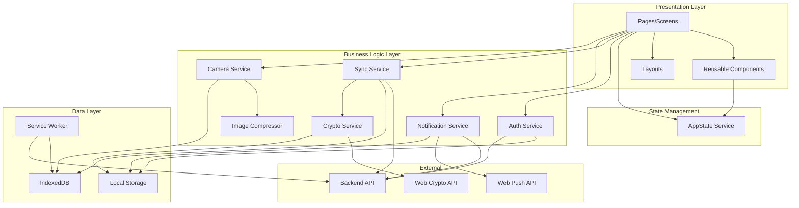
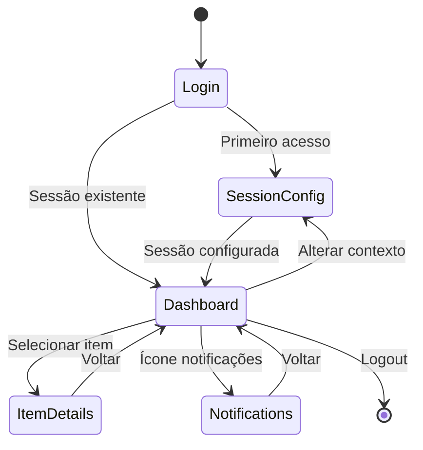
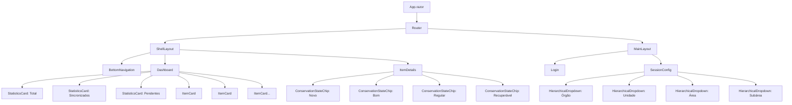

# Design Técnico - Refatoração Blazor PWA UI

## Overview

Este documento especifica o design técnico completo para a refatoração do front-end da aplicação "Aspec Captura - Inventário Patrimonial", um Progressive Web App (PWA) desenvolvido em Blazor WebAssembly.

### Objetivos da Refatoração

1. **Fidelidade ao Design**: Implementar fielmente os protótipos de UI fornecidos
2. **Arquitetura Modular**: Criar componentes Blazor reutilizáveis e testáveis
3. **Segurança**: Implementar criptografia local, proteção contra brute force e gestão segura de sessões
4. **Performance**: Otimizar para dispositivos móveis com lazy loading, batching e compressão inteligente
5. **Offline-First**: Garantir funcionalidade completa em modo offline com sincronização robusta
6. **Testabilidade**: Alcançar 80% de cobertura em componentes e 70% em páginas usando bUnit

### Escopo

A refatoração abrange:
- 4 telas principais (Login, Dashboard, Configuração de Sessão, Detalhes do Patrimônio)
- 5 componentes reutilizáveis (Statistics_Card, Item_Card, Hierarchical_Dropdown, Conservation_State_Chip, Bottom_Navigation)
- 2 layouts (ShellLayout com navegação inferior, MainLayout para páginas específicas)
- 7 serviços principais (Auth, Crypto, Sync, Storage, Notification, Camera, ImageCompressor)
- Sistema completo de notificações com persistência servidor e Web Push API
- Responsividade para 4 breakpoints (320px, 768px, 1024px, 1440px)

## Architecture

### High-Level Architecture



### Folder Structure

```
aspec-captura/
├── Pages/
│   ├── Login.razor                    # Tela de autenticação
│   ├── Dashboard.razor                # Tela principal com estatísticas
│   ├── SessionConfig.razor            # Configuração hierárquica de sessão
│   ├── ItemDetails.razor              # Detalhes e edição de patrimônio
│   └── Notifications.razor            # Lista de notificações
├── Components/
│   ├── Cards/
│   │   ├── StatisticsCard.razor       # Card de estatísticas
│   │   └── ItemCard.razor             # Card de item
│   ├── Forms/
│   │   ├── HierarchicalDropdown.razor # Dropdown em cascata
│   │   └── ConservationStateChip.razor # Chip selecionável
│   ├── Navigation/
│   │   └── BottomNavigation.razor     # Barra de navegação inferior
│   └── Shared/
│       ├── LoadingSpinner.razor       # Indicador de carregamento
│       ├── ErrorMessage.razor         # Mensagem de erro
│       └── Toast.razor                # Notificação toast
├── Layouts/
│   ├── ShellLayout.razor              # Layout com bottom navigation
│   └── MainLayout.razor               # Layout para páginas específicas
├── Services/
│   ├── Auth/
│   │   ├── IAuthService.cs
│   │   ├── AuthService.cs             # Autenticação e sessão
│   │   └── BruteForceProtection.cs    # Proteção contra brute force
│   ├── Crypto/
│   │   ├── ICryptoService.cs
│   │   └── CryptoService.cs           # Criptografia AES-GCM
│   ├── Sync/
│   │   ├── ISyncService.cs
│   │   ├── SyncService.cs             # Sincronização em lote
│   │   └── SyncBatch.cs               # Gerenciamento de lotes
│   ├── Storage/
│   │   ├── ILocalStorageService.cs
│   │   └── LocalStorageService.cs     # Wrapper para local storage
│   ├── Notification/
│   │   ├── INotificationService.cs
│   │   ├── NotificationService.cs     # Gerenciamento de notificações
│   │   └── WebPushManager.cs          # Web Push API
│   ├── Camera/
│   │   ├── ICameraService.cs
│   │   └── CameraService.cs           # Captura de fotos
│   ├── Image/
│   │   ├── IImageCompressor.cs
│   │   └── ImageCompressor.cs         # Compressão de imagens
│   ├── AppState.cs                    # Estado global da aplicação
│   └── ToastService.cs                # Serviço de notificações toast
├── Models/
│   ├── Item.cs                        # Modelo de patrimônio
│   ├── Usuario.cs                     # Modelo de usuário
│   ├── SessionToken.cs                # Token de sessão
│   ├── Notification.cs                # Modelo de notificação
│   ├── SyncBatchResult.cs             # Resultado de sincronização
│   └── HierarchyNode.cs               # Nó hierárquico (Órgão/Unidade/Área)
├── wwwroot/
│   ├── css/
│   │   ├── app.css                    # Estilos globais
│   │   ├── theme.css                  # Variáveis de tema
│   │   ├── components.css             # Estilos de componentes
│   │   └── responsive.css             # Media queries
│   ├── js/
│   │   ├── camera.js                  # Interop para câmera
│   │   ├── crypto.js                  # Interop para Web Crypto API
│   │   ├── storage.js                 # Interop para IndexedDB
│   │   └── push.js                    # Interop para Web Push API
│   ├── service-worker.js              # Service worker para PWA
│   └── manifest.json                  # Manifest PWA
└── Tests/
    ├── Components/
    │   ├── StatisticsCardTests.cs
    │   ├── ItemCardTests.cs
    │   ├── HierarchicalDropdownTests.cs
    │   ├── ConservationStateChipTests.cs
    │   └── BottomNavigationTests.cs
    ├── Pages/
    │   ├── LoginTests.cs
    │   ├── DashboardTests.cs
    │   ├── SessionConfigTests.cs
    │   └── ItemDetailsTests.cs
    └── Services/
        ├── AuthServiceTests.cs
        ├── CryptoServiceTests.cs
        ├── SyncServiceTests.cs
        └── NotificationServiceTests.cs
```

### Navigation Flow



### State Management Strategy

O gerenciamento de estado utiliza o padrão **Service Singleton** com `AppState` como fonte única de verdade:

**AppState Service:**
- Armazena estado global da aplicação (usuário autenticado, sessão, estatísticas)
- Implementa `INotifyPropertyChanged` para notificar componentes de mudanças
- Persiste estado crítico em LocalStorage para sobreviver a reloads
- Sincroniza com backend durante operações de sync

**Fluxo de Dados:**
1. Componentes injetam `AppState` via DI
2. Componentes leem estado via propriedades públicas
3. Componentes modificam estado via métodos públicos
4. `AppState` notifica mudanças via eventos
5. Componentes re-renderizam automaticamente

## Components and Interfaces

### Component Hierarchy



### Component Specifications

#### 1. StatisticsCard Component

**Purpose:** Exibir estatísticas numéricas com label e cor customizável

**Parameters:**
```csharp
[Parameter] public int Value { get; set; }                    // Valor numérico
[Parameter] public string Label { get; set; }                 // Label descritivo
[Parameter] public string BackgroundColor { get; set; }       // Cor de fundo (opcional)
[Parameter] public string TextColor { get; set; } = "white"  // Cor do texto
```

**Events:** Nenhum

**Usage Example:**
```razor
<StatisticsCard 
    Value="@totalItems" 
    Label="TOTAL" 
    BackgroundColor="var(--primary-color)" />

<StatisticsCard 
    Value="@syncedItems" 
    Label="SINCR." 
    BackgroundColor="var(--success-color)" />
```

#### 2. ItemCard Component

**Purpose:** Exibir item de patrimônio em formato de card clicável

**Parameters:**
```csharp
[Parameter] public string ItemName { get; set; }              // Nome/descrição do item
[Parameter] public string ItemCode { get; set; }              // Código do patrimônio
[Parameter] public DateTime LastUpdate { get; set; }          // Data última atualização
[Parameter] public bool IsSynchronized { get; set; }          // Status de sincronização
[Parameter] public string IconClass { get; set; }             // Classe CSS do ícone
[Parameter] public EventCallback OnClick { get; set; }        // Evento de clique
```

**Events:**
- `OnClick`: Disparado quando o card é clicado

**Usage Example:**
```razor
<ItemCard 
    ItemName="@item.Description"
    ItemCode="@item.Code"
    LastUpdate="@item.UpdatedAt"
    IsSynchronized="@item.IsSynced"
    IconClass="icon-furniture"
    OnClick="@(() => NavigateToDetails(item.Id))" />
```

#### 3. HierarchicalDropdown Component

**Purpose:** Dropdown que carrega opções baseadas em seleção pai (cascata)

**Parameters:**
```csharp
[Parameter] public string Label { get; set; }                           // Label acima do dropdown
[Parameter] public string Placeholder { get; set; }                     // Texto placeholder
[Parameter] public List<HierarchyNode> Options { get; set; }           // Lista de opções
[Parameter] public string SelectedValue { get; set; }                   // Valor selecionado
[Parameter] public bool IsEnabled { get; set; } = true                 // Habilitado/desabilitado
[Parameter] public bool IsLoading { get; set; }                        // Estado de carregamento
[Parameter] public EventCallback<string> OnValueChanged { get; set; }  // Evento de mudança
```

**Events:**
- `OnValueChanged`: Disparado quando valor é selecionado

**Usage Example:**
```razor
<HierarchicalDropdown 
    Label="ÓRGÃO"
    Placeholder="Selecione o órgão"
    Options="@orgaos"
    SelectedValue="@selectedOrgao"
    IsEnabled="true"
    OnValueChanged="@HandleOrgaoChanged" />
```

#### 4. ConservationStateChip Component

**Purpose:** Chip selecionável para estado de conservação

**Parameters:**
```csharp
[Parameter] public string Label { get; set; }                 // Texto do chip
[Parameter] public bool IsSelected { get; set; }              // Estado selecionado
[Parameter] public EventCallback OnClick { get; set; }        // Evento de clique
```

**Events:**
- `OnClick`: Disparado quando chip é clicado

**Usage Example:**
```razor
<ConservationStateChip 
    Label="Novo"
    IsSelected="@(selectedState == ConservationState.New)"
    OnClick="@(() => SelectState(ConservationState.New))" />
```

#### 5. BottomNavigation Component

**Purpose:** Barra de navegação inferior com 5 itens

**Parameters:**
```csharp
[Parameter] public string ActiveRoute { get; set; }                    // Rota ativa
[Parameter] public EventCallback<string> OnNavigate { get; set; }     // Evento de navegação
```

**Events:**
- `OnNavigate`: Disparado quando item de navegação é clicado

**Navigation Items:**
1. INÍCIO (home icon) → `/dashboard`
2. Histórico (history icon) → `/history`
3. Câmera (camera icon) → `/camera`
4. Sincronização (sync icon) → `/sync`
5. Configurações (settings icon) → `/settings`

**Usage Example:**
```razor
<BottomNavigation 
    ActiveRoute="@currentRoute"
    OnNavigate="@HandleNavigation" />
```

### Layout Specifications

#### ShellLayout

**Purpose:** Layout global com bottom navigation persistente

**Structure:**
```razor
<div class="shell-layout">
    <div class="shell-content">
        @Body
    </div>
    <BottomNavigation ActiveRoute="@CurrentRoute" OnNavigate="@HandleNavigation" />
</div>
```

**Used By:** Dashboard, ItemDetails, History, Sync, Settings

#### MainLayout

**Purpose:** Layout para páginas sem bottom navigation

**Structure:**
```razor
<div class="main-layout">
    <div class="main-content">
        @Body
    </div>
</div>
```

**Used By:** Login, SessionConfig, Notifications

## Data Models

### Core Models

#### Item (Patrimônio)

```csharp
public class Item
{
    public string Id { get; set; }                          // UUID
    public string Code { get; set; }                        // Código do patrimônio (formato: XXXX-XXXX-X)
    public string Description { get; set; }                 // Descrição do item
    public decimal EstimatedValue { get; set; }             // Valor estimado
    public string Location { get; set; }                    // Localização
    public ConservationState State { get; set; }            // Estado de conservação
    public string Observations { get; set; }                // Observações
    public string PhotoPath { get; set; }                   // Caminho da foto local
    public bool IsSynchronized { get; set; }                // Status de sincronização
    public DateTime CreatedAt { get; set; }                 // Data de criação
    public DateTime UpdatedAt { get; set; }                 // Data de atualização
    public string UserId { get; set; }                      // ID do usuário
    public string SessionId { get; set; }                   // ID da sessão
    
    // Campos criptografados (armazenados como base64)
    public string EncryptedDescription { get; set; }
    public string EncryptedLocation { get; set; }
    public string EncryptedObservations { get; set; }
}

public enum ConservationState
{
    New,        // Novo
    Good,       // Bom
    Regular,    // Regular
    Recoverable // Recuperável
}
```

#### Usuario (User)

```csharp
public class Usuario
{
    public string Id { get; set; }                          // UUID
    public string Username { get; set; }                    // Nome de usuário
    public string FullName { get; set; }                    // Nome completo
    public string Email { get; set; }                       // Email
    public string AvatarUrl { get; set; }                   // URL do avatar
    public bool IsOnline { get; set; }                      // Status online
    public DateTime LastActivity { get; set; }              // Última atividade
}
```

#### SessionToken

```csharp
public class SessionToken
{
    public string Token { get; set; }                       // JWT token
    public DateTime ExpiresAt { get; set; }                 // Data de expiração
    public DateTime IssuedAt { get; set; }                  // Data de emissão
    public string UserId { get; set; }                      // ID do usuário
    public bool IsValid => DateTime.UtcNow < ExpiresAt;    // Validação
}
```

#### SessionConfig

```csharp
public class SessionConfig
{
    public string Id { get; set; }                          // UUID da sessão
    public string OrgaoId { get; set; }                     // ID do órgão
    public string OrgaoName { get; set; }                   // Nome do órgão
    public string UnidadeId { get; set; }                   // ID da unidade
    public string UnidadeName { get; set; }                 // Nome da unidade
    public string AreaId { get; set; }                      // ID da área
    public string AreaName { get; set; }                    // Nome da área
    public string SubareaId { get; set; }                   // ID da subárea (opcional)
    public string SubareaName { get; set; }                 // Nome da subárea
    public DateTime CreatedAt { get; set; }                 // Data de criação
    public string UserId { get; set; }                      // ID do usuário
}
```

#### HierarchyNode

```csharp
public class HierarchyNode
{
    public string Id { get; set; }                          // UUID
    public string Name { get; set; }                        // Nome do nó
    public string ParentId { get; set; }                    // ID do pai (null para raiz)
    public HierarchyLevel Level { get; set; }               // Nível hierárquico
}

public enum HierarchyLevel
{
    Orgao,      // Órgão (nível 1)
    Unidade,    // Unidade (nível 2)
    Area,       // Área (nível 3)
    Subarea     // Subárea (nível 4)
}
```

#### Notification

```csharp
public class Notification
{
    public string Id { get; set; }                          // UUID
    public string UserId { get; set; }                      // ID do usuário
    public NotificationType Type { get; set; }              // Tipo de notificação
    public string Title { get; set; }                       // Título
    public string Message { get; set; }                     // Mensagem
    public NotificationPriority Priority { get; set; }      // Prioridade
    public DateTime Timestamp { get; set; }                 // Data/hora
    public bool IsRead { get; set; }                        // Lida ou não
    public DateTime? ReadAt { get; set; }                   // Data de leitura
}

public enum NotificationType
{
    SyncComplete,       // Sincronização completa
    SyncError,          // Erro de sincronização
    SystemUpdate,       // Atualização do sistema
    SessionExpiring,    // Sessão expirando
    StorageLow          // Armazenamento baixo
}

public enum NotificationPriority
{
    Critical,   // Crítica (requer ação imediata)
    High,       // Alta
    Normal,     // Normal
    Low         // Baixa
}
```

#### SyncBatchResult

```csharp
public class SyncBatchResult
{
    public int BatchNumber { get; set; }                    // Número do lote
    public int TotalBatches { get; set; }                   // Total de lotes
    public int SuccessCount { get; set; }                   // Itens sincronizados com sucesso
    public int FailureCount { get; set; }                   // Itens com falha
    public List<string> FailedItemIds { get; set; }         // IDs dos itens com falha
    public List<string> ErrorMessages { get; set; }         // Mensagens de erro
    public TimeSpan Duration { get; set; }                  // Duração do lote
}
```

### IndexedDB Schema

**Database Name:** `aspec-captura-db`  
**Version:** 1

**Object Stores:**

1. **items** (Patrimônios)
   - Key: `id` (string, UUID)
   - Indexes:
     - `code` (unique)
     - `isSynchronized` (boolean)
     - `createdAt` (timestamp)
     - `userId` (string)

2. **photos** (Fotos)
   - Key: `id` (string, UUID)
   - Indexes:
     - `itemId` (string, foreign key)
     - `createdAt` (timestamp)
   - Data: Blob criptografado

3. **notifications** (Notificações)
   - Key: `id` (string, UUID)
   - Indexes:
     - `userId` (string)
     - `isRead` (boolean)
     - `timestamp` (timestamp)
     - `priority` (string)

4. **syncQueue** (Fila de sincronização)
   - Key: `id` (string, UUID)
   - Indexes:
     - `itemId` (string)
     - `createdAt` (timestamp)
     - `retryCount` (number)

### LocalStorage Schema

**Keys:**

1. `auth_token` - SessionToken serializado (JSON)
2. `user_profile` - Usuario serializado (JSON)
3. `session_config` - SessionConfig serializado (JSON)
4. `encryption_key` - Chave de criptografia (base64)
5. `failed_login_attempts` - Contador de tentativas falhas (JSON)
6. `last_activity` - Timestamp da última atividade (ISO string)
7. `app_settings` - Configurações da aplicação (JSON)
8. `notification_count` - Contador de notificações não lidas (number)


## Service Interfaces and Implementation

### 1. AuthService

**Interface:**
```csharp
public interface IAuthService
{
    Task<LoginResult> LoginAsync(string username, string password);
    Task LogoutAsync();
    Task<bool> ValidateTokenAsync();
    Task<bool> RefreshTokenAsync();
    SessionToken GetCurrentToken();
    Usuario GetCurrentUser();
    bool IsAuthenticated { get; }
    event EventHandler<AuthStateChangedEventArgs> OnAuthStateChanged;
}
```

**Implementation Details:**
- Gerencia autenticação JWT com backend
- Armazena SessionToken em LocalStorage
- Implementa proteção contra brute force (5 tentativas, 15 min lockout)
- Implementa auto-logout por inatividade (30 minutos)
- Refresh automático de token (30 minutos antes da expiração)
- Rastreia atividade do usuário (taps, scrolls, keyboard)

**Key Methods:**
- `LoginAsync`: Autentica usuário, gera token, inicia rastreamento de atividade
- `LogoutAsync`: Invalida token, limpa storage, redireciona para login
- `ValidateTokenAsync`: Verifica validade do token (expiração e servidor)
- `RefreshTokenAsync`: Renova token antes da expiração

### 2. CryptoService

**Interface:**
```csharp
public interface ICryptoService
{
    Task<string> EncryptAsync(string plainText);
    Task<string> DecryptAsync(string cipherText);
    Task<byte[]> EncryptBytesAsync(byte[] data);
    Task<byte[]> DecryptBytesAsync(byte[] encryptedData);
    Task InitializeKeyAsync(string userCredentials);
    Task ClearKeysAsync();
}
```

**Implementation Details:**
- Usa Web Crypto API via JavaScript Interop
- Algoritmo: AES-GCM com chaves de 256 bits
- Deriva chave de criptografia das credenciais do usuário (PBKDF2)
- Criptografa campos sensíveis: description, location, observations
- Criptografa fotos antes de armazenar localmente
- Usa streaming encryption para arquivos > 500KB
- Limpa chaves da memória no logout

**Key Methods:**
- `EncryptAsync`: Criptografa string usando AES-GCM
- `DecryptAsync`: Descriptografa string
- `EncryptBytesAsync`: Criptografa bytes (para fotos)
- `InitializeKeyAsync`: Deriva e armazena chave de criptografia

### 3. SyncService

**Interface:**
```csharp
public interface ISyncService
{
    Task<SyncResult> SyncAllAsync();
    Task<SyncBatchResult> SyncBatchAsync(List<Item> items);
    Task QueueItemForSyncAsync(Item item);
    Task<int> GetPendingCountAsync();
    bool IsSyncing { get; }
    event EventHandler<SyncProgressEventArgs> OnSyncProgress;
    event EventHandler<SyncCompletedEventArgs> OnSyncCompleted;
}
```

**Implementation Details:**
- Sincroniza itens em lotes de 50 (máximo)
- Processa lotes sequencialmente (não paralelo)
- Aguarda 2 segundos entre lotes
- Retry automático: 3 tentativas por lote
- Descriptografa dados antes de enviar ao servidor
- Atualiza status de sincronização após sucesso
- Mantém fila de sincronização em IndexedDB
- Requer HTTPS obrigatório

**Key Methods:**
- `SyncAllAsync`: Sincroniza todos os itens pendentes em lotes
- `SyncBatchAsync`: Sincroniza um lote específico de itens
- `QueueItemForSyncAsync`: Adiciona item à fila de sincronização

### 4. NotificationService

**Interface:**
```csharp
public interface INotificationService
{
    Task<List<Notification>> GetNotificationsAsync(int page = 1, int pageSize = 20);
    Task<int> GetUnreadCountAsync();
    Task MarkAsReadAsync(string notificationId);
    Task MarkAllAsReadAsync();
    Task<bool> RegisterForPushAsync();
    Task SyncNotificationsAsync();
    event EventHandler<NotificationReceivedEventArgs> OnNotificationReceived;
}
```

**Implementation Details:**
- Persiste notificações no servidor (API)
- Armazena 50 notificações mais recentes localmente
- Sincronização bidirecional (servidor ↔ cliente)
- Suporta Web Push API quando disponível
- 4 níveis de prioridade: crítica, alta, normal, baixa
- Notificações críticas requerem acknowledgment
- Retenção de 30 dias no servidor
- Agrupa notificações por tipo e data

**Key Methods:**
- `GetNotificationsAsync`: Busca notificações com paginação
- `MarkAsReadAsync`: Marca como lida e sincroniza com servidor
- `RegisterForPushAsync`: Registra para Web Push notifications
- `SyncNotificationsAsync`: Sincroniza status de leitura

### 5. CameraService

**Interface:**
```csharp
public interface ICameraService
{
    Task<CaptureResult> CapturePhotoAsync();
    Task<bool> RequestPermissionAsync();
    Task<byte[]> GetPhotoDataAsync(string photoId);
    bool HasPermission { get; }
}
```

**Implementation Details:**
- Usa JavaScript Interop para acessar câmera do dispositivo
- Solicita permissão antes do primeiro uso
- Comprime fotos automaticamente via ImageCompressor
- Armazena fotos criptografadas em IndexedDB
- Mantém referência ao item associado
- Suporta substituição de foto existente

**Key Methods:**
- `CapturePhotoAsync`: Abre câmera e captura foto
- `RequestPermissionAsync`: Solicita permissão de câmera
- `GetPhotoDataAsync`: Recupera e descriptografa foto

### 6. ImageCompressor

**Interface:**
```csharp
public interface IImageCompressor
{
    Task<byte[]> CompressAsync(byte[] imageData, CompressionQuality quality = CompressionQuality.Medium);
    Task<byte[]> ResizeAsync(byte[] imageData, int maxWidth, int maxHeight);
    Task<long> GetCompressedSizeAsync(byte[] imageData, CompressionQuality quality);
}
```

**Implementation Details:**
- Comprime para máximo 1MB por padrão
- Formato: JPEG com qualidade 85% (padrão)
- Mantém aspect ratio durante compressão
- Dimensões máximas: 1920x1920 pixels
- Ajusta qualidade baseado em storage disponível:
  - Storage < 100MB: qualidade 70%
  - Storage normal: qualidade 85%
- 3 níveis de qualidade: Alta (90%), Média (85%), Baixa (70%)
- Preview antes de salvar

**Key Methods:**
- `CompressAsync`: Comprime imagem com qualidade especificada
- `ResizeAsync`: Redimensiona mantendo aspect ratio
- `GetCompressedSizeAsync`: Calcula tamanho após compressão

### 7. AppState Service

**Purpose:** Gerenciamento centralizado de estado da aplicação

**Properties:**
```csharp
public class AppState : INotifyPropertyChanged
{
    // User & Session
    public Usuario CurrentUser { get; set; }
    public SessionConfig CurrentSession { get; set; }
    public bool IsAuthenticated { get; set; }
    
    // Statistics
    public int TotalItems { get; set; }
    public int SynchronizedItems { get; set; }
    public int PendingItems { get; set; }
    
    // UI State
    public bool IsLoading { get; set; }
    public bool IsOffline { get; set; }
    public bool IsSyncing { get; set; }
    public int UnreadNotifications { get; set; }
    
    // Navigation
    public string CurrentRoute { get; set; }
    
    // Events
    public event PropertyChangedEventHandler PropertyChanged;
    public event EventHandler OnStateChanged;
}
```

**Key Methods:**
- `UpdateStatisticsAsync()`: Atualiza contadores de estatísticas
- `SetOfflineMode(bool isOffline)`: Atualiza status de conexão
- `RefreshNotificationCount()`: Atualiza contador de notificações
- `SaveStateAsync()`: Persiste estado em LocalStorage
- `LoadStateAsync()`: Carrega estado do LocalStorage

## CSS Architecture and Theming

### Theme Variables (theme.css)

```css
:root {
    /* Primary Colors */
    --primary-color: #1B3A5F;
    --primary-dark: #0F2438;
    --primary-light: #2A4A6F;
    
    /* Status Colors */
    --success-color: #4CAF50;
    --warning-color: #FF9800;
    --error-color: #F44336;
    --info-color: #2196F3;
    
    /* Neutral Colors */
    --background-color: #F5F5F5;
    --surface-color: #FFFFFF;
    --text-primary: #212121;
    --text-secondary: #757575;
    --text-disabled: #BDBDBD;
    --divider-color: #E0E0E0;
    
    /* Spacing (8px grid) */
    --spacing-xs: 4px;
    --spacing-sm: 8px;
    --spacing-md: 16px;
    --spacing-lg: 24px;
    --spacing-xl: 32px;
    --spacing-xxl: 48px;
    
    /* Typography */
    --font-family: -apple-system, BlinkMacSystemFont, 'Segoe UI', Roboto, Oxygen, Ubuntu, sans-serif;
    --font-size-xs: 12px;
    --font-size-sm: 14px;
    --font-size-md: 16px;
    --font-size-lg: 18px;
    --font-size-xl: 24px;
    --font-size-xxl: 32px;
    
    --font-weight-regular: 400;
    --font-weight-medium: 500;
    --font-weight-bold: 700;
    
    /* Border Radius */
    --radius-sm: 4px;
    --radius-md: 8px;
    --radius-lg: 12px;
    --radius-full: 9999px;
    
    /* Shadows */
    --shadow-sm: 0 1px 3px rgba(0, 0, 0, 0.12);
    --shadow-md: 0 4px 6px rgba(0, 0, 0, 0.16);
    --shadow-lg: 0 10px 20px rgba(0, 0, 0, 0.19);
    
    /* Transitions */
    --transition-fast: 150ms ease-in-out;
    --transition-normal: 300ms ease-in-out;
    --transition-slow: 400ms ease-in-out;
    
    /* Z-index layers */
    --z-dropdown: 1000;
    --z-sticky: 1020;
    --z-fixed: 1030;
    --z-modal-backdrop: 1040;
    --z-modal: 1050;
    --z-popover: 1060;
    --z-tooltip: 1070;
}
```

### Responsive Breakpoints (responsive.css)

```css
/* Mobile First Approach */

/* Extra Small Devices (320px - 767px) */
@media (min-width: 320px) {
    .container {
        padding: var(--spacing-md);
    }
    
    .statistics-grid {
        display: grid;
        grid-template-columns: repeat(3, 1fr);
        gap: var(--spacing-sm);
    }
    
    .item-list {
        display: flex;
        flex-direction: column;
        gap: var(--spacing-sm);
    }
}

/* Tablet (768px - 1023px) */
@media (min-width: 768px) {
    .container {
        max-width: 720px;
        margin: 0 auto;
        padding: var(--spacing-lg);
    }
    
    .statistics-grid {
        gap: var(--spacing-md);
    }
    
    .item-list {
        gap: var(--spacing-md);
    }
}

/* Desktop (1024px - 1439px) */
@media (min-width: 1024px) {
    .container {
        max-width: 1200px;
    }
    
    .bottom-navigation {
        display: none;
    }
    
    .sidebar-navigation {
        display: flex;
        flex-direction: column;
        position: fixed;
        left: 0;
        top: 0;
        height: 100vh;
        width: 240px;
        background: var(--surface-color);
        box-shadow: var(--shadow-md);
    }
    
    .main-content {
        margin-left: 240px;
    }
    
    .dashboard-header {
        display: flex;
        justify-content: space-between;
        align-items: center;
    }
}

/* Large Desktop (1440px+) */
@media (min-width: 1440px) {
    .statistics-grid {
        grid-template-columns: repeat(3, 1fr);
        gap: var(--spacing-lg);
    }
    
    .item-list {
        display: grid;
        grid-template-columns: repeat(2, 1fr);
        gap: var(--spacing-lg);
    }
}

/* Reduced Motion */
@media (prefers-reduced-motion: reduce) {
    * {
        animation-duration: 0.01ms !important;
        animation-iteration-count: 1 !important;
        transition-duration: 0.01ms !important;
    }
}
```

### Component Styles (components.css)

```css
/* Statistics Card */
.statistics-card {
    background: var(--primary-color);
    border-radius: var(--radius-md);
    padding: var(--spacing-md);
    text-align: center;
    box-shadow: var(--shadow-sm);
    transition: transform var(--transition-fast);
}

.statistics-card:hover {
    transform: translateY(-2px);
    box-shadow: var(--shadow-md);
}

.statistics-card__value {
    font-size: var(--font-size-xxl);
    font-weight: var(--font-weight-bold);
    color: white;
    margin-bottom: var(--spacing-xs);
}

.statistics-card__label {
    font-size: var(--font-size-sm);
    font-weight: var(--font-weight-medium);
    color: rgba(255, 255, 255, 0.9);
    text-transform: uppercase;
    letter-spacing: 0.5px;
}

/* Item Card */
.item-card {
    background: var(--surface-color);
    border-radius: var(--radius-md);
    padding: var(--spacing-md);
    box-shadow: var(--shadow-sm);
    cursor: pointer;
    transition: all var(--transition-fast);
    display: flex;
    align-items: center;
    gap: var(--spacing-md);
}

.item-card:active {
    transform: scale(0.98);
    box-shadow: var(--shadow-md);
}

.item-card__icon {
    width: 48px;
    height: 48px;
    border-radius: var(--radius-md);
    background: var(--background-color);
    display: flex;
    align-items: center;
    justify-content: center;
    font-size: 24px;
}

.item-card__content {
    flex: 1;
}

.item-card__name {
    font-size: var(--font-size-md);
    font-weight: var(--font-weight-medium);
    color: var(--text-primary);
    margin-bottom: var(--spacing-xs);
}

.item-card__code {
    font-size: var(--font-size-sm);
    color: var(--text-secondary);
    margin-bottom: var(--spacing-xs);
}

.item-card__date {
    font-size: var(--font-size-xs);
    color: var(--text-disabled);
}

.item-card__status {
    width: 12px;
    height: 12px;
    border-radius: var(--radius-full);
    background: var(--text-disabled);
}

.item-card__status--synced {
    background: var(--success-color);
}

/* Hierarchical Dropdown */
.hierarchical-dropdown {
    margin-bottom: var(--spacing-md);
}

.hierarchical-dropdown__label {
    font-size: var(--font-size-sm);
    font-weight: var(--font-weight-medium);
    color: var(--text-secondary);
    margin-bottom: var(--spacing-xs);
    text-transform: uppercase;
    letter-spacing: 0.5px;
}

.hierarchical-dropdown__select {
    width: 100%;
    padding: var(--spacing-md);
    border: 1px solid var(--divider-color);
    border-radius: var(--radius-md);
    font-size: var(--font-size-md);
    color: var(--text-primary);
    background: var(--surface-color);
    cursor: pointer;
    transition: border-color var(--transition-fast);
    min-height: 44px; /* Touch-friendly */
}

.hierarchical-dropdown__select:focus {
    outline: none;
    border-color: var(--primary-color);
}

.hierarchical-dropdown__select:disabled {
    background: var(--background-color);
    color: var(--text-disabled);
    cursor: not-allowed;
}

/* Conservation State Chip */
.conservation-chip {
    display: inline-flex;
    align-items: center;
    justify-content: center;
    padding: var(--spacing-sm) var(--spacing-md);
    border-radius: var(--radius-full);
    font-size: var(--font-size-sm);
    font-weight: var(--font-weight-medium);
    cursor: pointer;
    transition: all var(--transition-fast);
    min-width: 44px; /* Touch-friendly */
    min-height: 44px;
    background: var(--background-color);
    color: var(--text-primary);
    border: 2px solid transparent;
}

.conservation-chip:active {
    transform: scale(0.95);
}

.conservation-chip--selected {
    background: var(--primary-color);
    color: white;
    border-color: var(--primary-dark);
}

/* Bottom Navigation */
.bottom-navigation {
    position: fixed;
    bottom: 0;
    left: 0;
    right: 0;
    height: 64px;
    background: var(--surface-color);
    border-top: 1px solid var(--divider-color);
    display: flex;
    justify-content: space-around;
    align-items: center;
    z-index: var(--z-fixed);
    box-shadow: 0 -2px 4px rgba(0, 0, 0, 0.1);
}

.bottom-navigation__item {
    display: flex;
    flex-direction: column;
    align-items: center;
    justify-content: center;
    flex: 1;
    height: 100%;
    cursor: pointer;
    transition: color var(--transition-fast);
    color: var(--text-disabled);
    min-width: 44px; /* Touch-friendly */
}

.bottom-navigation__item--active {
    color: var(--primary-color);
}

.bottom-navigation__icon {
    font-size: 24px;
    margin-bottom: var(--spacing-xs);
}

.bottom-navigation__label {
    font-size: var(--font-size-xs);
    font-weight: var(--font-weight-medium);
}

/* Loading Spinner */
.loading-spinner {
    display: inline-block;
    width: 40px;
    height: 40px;
    border: 4px solid var(--divider-color);
    border-top-color: var(--primary-color);
    border-radius: var(--radius-full);
    animation: spin 1s linear infinite;
}

@keyframes spin {
    to { transform: rotate(360deg); }
}

/* Toast Notification */
.toast {
    position: fixed;
    bottom: 80px;
    left: var(--spacing-md);
    right: var(--spacing-md);
    padding: var(--spacing-md);
    border-radius: var(--radius-md);
    background: var(--text-primary);
    color: white;
    box-shadow: var(--shadow-lg);
    z-index: var(--z-tooltip);
    animation: slideUp var(--transition-normal);
}

@keyframes slideUp {
    from {
        transform: translateY(100%);
        opacity: 0;
    }
    to {
        transform: translateY(0);
        opacity: 1;
    }
}

.toast--success {
    background: var(--success-color);
}

.toast--error {
    background: var(--error-color);
}

.toast--warning {
    background: var(--warning-color);
}
```

### PWA Configuration

#### manifest.json

```json
{
  "name": "Aspec Captura - Inventário Patrimonial",
  "short_name": "Aspec Captura",
  "description": "Aplicação para captura e gerenciamento de inventário patrimonial",
  "start_url": "/",
  "display": "standalone",
  "background_color": "#1B3A5F",
  "theme_color": "#1B3A5F",
  "orientation": "portrait-primary",
  "icons": [
    {
      "src": "/icon-192.png",
      "sizes": "192x192",
      "type": "image/png",
      "purpose": "any maskable"
    },
    {
      "src": "/icon-512.png",
      "sizes": "512x512",
      "type": "image/png",
      "purpose": "any maskable"
    }
  ],
  "categories": ["productivity", "business"],
  "screenshots": [
    {
      "src": "/screenshots/dashboard.png",
      "sizes": "540x720",
      "type": "image/png"
    }
  ]
}
```

#### Service Worker Strategy

**Caching Strategy:**

1. **App Shell (Cache First)**
   - HTML, CSS, JS, fonts
   - Atualiza em background

2. **API Calls (Network First)**
   - Tenta rede primeiro
   - Fallback para cache se offline
   - Timeout: 5 segundos

3. **Images (Cache First)**
   - Fotos capturadas
   - Ícones e assets
   - Compressão automática

4. **Sync Queue (Background Sync)**
   - Itens pendentes de sincronização
   - Fotos para upload
   - Status de notificações

**Service Worker Registration:**
```javascript
// service-worker.js
const CACHE_NAME = 'aspec-captura-v1';
const APP_SHELL = [
    '/',
    '/index.html',
    '/css/app.css',
    '/css/theme.css',
    '/css/components.css',
    '/css/responsive.css',
    '/js/app.js',
    '/icon-192.png',
    '/icon-512.png'
];

// Install event - cache app shell
self.addEventListener('install', event => {
    event.waitUntil(
        caches.open(CACHE_NAME)
            .then(cache => cache.addAll(APP_SHELL))
    );
});

// Fetch event - network first for API, cache first for assets
self.addEventListener('fetch', event => {
    const { request } = event;
    const url = new URL(request.url);
    
    if (url.pathname.startsWith('/api/')) {
        // Network first for API calls
        event.respondWith(networkFirst(request));
    } else {
        // Cache first for assets
        event.respondWith(cacheFirst(request));
    }
});

// Background sync for offline operations
self.addEventListener('sync', event => {
    if (event.tag === 'sync-items') {
        event.waitUntil(syncPendingItems());
    }
});
```


## Correctness Properties

*A property is a characteristic or behavior that should hold true across all valid executions of a system—essentially, a formal statement about what the system should do. Properties serve as the bridge between human-readable specifications and machine-verifiable correctness guarantees.*

### Property Reflection

After analyzing all acceptance criteria, the following properties were identified as testable and non-redundant. Properties that test the same underlying behavior have been consolidated:

**Consolidated Properties:**
- Component rendering properties (3.1, 3.2) → Combined into single property testing component parameter rendering
- Cascading dropdown properties (5.4, 5.5, 5.6, 6.4, 6.5) → Combined into single property testing hierarchical behavior
- Chip visual state properties (8.4, 8.5) → Combined into single property testing selected/unselected states
- Encryption round-trip properties (23.4, 24.3) → Combined into single property testing encryption/decryption
- Photo compression properties (14.4, 31.1) → Combined into single property testing compression limits

### Property 1: Valid Login Navigation

*For any* valid username and password combination, when submitted through the login form, the application should navigate to the Dashboard screen and establish an authenticated session.

**Validates: Requirements 1.6**

### Property 2: Invalid Login Error Display

*For any* invalid username or password combination, when submitted through the login form, the application should display an error message and remain on the Login screen.

**Validates: Requirements 1.7**

### Property 3: Component Parameter Rendering

*For any* Blazor component with parameters (StatisticsCard, ItemCard, ConservationStateChip), when rendered with valid parameter values, all parameter values should be present in the rendered output.

**Validates: Requirements 3.1, 3.2**

### Property 4: Item Card Click Navigation

*For any* item displayed in an ItemCard component, when the card is clicked, the OnClick event should be triggered with the correct item identifier.

**Validates: Requirements 4.6**

### Property 5: Hierarchical Dropdown Cascading

*For any* hierarchical dropdown with a parent selection, when the parent value changes, the child dropdown should be cleared, enabled, and populated with options corresponding to the new parent value.

**Validates: Requirements 5.4, 5.5, 5.6, 6.4, 6.5**

### Property 6: Conservation Chip Selection State

*For any* ConservationStateChip component, the visual styling (background color and text color) should correctly reflect the IsSelected parameter state.

**Validates: Requirements 8.4, 8.5**

### Property 7: Photo Compression Size Limit

*For any* captured or uploaded photo, after compression, the resulting file size should not exceed 1MB.

**Validates: Requirements 14.4, 31.1**

### Property 8: Offline Photo Storage

*For any* photo captured while in offline mode, the photo should be stored locally in IndexedDB and queued for synchronization.

**Validates: Requirements 14.5**

### Property 9: Search Result Filtering

*For any* search term entered in the dashboard search input, all displayed items should match the search term in either code, description, or location fields.

**Validates: Requirements 15.1**

### Property 10: Case-Insensitive Search

*For any* search term, searching with uppercase, lowercase, or mixed case should return identical result sets.

**Validates: Requirements 15.6**

### Property 11: Sync Order Preservation

*For any* set of pending items, when synchronized, the items should be processed in ascending order of their creation timestamps.

**Validates: Requirements 16.3**

### Property 12: Statistics Update After Sync

*For any* successful sync operation, the statistics displayed in StatisticsCard components (total, synchronized, pending) should be updated to reflect the new counts.

**Validates: Requirements 16.7**

### Property 13: Session Token Generation

*For any* successful authentication, a SessionToken should be generated with a valid expiration timestamp set to 8 hours from creation.

**Validates: Requirements 21.1**

### Property 14: Token Expiration Logout

*For any* SessionToken that has passed its expiration timestamp, any authenticated request should trigger automatic logout and redirect to Login screen.

**Validates: Requirements 21.4**

### Property 15: Brute Force Lockout

*For any* username, after 5 consecutive failed login attempts, further login attempts for that username should be blocked for 15 minutes.

**Validates: Requirements 22.2**

### Property 16: Failed Attempt Counter Reset

*For any* username with failed login attempts, a successful login should reset the failed attempt counter to zero.

**Validates: Requirements 22.5**

### Property 17: Sensitive Data Encryption

*For any* item with sensitive fields (description, location, observations), when stored locally, these fields should be encrypted using AES-GCM.

**Validates: Requirements 23.3**

### Property 18: Data Encryption Round-Trip

*For any* item or photo data, encrypting and then decrypting should produce data equivalent to the original.

**Validates: Requirements 23.4, 24.3**

### Property 19: Photo Encryption Before Storage

*For any* captured photo, before being stored in IndexedDB, the image data should be encrypted.

**Validates: Requirements 24.1**

### Property 20: HTTPS-Only Synchronization

*For any* sync operation attempt, the operation should only proceed if the connection uses HTTPS protocol.

**Validates: Requirements 25.1**

### Property 21: Sync Batch Size Limit

*For any* number of pending items, when creating sync batches, each batch should contain a maximum of 50 items.

**Validates: Requirements 27.1**

### Property 22: Sequential Batch Processing

*For any* set of sync batches, the batches should be processed sequentially (one completes before the next starts), not in parallel.

**Validates: Requirements 27.3**

### Property 23: Initial Load Pagination

*For any* dashboard load, the initial display should show exactly 20 most recent items (or fewer if total items < 20).

**Validates: Requirements 28.1**

### Property 24: Lazy Loading Trigger

*For any* scroll event that reaches the bottom of the item list, the next 20 items should be loaded and appended to the display.

**Validates: Requirements 28.2**

### Property 25: Aspect Ratio Preservation

*For any* photo, after compression or resizing, the aspect ratio should remain equal to the original aspect ratio (within 1% tolerance).

**Validates: Requirements 31.4**

### Property 26: Notification Broadcast

*For any* new notification created on the server for a user, all active sessions for that user should receive the notification.

**Validates: Requirements 35.3**

### Property 27: Notification Read Status Sync

*For any* notification marked as read by the user, the read status should be synchronized to the server within 5 seconds.

**Validates: Requirements 35.7**

## Error Handling

### Error Categories and Handling Strategies

#### 1. Authentication Errors

**Scenarios:**
- Invalid credentials
- Expired token
- Network failure during login
- Brute force lockout

**Handling:**
```csharp
public async Task<LoginResult> LoginAsync(string username, string password)
{
    try
    {
        // Check brute force protection
        if (await _bruteForceProtection.IsLockedOutAsync(username))
        {
            var remainingTime = await _bruteForceProtection.GetRemainingLockoutTimeAsync(username);
            return LoginResult.Failure($"Conta temporariamente bloqueada. Tente novamente em {remainingTime.Minutes} minutos.");
        }
        
        // Attempt authentication
        var response = await _httpClient.PostAsJsonAsync("/api/auth/login", new { username, password });
        
        if (response.IsSuccessStatusCode)
        {
            await _bruteForceProtection.ResetAttemptsAsync(username);
            var token = await response.Content.ReadFromJsonAsync<SessionToken>();
            await StoreTokenAsync(token);
            return LoginResult.Success(token);
        }
        else
        {
            await _bruteForceProtection.RecordFailedAttemptAsync(username);
            return LoginResult.Failure("Usuário ou senha inválidos");
        }
    }
    catch (HttpRequestException ex)
    {
        _logger.LogError(ex, "Network error during login");
        return LoginResult.Failure("Erro de conexão. Verifique sua internet e tente novamente.");
    }
    catch (Exception ex)
    {
        _logger.LogError(ex, "Unexpected error during login");
        return LoginResult.Failure("Erro inesperado. Tente novamente mais tarde.");
    }
}
```

#### 2. Synchronization Errors

**Scenarios:**
- Network timeout
- Server error (5xx)
- Invalid data format
- Partial batch failure

**Handling:**
```csharp
public async Task<SyncBatchResult> SyncBatchAsync(List<Item> items)
{
    var result = new SyncBatchResult();
    var retryCount = 0;
    const int maxRetries = 3;
    
    while (retryCount < maxRetries)
    {
        try
        {
            // Decrypt items before sending
            var decryptedItems = await DecryptItemsAsync(items);
            
            // Send batch to server
            var response = await _httpClient.PostAsJsonAsync("/api/items/sync", decryptedItems);
            
            if (response.IsSuccessStatusCode)
            {
                var syncedIds = await response.Content.ReadFromJsonAsync<List<string>>();
                await MarkItemsAsSyncedAsync(syncedIds);
                result.SuccessCount = syncedIds.Count;
                return result;
            }
            else if (response.StatusCode == System.Net.HttpStatusCode.BadRequest)
            {
                // Don't retry on bad request
                var error = await response.Content.ReadAsStringAsync();
                result.ErrorMessages.Add($"Dados inválidos: {error}");
                result.FailureCount = items.Count;
                return result;
            }
            else
            {
                // Retry on server errors
                retryCount++;
                await Task.Delay(TimeSpan.FromSeconds(2 * retryCount)); // Exponential backoff
            }
        }
        catch (HttpRequestException ex)
        {
            _logger.LogWarning(ex, $"Network error during sync, attempt {retryCount + 1}/{maxRetries}");
            retryCount++;
            await Task.Delay(TimeSpan.FromSeconds(2 * retryCount));
        }
    }
    
    // All retries failed
    result.FailureCount = items.Count;
    result.FailedItemIds = items.Select(i => i.Id).ToList();
    result.ErrorMessages.Add("Falha na sincronização após 3 tentativas. Itens permanecerão pendentes.");
    return result;
}
```

#### 3. Camera and Photo Errors

**Scenarios:**
- Permission denied
- Camera not available
- Compression failure
- Storage full

**Handling:**
```csharp
public async Task<CaptureResult> CapturePhotoAsync()
{
    try
    {
        // Check permission
        if (!await RequestPermissionAsync())
        {
            return CaptureResult.Failure("Permissão de câmera negada. Habilite nas configurações do dispositivo.");
        }
        
        // Check storage
        var availableStorage = await _storageService.GetAvailableSpaceAsync();
        if (availableStorage < 10 * 1024 * 1024) // 10MB minimum
        {
            return CaptureResult.Failure("Armazenamento insuficiente. Libere espaço e tente novamente.");
        }
        
        // Capture photo
        var photoData = await _jsRuntime.InvokeAsync<byte[]>("camera.capture");
        
        if (photoData == null || photoData.Length == 0)
        {
            return CaptureResult.Failure("Falha ao capturar foto. Tente novamente.");
        }
        
        // Compress photo
        var compressedData = await _imageCompressor.CompressAsync(photoData);
        
        // Encrypt and store
        var encryptedData = await _cryptoService.EncryptBytesAsync(compressedData);
        var photoId = await _storageService.StorePhotoAsync(encryptedData);
        
        return CaptureResult.Success(photoId);
    }
    catch (JSException ex) when (ex.Message.Contains("NotAllowedError"))
    {
        _logger.LogWarning(ex, "Camera permission denied");
        return CaptureResult.Failure("Permissão de câmera negada.");
    }
    catch (JSException ex) when (ex.Message.Contains("NotFoundError"))
    {
        _logger.LogError(ex, "Camera not found");
        return CaptureResult.Failure("Câmera não encontrada neste dispositivo.");
    }
    catch (Exception ex)
    {
        _logger.LogError(ex, "Unexpected error during photo capture");
        return CaptureResult.Failure("Erro ao capturar foto. Tente novamente.");
    }
}
```

#### 4. Encryption Errors

**Scenarios:**
- Key derivation failure
- Encryption/decryption failure
- Corrupted data

**Handling:**
```csharp
public async Task<string> EncryptAsync(string plainText)
{
    try
    {
        if (string.IsNullOrEmpty(plainText))
        {
            return string.Empty;
        }
        
        var key = await GetOrCreateKeyAsync();
        var encrypted = await _jsRuntime.InvokeAsync<string>("crypto.encrypt", plainText, key);
        return encrypted;
    }
    catch (JSException ex)
    {
        _logger.LogError(ex, "Encryption failed");
        throw new CryptoException("Falha ao criptografar dados. Tente fazer login novamente.", ex);
    }
}

public async Task<string> DecryptAsync(string cipherText)
{
    try
    {
        if (string.IsNullOrEmpty(cipherText))
        {
            return string.Empty;
        }
        
        var key = await GetOrCreateKeyAsync();
        var decrypted = await _jsRuntime.InvokeAsync<string>("crypto.decrypt", cipherText, key);
        return decrypted;
    }
    catch (JSException ex)
    {
        _logger.LogError(ex, "Decryption failed");
        throw new CryptoException("Falha ao descriptografar dados. Os dados podem estar corrompidos.", ex);
    }
}
```

#### 5. Validation Errors

**Scenarios:**
- Empty required fields
- Invalid format
- Out of range values

**Handling:**
```csharp
public class ItemValidator
{
    public ValidationResult Validate(Item item)
    {
        var errors = new List<string>();
        
        if (string.IsNullOrWhiteSpace(item.Code))
        {
            errors.Add("Código do patrimônio é obrigatório");
        }
        
        if (string.IsNullOrWhiteSpace(item.Description))
        {
            errors.Add("Descrição é obrigatória");
        }
        
        if (item.EstimatedValue < 0)
        {
            errors.Add("Valor estimado não pode ser negativo");
        }
        
        if (string.IsNullOrWhiteSpace(item.Location))
        {
            errors.Add("Localização é obrigatória");
        }
        
        if (item.State == null)
        {
            errors.Add("Estado de conservação é obrigatório");
        }
        
        return errors.Any() 
            ? ValidationResult.Failure(errors) 
            : ValidationResult.Success();
    }
}
```

### Error Display Strategy

**Toast Notifications (Non-Critical):**
- Auto-dismiss after 5 seconds
- Used for: sync completion, photo saved, settings updated

**Inline Messages (Form Validation):**
- Persistent until corrected
- Used for: field validation errors, required fields

**Modal Dialogs (Critical):**
- Require user acknowledgment
- Used for: session expiration, critical notifications, data loss warnings

**Error Logging:**
- All errors logged to browser console
- Critical errors logged to server (when online)
- Include timestamp, user ID, error type, stack trace

## Testing Strategy

### Dual Testing Approach

The testing strategy employs both unit testing and property-based testing to ensure comprehensive coverage:

**Unit Tests:**
- Specific examples and edge cases
- Integration points between components
- Error conditions and boundary values
- UI component rendering with specific inputs

**Property-Based Tests:**
- Universal properties across all inputs
- Comprehensive input coverage through randomization
- Minimum 100 iterations per property test
- Validates correctness properties from design document

### Testing Framework and Tools

**Primary Framework:** bUnit (Blazor component testing)

**Property-Based Testing Library:** FsCheck (F# property testing for .NET)

**Additional Tools:**
- xUnit for test runner
- Moq for mocking services
- FluentAssertions for readable assertions
- Bogus for generating test data

### Component Testing (bUnit)

**Target Coverage:** 80% for reusable components

**Components to Test:**
1. StatisticsCard
2. ItemCard
3. HierarchicalDropdown
4. ConservationStateChip
5. BottomNavigation

**Example Test:**
```csharp
public class StatisticsCardTests : TestContext
{
    [Fact]
    public void StatisticsCard_RendersValueAndLabel()
    {
        // Arrange
        var value = 42;
        var label = "TOTAL";
        
        // Act
        var cut = RenderComponent<StatisticsCard>(parameters => parameters
            .Add(p => p.Value, value)
            .Add(p => p.Label, label));
        
        // Assert
        cut.Find(".statistics-card__value").TextContent.Should().Be("42");
        cut.Find(".statistics-card__label").TextContent.Should().Be("TOTAL");
    }
    
    [Property]
    public Property StatisticsCard_RendersAnyValidValue(int value, NonEmptyString label)
    {
        // Property: For any valid value and label, component should render both
        var cut = RenderComponent<StatisticsCard>(parameters => parameters
            .Add(p => p.Value, value)
            .Add(p => p.Label, label.Get));
        
        var renderedValue = cut.Find(".statistics-card__value").TextContent;
        var renderedLabel = cut.Find(".statistics-card__label").TextContent;
        
        return (renderedValue == value.ToString() && renderedLabel == label.Get)
            .ToProperty()
            .Label($"Feature: blazor-pwa-ui-refactoring, Property 3: Component Parameter Rendering");
    }
}
```

### Page Testing (bUnit)

**Target Coverage:** 70% for page components

**Pages to Test:**
1. Login
2. Dashboard
3. SessionConfig
4. ItemDetails

**Example Test:**
```csharp
public class LoginPageTests : TestContext
{
    [Fact]
    public void Login_DisplaysRequiredElements()
    {
        // Arrange
        Services.AddSingleton<IAuthService, MockAuthService>();
        
        // Act
        var cut = RenderComponent<Login>();
        
        // Assert
        cut.Find("input[name='username']").Should().NotBeNull();
        cut.Find("input[name='password']").Should().NotBeNull();
        cut.Find("button[type='submit']").Should().NotBeNull();
        cut.Find(".app-title").TextContent.Should().Contain("Aspec Captura");
    }
    
    [Property]
    public Property Login_InvalidCredentials_ShowsError(NonEmptyString username, NonEmptyString password)
    {
        // Property: For any invalid credentials, error message should be displayed
        // Feature: blazor-pwa-ui-refactoring, Property 2: Invalid Login Error Display
        
        var mockAuth = new Mock<IAuthService>();
        mockAuth.Setup(a => a.LoginAsync(It.IsAny<string>(), It.IsAny<string>()))
            .ReturnsAsync(LoginResult.Failure("Usuário ou senha inválidos"));
        
        Services.AddSingleton(mockAuth.Object);
        
        var cut = RenderComponent<Login>();
        
        // Fill form
        cut.Find("input[name='username']").Change(username.Get);
        cut.Find("input[name='password']").Change(password.Get);
        cut.Find("button[type='submit']").Click();
        
        // Wait for async operation
        cut.WaitForState(() => cut.FindAll(".error-message").Any());
        
        var hasError = cut.FindAll(".error-message").Any();
        var staysOnLogin = cut.Instance.GetType().Name == "Login";
        
        return (hasError && staysOnLogin).ToProperty();
    }
}
```

### Service Testing

**Target Coverage:** 90% for service classes

**Services to Test:**
1. AuthService
2. CryptoService
3. SyncService
4. NotificationService
5. CameraService
6. ImageCompressor

**Example Test:**
```csharp
public class SyncServiceTests
{
    [Fact]
    public async Task SyncBatchAsync_ProcessesItemsInOrder()
    {
        // Arrange
        var items = CreateTestItems(10);
        var service = CreateSyncService();
        
        // Act
        var result = await service.SyncBatchAsync(items);
        
        // Assert
        result.SuccessCount.Should().Be(10);
        // Verify order was preserved
    }
    
    [Property]
    public Property SyncBatch_NeverExceeds50Items(PositiveInt itemCount)
    {
        // Property: For any number of items, batches should not exceed 50
        // Feature: blazor-pwa-ui-refactoring, Property 21: Sync Batch Size Limit
        
        var items = CreateTestItems(itemCount.Get);
        var service = CreateSyncService();
        
        var batches = service.CreateBatches(items);
        
        return batches.All(batch => batch.Count <= 50).ToProperty();
    }
    
    [Property]
    public Property Encryption_RoundTrip_PreservesData(NonEmptyString plainText)
    {
        // Property: For any data, encrypt then decrypt should return original
        // Feature: blazor-pwa-ui-refactoring, Property 18: Data Encryption Round-Trip
        
        var cryptoService = CreateCryptoService();
        
        var encrypted = await cryptoService.EncryptAsync(plainText.Get);
        var decrypted = await cryptoService.DecryptAsync(encrypted);
        
        return (decrypted == plainText.Get).ToProperty();
    }
}
```

### Property-Based Test Configuration

**FsCheck Configuration:**
```csharp
public class PropertyTestConfig
{
    public static Configuration Standard => Configuration.QuickThrowOnFailure
        .WithMaxTest(100)  // Minimum 100 iterations
        .WithStartSize(10)
        .WithEndSize(100);
}

// Usage in tests
[Property(MaxTest = 100)]
public Property MyProperty(...)
{
    // Test implementation
}
```

### Integration Testing

**Critical User Flows:**

1. **Login → Dashboard → Item Details → Save**
   - Tests complete authentication and item management flow
   - Validates state management across navigation

2. **Offline Capture → Online Sync**
   - Tests offline functionality and synchronization
   - Validates encryption and decryption

3. **Session Configuration → Dashboard**
   - Tests hierarchical selection and session creation
   - Validates cascading dropdowns

4. **Photo Capture → Compression → Storage**
   - Tests camera integration and image processing
   - Validates storage and encryption

### Accessibility Testing

**bUnit Accessibility Assertions:**
```csharp
[Fact]
public void Dashboard_MeetsAccessibilityStandards()
{
    var cut = RenderComponent<Dashboard>();
    
    // Check for proper heading hierarchy
    cut.FindAll("h1").Should().HaveCount(1);
    
    // Check for alt text on images
    cut.FindAll("img").Should().OnlyContain(img => 
        !string.IsNullOrEmpty(img.GetAttribute("alt")));
    
    // Check for ARIA labels on interactive elements
    cut.FindAll("button").Should().OnlyContain(btn => 
        !string.IsNullOrEmpty(btn.GetAttribute("aria-label")) || 
        !string.IsNullOrEmpty(btn.TextContent));
    
    // Check color contrast (requires manual verification)
    // Note: Automated color contrast testing has limitations
}
```

### Performance Testing

**Metrics to Measure:**
- Initial page load time (target: < 3s on 3G)
- Time to Interactive (target: < 5s on 3G)
- Component render time (target: < 100ms)
- Search response time (target: < 300ms)
- Sync operation time (target: < 2s per batch)

**Example Performance Test:**
```csharp
[Fact]
public async Task Dashboard_LoadsWithin3Seconds()
{
    var stopwatch = Stopwatch.StartNew();
    
    var cut = RenderComponent<Dashboard>();
    await cut.WaitForState(() => !cut.Instance.IsLoading, TimeSpan.FromSeconds(5));
    
    stopwatch.Stop();
    stopwatch.ElapsedMilliseconds.Should().BeLessThan(3000);
}
```

### CI/CD Integration

**Test Execution Pipeline:**
1. Unit tests (all)
2. Component tests (bUnit)
3. Property-based tests (FsCheck, 100 iterations each)
4. Integration tests
5. Code coverage report generation
6. Coverage threshold validation (80% components, 70% pages)

**Coverage Report Format:**
- HTML report for human review
- XML report for CI/CD integration
- Console summary for quick feedback

### Test Data Generation

**Using Bogus for realistic test data:**
```csharp
public class TestDataGenerator
{
    private readonly Faker<Item> _itemFaker;
    
    public TestDataGenerator()
    {
        _itemFaker = new Faker<Item>()
            .RuleFor(i => i.Id, f => Guid.NewGuid().ToString())
            .RuleFor(i => i.Code, f => f.Random.Replace("####-####-#"))
            .RuleFor(i => i.Description, f => f.Commerce.ProductName())
            .RuleFor(i => i.EstimatedValue, f => f.Finance.Amount(100, 10000))
            .RuleFor(i => i.Location, f => f.Address.FullAddress())
            .RuleFor(i => i.State, f => f.PickRandom<ConservationState>())
            .RuleFor(i => i.CreatedAt, f => f.Date.Past())
            .RuleFor(i => i.IsSynchronized, f => f.Random.Bool());
    }
    
    public Item GenerateItem() => _itemFaker.Generate();
    public List<Item> GenerateItems(int count) => _itemFaker.Generate(count);
}
```

## Implementation Roadmap

### Phase 1: Foundation (Week 1-2)

1. Setup project structure and dependencies
2. Implement core services (Auth, Crypto, Storage)
3. Create base layouts (ShellLayout, MainLayout)
4. Setup CSS architecture and theme
5. Configure PWA (manifest, service worker)

### Phase 2: Components (Week 3-4)

1. Implement reusable components
   - StatisticsCard
   - ItemCard
   - HierarchicalDropdown
   - ConservationStateChip
   - BottomNavigation
2. Write component tests (bUnit)
3. Implement property-based tests for components

### Phase 3: Pages (Week 5-6)

1. Implement Login page
2. Implement Dashboard page
3. Implement SessionConfig page
4. Implement ItemDetails page
5. Write page tests (bUnit)

### Phase 4: Advanced Features (Week 7-8)

1. Implement camera integration
2. Implement image compression
3. Implement synchronization service
4. Implement notification system
5. Write integration tests

### Phase 5: Security & Performance (Week 9-10)

1. Implement encryption for offline data
2. Implement brute force protection
3. Implement auto-logout
4. Optimize performance (lazy loading, caching)
5. Conduct performance testing

### Phase 6: Testing & Polish (Week 11-12)

1. Achieve coverage targets (80% components, 70% pages)
2. Implement all property-based tests
3. Conduct accessibility testing
4. Fix bugs and refine UX
5. Prepare for deployment

## Deployment Considerations

### Build Configuration

**Production Build:**
```bash
dotnet publish -c Release -o ./publish
```

**Optimizations:**
- Enable Blazor WebAssembly AOT compilation
- Enable IL trimming
- Enable compression (Brotli)
- Minify CSS and JS

### HTTPS Requirements

- All production deployments MUST use HTTPS
- Redirect HTTP to HTTPS automatically
- Use HSTS headers
- Validate SSL/TLS certificates

### Service Worker Updates

- Implement update notification for new versions
- Clear old caches on update
- Prompt user to reload for updates

### Monitoring and Analytics

**Metrics to Track:**
- Page load times
- Error rates
- Sync success/failure rates
- User engagement
- Offline usage patterns

**Logging:**
- Client-side errors logged to server
- Performance metrics sent to analytics
- User actions tracked for UX improvements

