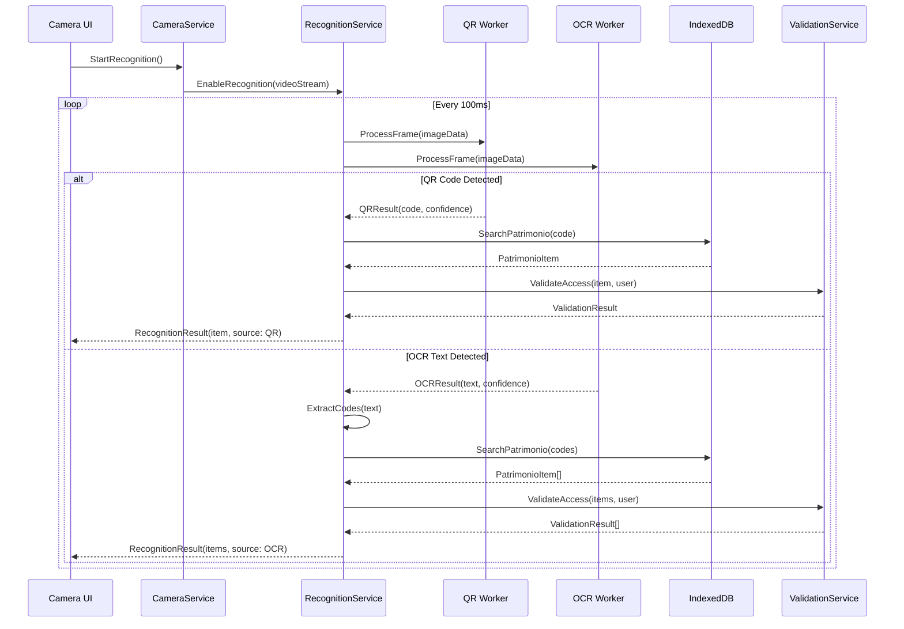

# Design Document - Ciclo de Captura OCR/QR Code

## Overview

Este documento especifica o design técnico para implementação do ciclo de captura automática de patrimônio utilizando reconhecimento de QR Code e OCR (Optical Character Recognition) no PWA Blazor Aspec Captura. O sistema integra tecnologias de reconhecimento automático ao fluxo existente de captura manual, proporcionando preenchimento automático de formulários baseado em dados armazenados localmente no IndexedDB.

### Objetivos Técnicos

- **Integração Não-Invasiva**: Adicionar funcionalidades de reconhecimento sem quebrar o fluxo existente
- **Performance Otimizada**: Processamento em Web Workers para manter responsividade da UI
- **Fallback Gracioso**: Degradação elegante para modo manual quando reconhecimento falha
- **Compatibilidade**: Manter todas as APIs existentes funcionando
- **Segurança**: Validação de esfera de acesso e sanitização de dados

### Arquitetura Geral

O sistema utiliza uma arquitetura em camadas com separação clara de responsabilidades:

```
┌─────────────────────────────────────────────────────────────┐
│                    UI Layer (Blazor)                        │
│  ┌─────────────────┐  ┌─────────────────┐  ┌──────────────┐ │
│  │   Camera.razor  │  │ Recognition UI  │  │ Form Fields  │ │
│  └─────────────────┘  └─────────────────┘  └──────────────┘ │
└─────────────────────────────────────────────────────────────┘
                                │
┌─────────────────────────────────────────────────────────────┐
│                 Service Layer (C#)                          │
│  ┌─────────────────┐  ┌─────────────────┐  ┌──────────────┐ │
│  │ CameraService   │  │RecognitionSvc   │  │ValidationSvc │ │
│  └─────────────────┘  └─────────────────┘  └──────────────┘ │
└─────────────────────────────────────────────────────────────┘
                                │
┌─────────────────────────────────────────────────────────────┐
│              JavaScript Interop Layer                       │
│  ┌─────────────────┐  ┌─────────────────┐  ┌──────────────┐ │
│  │camera-interop.js│  │recognition-     │  │ db-interop.js│ │
│  │                 │  │interop.js       │  │              │ │
│  └─────────────────┘  └─────────────────┘  └──────────────┘ │
└─────────────────────────────────────────────────────────────┘
                                │
┌─────────────────────────────────────────────────────────────┐
│                Web Worker Layer                              │
│  ┌─────────────────┐  ┌─────────────────┐  ┌──────────────┐ │
│  │  QR Worker      │  │  OCR Worker     │  │Cache Worker  │ │
│  │  (ZXing-js)     │  │ (Tesseract.js)  │  │              │ │
│  └─────────────────┘  └─────────────────┘  └──────────────┘ │
└─────────────────────────────────────────────────────────────┘
                                │
┌─────────────────────────────────────────────────────────────┐
│                 Storage Layer                                │
│  ┌─────────────────┐  ┌─────────────────┐  ┌──────────────┐ │
│  │   IndexedDB     │  │  LocalStorage   │  │  Cache API   │ │
│  │  (patrimonio)   │  │ (preferences)   │  │ (libraries)  │ │
│  └─────────────────┘  └─────────────────┘  └──────────────┘ │
└─────────────────────────────────────────────────────────────┘
```

## Architecture

### Componentes Principais

#### 1. Recognition Service Layer

**IRecognitionService**
- Interface principal para coordenação de reconhecimento
- Gerencia priorização entre QR Code e OCR
- Controla cache de resultados e throttling

**QRCodeRecognitionService**
- Implementa reconhecimento de QR Code usando ZXing-js
- Processa frames de vídeo em tempo real
- Retorna códigos decodificados com confiança

**OCRRecognitionService**
- Implementa reconhecimento OCR usando Tesseract.js
- Extrai texto de regiões específicas da imagem
- Aplica filtros para códigos de patrimônio

#### 2. Processing Workers

**QRWorker (qr-worker.js)**
- Web Worker dedicado para processamento QR
- Carrega ZXing-js de forma assíncrona
- Processa frames sem bloquear UI thread

**OCRWorker (ocr-worker.js)**
- Web Worker dedicado para processamento OCR
- Carrega Tesseract.js com modelos otimizados
- Aplica pré-processamento de imagem

#### 3. Data Access Layer

**PatrimonioSearchService**
- Otimiza buscas no IndexedDB
- Implementa cache inteligente
- Gerencia índices para performance

**ValidationService**
- Valida esfera de acesso
- Sanitiza códigos detectados
- Aplica regras de negócio

### Fluxo de Dados



## Components and Interfaces

### Core Interfaces

```csharp
public interface IRecognitionService
{
    Task<bool> StartRecognitionAsync(string videoElementId);
    Task StopRecognitionAsync();
    Task<RecognitionResult> ProcessFrameAsync(byte[] imageData);
    event EventHandler<RecognitionEventArgs> CodeDetected;
    bool IsActive { get; }
    RecognitionSettings Settings { get; set; }
}

public interface IQRCodeService
{
    Task<QRResult[]> DetectQRCodesAsync(byte[] imageData);
    Task<bool> InitializeAsync();
}

public interface IOCRService
{
    Task<OCRResult> ExtractTextAsync(byte[] imageData, OCROptions options);
    Task<string[]> ExtractCodesAsync(string text);
    Task<bool> InitializeAsync();
}

public interface IPatrimonioSearchService
{
    Task<PatrimonioItem?> SearchByCodeAsync(string code);
    Task<PatrimonioItem[]> SearchByCodesAsync(string[] codes);
    Task<bool> IsCachedAsync(string code);
    void ClearCache();
}

public interface IValidationService
{
    Task<ValidationResult> ValidateAccessAsync(PatrimonioItem item, Usuario user);
    string SanitizeCode(string rawCode);
    bool IsValidPatrimonioCode(string code);
}
```

### Data Models

```csharp
public class RecognitionResult
{
    public bool Success { get; set; }
    public RecognitionSource Source { get; set; } // QR, OCR, Manual
    public PatrimonioItem? PatrimonioFound { get; set; }
    public string? DetectedCode { get; set; }
    public float Confidence { get; set; }
    public string? ErrorMessage { get; set; }
    public DateTime Timestamp { get; set; }
}

public class QRResult
{
    public string Code { get; set; } = string.Empty;
    public float Confidence { get; set; }
    public Rectangle BoundingBox { get; set; }
    public QRFormat Format { get; set; }
}

public class OCRResult
{
    public string Text { get; set; } = string.Empty;
    public float Confidence { get; set; }
    public string[] ExtractedCodes { get; set; } = [];
    public Rectangle[] CodeRegions { get; set; } = [];
}

public class ValidationResult
{
    public bool IsValid { get; set; }
    public bool HasAccess { get; set; }
    public string? ErrorMessage { get; set; }
    public string? RestrictedReason { get; set; }
}

public class RecognitionSettings
{
    public bool QREnabled { get; set; } = true;
    public bool OCREnabled { get; set; } = true;
    public int ProcessingIntervalMs { get; set; } = 100;
    public float MinConfidence { get; set; } = 0.7f;
    public int CacheTimeoutMinutes { get; set; } = 5;
    public OCRLanguage Language { get; set; } = OCRLanguage.Portuguese;
}
```

### Component Structure

#### RecognitionService Implementation

```csharp
public class RecognitionService : IRecognitionService
{
    private readonly IQRCodeService _qrService;
    private readonly IOCRService _ocrService;
    private readonly IPatrimonioSearchService _searchService;
    private readonly IValidationService _validationService;
    private readonly IJSRuntime _jsRuntime;
    
    private Timer? _processingTimer;
    private bool _isActive;
    private readonly SemaphoreSlim _processingSemaphore = new(1, 1);

    public async Task<bool> StartRecognitionAsync(string videoElementId)
    {
        if (_isActive) return true;
        
        // Initialize workers
        await _qrService.InitializeAsync();
        await _ocrService.InitializeAsync();
        
        // Start frame processing timer
        _processingTimer = new Timer(ProcessCurrentFrame, null, 
            TimeSpan.Zero, TimeSpan.FromMilliseconds(Settings.ProcessingIntervalMs));
        
        _isActive = true;
        return true;
    }

    private async void ProcessCurrentFrame(object? state)
    {
        if (!await _processingSemaphore.WaitAsync(10)) return;
        
        try
        {
            var frameData = await _jsRuntime.InvokeAsync<byte[]>(
                "recognitionInterop.captureFrame");
            
            if (frameData?.Length > 0)
            {
                var result = await ProcessFrameAsync(frameData);
                if (result.Success)
                {
                    CodeDetected?.Invoke(this, new RecognitionEventArgs(result));
                }
            }
        }
        finally
        {
            _processingSemaphore.Release();
        }
    }
}
```

## Data Models

### Enhanced PatrimonioItem

```csharp
public class PatrimonioItem
{
    public long IdPatomb { get; set; }
    public string Nutomb { get; set; } = string.Empty;
    public string Code { get; set; } = string.Empty; // Alias para Nutomb
    public string Esfera { get; set; } = string.Empty;
    public string Deprod { get; set; } = string.Empty;
    public string? Descricao { get; set; }
    public string? Localizacao { get; set; }
    public decimal? ValorEstimado { get; set; }
    public ConservationState? Estado { get; set; }
    
    // Metadados de reconhecimento
    public DateTime? LastRecognized { get; set; }
    public RecognitionSource? RecognitionSource { get; set; }
    public float? RecognitionConfidence { get; set; }
}
```

### Recognition Cache Model

```csharp
public class RecognitionCache
{
    public string Code { get; set; } = string.Empty;
    public PatrimonioItem? Result { get; set; }
    public DateTime CachedAt { get; set; }
    public TimeSpan TTL { get; set; } = TimeSpan.FromMinutes(5);
    public bool IsExpired => DateTime.Now - CachedAt > TTL;
}
```

### Form Mapping Model

```csharp
public class FormMappingResult
{
    public InventoryItem MappedItem { get; set; } = new();
    public string[] PrefilledFields { get; set; } = [];
    public bool RequiresUserConfirmation { get; set; }
    public string? MappingSource { get; set; } // "QR", "OCR", "Manual"
}
```

## JavaScript Interop Layer

### recognition-interop.js

```javascript
window.recognitionInterop = {
    qrWorker: null,
    ocrWorker: null,
    isInitialized: false,
    
    async initialize() {
        // Initialize QR Worker
        this.qrWorker = new Worker('/js/workers/qr-worker.js');
        this.ocrWorker = new Worker('/js/workers/ocr-worker.js');
        
        // Setup message handlers
        this.qrWorker.onmessage = (e) => {
            if (e.data.type === 'qr-result') {
                DotNet.invokeMethodAsync('pwa-camera-poc-blazor', 
                    'OnQRDetected', e.data.result);
            }
        };
        
        this.ocrWorker.onmessage = (e) => {
            if (e.data.type === 'ocr-result') {
                DotNet.invokeMethodAsync('pwa-camera-poc-blazor', 
                    'OnOCRDetected', e.data.result);
            }
        };
        
        this.isInitialized = true;
    },
    
    captureFrame() {
        const video = document.getElementById('camera-feed');
        if (!video) return null;
        
        const canvas = document.createElement('canvas');
        canvas.width = video.videoWidth;
        canvas.height = video.videoHeight;
        
        const ctx = canvas.getContext('2d');
        ctx.drawImage(video, 0, 0);
        
        return canvas.getImageData(0, 0, canvas.width, canvas.height);
    },
    
    processFrame(imageData) {
        if (!this.isInitialized) return;
        
        // Send to both workers
        this.qrWorker.postMessage({
            type: 'process-frame',
            imageData: imageData
        });
        
        this.ocrWorker.postMessage({
            type: 'process-frame',
            imageData: imageData
        });
    }
};
```

### Web Workers

#### qr-worker.js

```javascript
importScripts('https://unpkg.com/@zxing/library@latest/umd/index.min.js');

let codeReader = null;

self.onmessage = async function(e) {
    if (e.data.type === 'process-frame') {
        if (!codeReader) {
            codeReader = new ZXing.BrowserQRCodeReader();
        }
        
        try {
            const result = await codeReader.decodeFromImageData(e.data.imageData);
            
            self.postMessage({
                type: 'qr-result',
                result: {
                    code: result.text,
                    confidence: 1.0,
                    format: result.format,
                    timestamp: Date.now()
                }
            });
        } catch (error) {
            // No QR code found - this is normal
        }
    }
};
```

#### ocr-worker.js

```javascript
importScripts('https://unpkg.com/tesseract.js@v4/dist/tesseract.min.js');

let worker = null;

self.onmessage = async function(e) {
    if (e.data.type === 'process-frame') {
        if (!worker) {
            worker = await Tesseract.createWorker('por', 1, {
                logger: m => console.log(m)
            });
            
            await worker.setParameters({
                tessedit_char_whitelist: '0123456789ABCDEFGHIJKLMNOPQRSTUVWXYZ-',
                tessedit_pageseg_mode: Tesseract.PSM.SINGLE_BLOCK
            });
        }
        
        try {
            const { data } = await worker.recognize(e.data.imageData);
            const extractedCodes = extractPatrimonioCodes(data.text);
            
            if (extractedCodes.length > 0) {
                self.postMessage({
                    type: 'ocr-result',
                    result: {
                        text: data.text,
                        confidence: data.confidence / 100,
                        codes: extractedCodes,
                        timestamp: Date.now()
                    }
                });
            }
        } catch (error) {
            console.error('OCR Error:', error);
        }
    }
};

function extractPatrimonioCodes(text) {
    const patterns = [
        /\b\d{6,12}\b/g,           // Códigos numéricos 6-12 dígitos
        /\b[A-Z]{2,4}\d{4,8}\b/g,  // Códigos alfanuméricos
        /\b\d{4}-\d{4}\b/g         // Códigos com hífen
    ];
    
    const codes = [];
    patterns.forEach(pattern => {
        const matches = text.match(pattern);
        if (matches) codes.push(...matches);
    });
    
    return [...new Set(codes)]; // Remove duplicatas
}
```

## Enhanced Camera Integration

### Modified Camera.razor

```csharp
@page "/camera"
@using pwa_camera_poc_blazor.Models
@using pwa_camera_poc_blazor.Services.Camera
@using pwa_camera_poc_blazor.Services.Recognition
@inject CameraService CameraService
@inject IRecognitionService RecognitionService
@inject IIndexedDbService DbService
@inject IAuthService AuthService
@inject NavigationManager Navigation
@inject ToastService ToastService
@inject AppState appState

<!-- Recognition Status Overlay -->
@if (!isFormVisible && recognitionEnabled)
{
    <div class="recognition-overlay">
        <div class="recognition-status">
            <MudChip Icon="@GetRecognitionIcon()" Color="@GetRecognitionColor()" Size="Size.Small">
                @GetRecognitionStatus()
            </MudChip>
        </div>
        
        @if (lastRecognitionResult != null)
        {
            <div class="recognition-result">
                <MudAlert Severity="@GetResultSeverity()" Dense="true">
                    @lastRecognitionResult.Message
                </MudAlert>
            </div>
        }
        
        <!-- QR Code Detection Overlay -->
        @if (qrDetectionBox != null)
        {
            <div class="qr-detection-box" style="@GetDetectionBoxStyle()">
                <div class="qr-corners"></div>
            </div>
        }
        
        <!-- OCR Text Highlight Overlay -->
        @if (ocrTextRegions?.Any() == true)
        {
            @foreach (var region in ocrTextRegions)
            {
                <div class="ocr-text-region" style="@GetTextRegionStyle(region)">
                    <span class="ocr-text">@region.Text</span>
                </div>
            }
        }
    </div>
}

<!-- Recognition Controls -->
@if (!isFormVisible)
{
    <div class="recognition-controls">
        <MudToggleIconButton @bind-Toggled="recognitionEnabled"
                           Icon="@Icons.Material.Filled.QrCodeScanner"
                           ToggledIcon="@Icons.Material.Filled.QrCodeScanner"
                           Color="Color.Surface"
                           ToggledColor="Color.Primary"
                           Size="Size.Large"
                           Title="@(recognitionEnabled ? "Desabilitar Reconhecimento" : "Habilitar Reconhecimento")" />
    </div>
}

@code {
    // Existing fields...
    private bool recognitionEnabled = true;
    private RecognitionResult? lastRecognitionResult;
    private Rectangle? qrDetectionBox;
    private OCRTextRegion[]? ocrTextRegions;
    private Timer? recognitionTimer;

    protected override async Task OnInitializedAsync()
    {
        // Existing initialization...
        
        // Setup recognition event handlers
        RecognitionService.CodeDetected += OnCodeDetected;
        RecognitionService.PatrimonioFound += OnPatrimonioFound;
        RecognitionService.RecognitionError += OnRecognitionError;
    }

    protected override async Task OnAfterRenderAsync(bool firstRender)
    {
        if (firstRender && !isFormVisible)
        {
            await StartCamera();
            if (recognitionEnabled)
            {
                await StartRecognition();
            }
        }
    }

    private async Task StartRecognition()
    {
        try
        {
            await RecognitionService.StartRecognitionAsync("camera-feed");
            StateHasChanged();
        }
        catch (Exception ex)
        {
            ToastService.ShowError($"Erro ao iniciar reconhecimento: {ex.Message}");
        }
    }

    private async Task StopRecognition()
    {
        await RecognitionService.StopRecognitionAsync();
        lastRecognitionResult = null;
        qrDetectionBox = null;
        ocrTextRegions = null;
        StateHasChanged();
    }

    private async void OnCodeDetected(object? sender, RecognitionEventArgs e)
    {
        await InvokeAsync(() =>
        {
            if (e.Result.Source == RecognitionSource.QR)
            {
                qrDetectionBox = e.Result.BoundingBox;
                // Vibrate device
                _ = Task.Run(async () => await CameraService.VibrateAsync(200));
            }
            else if (e.Result.Source == RecognitionSource.OCR)
            {
                ocrTextRegions = e.Result.TextRegions;
            }
            
            StateHasChanged();
        });
    }

    private async void OnPatrimonioFound(object? sender, PatrimonioFoundEventArgs e)
    {
        await InvokeAsync(async () =>
        {
            // Play confirmation sound
            await CameraService.PlaySoundAsync("success");
            
            // Auto-fill form
            await AutoFillForm(e.Patrimonio);
            
            // Show success message
            lastRecognitionResult = new RecognitionResult
            {
                Success = true,
                Message = $"Patrimônio encontrado: {e.Patrimonio.Nutomb}",
                Source = e.Source
            };
            
            StateHasChanged();
        });
    }

    private async void OnRecognitionError(object? sender, RecognitionErrorEventArgs e)
    {
        await InvokeAsync(() =>
        {
            lastRecognitionResult = new RecognitionResult
            {
                Success = false,
                Message = e.ErrorMessage,
                Source = e.Source
            };
            
            StateHasChanged();
        });
    }

    private async Task AutoFillForm(PatrimonioItem patrimonio)
    {
        // Validate access
        var validation = await RecognitionService.ValidateAccessAsync(patrimonio, currentUser);
        if (!validation.HasAccess)
        {
            ToastService.ShowError(validation.ErrorMessage ?? "Acesso negado ao patrimônio");
            return;
        }

        // Map patrimonio to form
        itemModel.Code = patrimonio.Nutomb;
        itemModel.Name = patrimonio.Descricao ?? string.Empty;
        itemModel.Location = patrimonio.Localizacao ?? string.Empty;
        itemModel.EstimatedValue = patrimonio.ValorEstimado ?? 0;
        itemModel.State = patrimonio.Estado ?? ConservationState.Good;

        // Mark fields as auto-filled
        autoFilledFields = new[] { "Code", "Name", "Location", "EstimatedValue", "State" };
        
        // Show form
        isFormVisible = true;
        editContext = new EditContext(itemModel);
        
        StateHasChanged();
    }

    private string GetRecognitionIcon()
    {
        return RecognitionService.IsActive switch
        {
            true when lastRecognitionResult?.Success == true => Icons.Material.Filled.CheckCircle,
            true => Icons.Material.Filled.Search,
            false => Icons.Material.Filled.SearchOff
        };
    }

    private Color GetRecognitionColor()
    {
        return RecognitionService.IsActive switch
        {
            true when lastRecognitionResult?.Success == true => Color.Success,
            true => Color.Primary,
            false => Color.Default
        };
    }

    private string GetRecognitionStatus()
    {
        return RecognitionService.IsActive switch
        {
            true when lastRecognitionResult?.Success == true => "Código Detectado",
            true => "Procurando...",
            false => "Reconhecimento Desabilitado"
        };
    }

    public async ValueTask DisposeAsync()
    {
        // Existing cleanup...
        
        // Cleanup recognition
        RecognitionService.CodeDetected -= OnCodeDetected;
        RecognitionService.PatrimonioFound -= OnPatrimonioFound;
        RecognitionService.RecognitionError -= OnRecognitionError;
        
        await StopRecognition();
    }
}
```

### Enhanced Form with Auto-Fill Indicators

```html
<EditForm EditContext="@editContext" OnValidSubmit="HandleSave" id="camera-form">
    <DataAnnotationsValidator />
    <MudGrid>
        <MudItem xs="12">
            <MudTextField @bind-Value="itemModel.Name" 
                         Label="Nome do Item *" 
                         Variant="Variant.Outlined"
                         For="@(() => itemModel.Name)"
                         Class="@GetFieldClass("Name")"
                         Adornment="@GetFieldAdornment("Name")"
                         AdornmentIcon="@GetFieldIcon("Name")" />
        </MudItem>
        <MudItem xs="12">
            <MudTextField @bind-Value="itemModel.Code" 
                         Label="Código/ID *" 
                         Variant="Variant.Outlined"
                         For="@(() => itemModel.Code)"
                         Class="@GetFieldClass("Code")"
                         Adornment="@GetFieldAdornment("Code")"
                         AdornmentIcon="@GetFieldIcon("Code")" />
        </MudItem>
        <!-- Additional fields with auto-fill indicators... -->
    </MudGrid>
</EditForm>

@code {
    private string[] autoFilledFields = Array.Empty<string>();

    private string GetFieldClass(string fieldName)
    {
        return autoFilledFields.Contains(fieldName) ? "auto-filled-field" : string.Empty;
    }

    private Adornment GetFieldAdornment(string fieldName)
    {
        return autoFilledFields.Contains(fieldName) ? Adornment.End : Adornment.None;
    }

    private string GetFieldIcon(string fieldName)
    {
        return autoFilledFields.Contains(fieldName) ? Icons.Material.Filled.AutoAwesome : string.Empty;
    }
}
```

### CSS Styles for Recognition UI

```css
.recognition-overlay {
    position: absolute;
    top: 0;
    left: 0;
    width: 100%;
    height: 100%;
    pointer-events: none;
    z-index: 10;
}

.recognition-status {
    position: absolute;
    top: 20px;
    left: 20px;
    pointer-events: auto;
}

.recognition-result {
    position: absolute;
    top: 60px;
    left: 20px;
    right: 20px;
    pointer-events: auto;
}

.qr-detection-box {
    position: absolute;
    border: 3px solid #4caf50;
    border-radius: 8px;
    background: rgba(76, 175, 80, 0.1);
    animation: qr-pulse 1s infinite;
}

.qr-corners::before,
.qr-corners::after {
    content: '';
    position: absolute;
    width: 20px;
    height: 20px;
    border: 3px solid #4caf50;
}

.qr-corners::before {
    top: -3px;
    left: -3px;
    border-right: none;
    border-bottom: none;
}

.qr-corners::after {
    bottom: -3px;
    right: -3px;
    border-left: none;
    border-top: none;
}

.ocr-text-region {
    position: absolute;
    border: 2px solid #2196f3;
    background: rgba(33, 150, 243, 0.1);
    border-radius: 4px;
    animation: ocr-highlight 2s infinite;
}

.ocr-text {
    position: absolute;
    bottom: -25px;
    left: 0;
    background: rgba(33, 150, 243, 0.9);
    color: white;
    padding: 2px 6px;
    border-radius: 3px;
    font-size: 12px;
    white-space: nowrap;
}

.recognition-controls {
    position: absolute;
    top: 20px;
    right: 20px;
    z-index: 15;
}

.auto-filled-field {
    background: linear-gradient(45deg, transparent 49%, rgba(76, 175, 80, 0.1) 50%, transparent 51%);
}

@keyframes qr-pulse {
    0%, 100% { box-shadow: 0 0 0 0 rgba(76, 175, 80, 0.7); }
    50% { box-shadow: 0 0 0 10px rgba(76, 175, 80, 0); }
}

@keyframes ocr-highlight {
    0%, 100% { border-color: #2196f3; }
    50% { border-color: #64b5f6; }
}
```

## Performance Optimizations

### Frame Processing Throttling

```csharp
public class FrameThrottler
{
    private readonly int _maxFPS;
    private DateTime _lastProcessTime = DateTime.MinValue;
    private readonly TimeSpan _minInterval;

    public FrameThrottler(int maxFPS = 10)
    {
        _maxFPS = maxFPS;
        _minInterval = TimeSpan.FromMilliseconds(1000.0 / maxFPS);
    }

    public bool ShouldProcess()
    {
        var now = DateTime.Now;
        if (now - _lastProcessTime >= _minInterval)
        {
            _lastProcessTime = now;
            return true;
        }
        return false;
    }
}
```

### Memory Management

```csharp
public class RecognitionMemoryManager
{
    private readonly Queue<byte[]> _frameBuffer = new();
    private const int MAX_BUFFER_SIZE = 5;
    private long _totalMemoryUsed = 0;
    private const long MAX_MEMORY_MB = 50;

    public bool CanProcessFrame(byte[] frameData)
    {
        var frameSizeMB = frameData.Length / (1024.0 * 1024.0);
        
        if (_totalMemoryUsed + frameSizeMB > MAX_MEMORY_MB)
        {
            CleanupOldFrames();
        }

        return _totalMemoryUsed + frameSizeMB <= MAX_MEMORY_MB;
    }

    public void AddFrame(byte[] frameData)
    {
        if (_frameBuffer.Count >= MAX_BUFFER_SIZE)
        {
            var oldFrame = _frameBuffer.Dequeue();
            _totalMemoryUsed -= oldFrame.Length / (1024.0 * 1024.0);
        }

        _frameBuffer.Enqueue(frameData);
        _totalMemoryUsed += frameData.Length / (1024.0 * 1024.0);
    }

    private void CleanupOldFrames()
    {
        while (_frameBuffer.Count > 2)
        {
            var oldFrame = _frameBuffer.Dequeue();
            _totalMemoryUsed -= oldFrame.Length / (1024.0 * 1024.0);
        }
    }
}
```

### IndexedDB Query Optimization

```javascript
// Enhanced db-interop.js with optimized patrimonio search
window.dbInterop = {
    // ... existing code ...

    searchPatrimonioOptimized: async function(codes) {
        return new Promise((resolve, reject) => {
            if (!this.db) {
                reject(new Error('Database not initialized'));
                return;
            }

            const transaction = this.db.transaction(['patrimonio'], 'readonly');
            const store = transaction.objectStore('patrimonio');
            const nutombIndex = store.index('nutomb');
            
            const results = [];
            let completed = 0;
            
            codes.forEach(code => {
                const request = nutombIndex.get(code);
                request.onsuccess = () => {
                    if (request.result) {
                        results.push(request.result);
                    }
                    completed++;
                    if (completed === codes.length) {
                        resolve(results);
                    }
                };
                request.onerror = () => {
                    completed++;
                    if (completed === codes.length) {
                        resolve(results);
                    }
                };
            });
        });
    },

    // Batch search with caching
    searchPatrimonioWithCache: async function(codes) {
        const cacheKey = 'patrimonio_cache';
        const cache = await this.getMetadata(cacheKey);
        const cachedResults = cache ? JSON.parse(cache) : {};
        
        const uncachedCodes = codes.filter(code => !cachedResults[code]);
        const cachedResults_filtered = codes
            .filter(code => cachedResults[code])
            .map(code => cachedResults[code]);

        if (uncachedCodes.length === 0) {
            return cachedResults_filtered;
        }

        const newResults = await this.searchPatrimonioOptimized(uncachedCodes);
        
        // Update cache
        newResults.forEach(result => {
            cachedResults[result.nutomb] = result;
        });
        
        await this.setMetadata(cacheKey, JSON.stringify(cachedResults));
        
        return [...cachedResults_filtered, ...newResults];
    }
};
```
## Correctness Properties

*A property is a characteristic or behavior that should hold true across all valid executions of a system-essentially, a formal statement about what the system should do. Properties serve as the bridge between human-readable specifications and machine-verifiable correctness guarantees.*

### Property 1: Real-time Recognition Detection

*For any* active camera feed with QR codes or text content, the recognition system should detect and process the content within the specified time limits (QR < 500ms, OCR < 2s)

**Validates: Requirements 1.1, 1.2, 2.1, 2.3**

### Property 2: Recognition Robustness

*For any* QR code in different orientations/lighting conditions or text in different fonts/sizes, the recognition system should successfully detect and decode the content

**Validates: Requirements 1.5, 2.5**

### Property 3: Multiple Code Prioritization

*For any* image containing multiple QR codes, the system should prioritize the code with the largest detection area

**Validates: Requirements 1.4**

### Property 4: Patrimonio Code Focus

*For any* text containing mixed content, the OCR system should prioritize and extract alphanumeric codes typical of patrimonio over other text

**Validates: Requirements 2.4**

### Property 5: Automatic Database Search

*For any* code detected via QR or OCR, the system should automatically search both 'code' and 'nutomb' fields in the patrimonio store

**Validates: Requirements 3.1, 3.2**

### Property 6: Optimized Cache Performance

*For any* previously searched code, subsequent searches should complete in under 100ms and avoid redundant database queries

**Validates: Requirements 3.3, 3.4**

### Property 7: New Item Fallback

*For any* code not found in the database, the system should enable the new item capture workflow

**Validates: Requirements 3.5**

### Property 8: Automatic Form Population

*For any* patrimonio found in the database, the system should automatically populate the corresponding form fields with the mapped data

**Validates: Requirements 4.1, 4.2**

### Property 9: Visual Auto-fill Indicators

*For any* automatically populated form field, the system should provide visual indication that the field was auto-filled while maintaining editability

**Validates: Requirements 4.3, 4.4**

### Property 10: Photo Association Preservation

*For any* automatic form population, the captured photo should remain associated with the item

**Validates: Requirements 4.5**

### Property 11: Sphere Access Validation

*For any* patrimonio found, the system should validate user sphere access where sphere 'A' allows all access, and matching spheres allow access

**Validates: Requirements 5.1, 5.3, 5.4**

### Property 12: Access Denial Handling

*For any* patrimonio with mismatched sphere access, the system should display an impeditive message and prevent capture continuation

**Validates: Requirements 5.2, 5.5**

### Property 13: Code Normalization

*For any* detected code, the sanitizer should remove whitespace, convert similar characters (O→0, I→1), and normalize to uppercase without special characters

**Validates: Requirements 6.1, 6.2, 6.3**

### Property 14: Reliable Code Selection

*For any* multiple detections of the same code with different confidence levels, the system should use the most reliable version and maintain detection history

**Validates: Requirements 6.4, 6.5**

### Property 15: Visual Recognition Feedback

*For any* successful code detection, the system should provide appropriate visual feedback (QR green frame, OCR text overlay, status indicators)

**Validates: Requirements 7.1, 7.2, 7.5**

### Property 16: Haptic and Audio Feedback

*For any* successful code decode, the system should vibrate for 200ms, and for patrimonio found, should play confirmation sound

**Validates: Requirements 7.3, 7.4**

### Property 17: Web Worker Processing

*For any* recognition processing, QR and OCR operations should execute in separate Web Workers to maintain UI responsiveness

**Validates: Requirements 8.1**

### Property 18: Frame Rate Throttling

*For any* active recognition, the system should process video frames at maximum 10 FPS

**Validates: Requirements 8.2**

### Property 19: Cache Time Management

*For any* search result, the cache should store results for exactly 5 minutes before expiration

**Validates: Requirements 8.4**

### Property 20: Memory-based Performance Adaptation

*For any* low memory condition, the system should automatically reduce processing frequency

**Validates: Requirements 8.5**

### Property 21: QR Priority over OCR

*For any* simultaneous QR and OCR detection, the system should prioritize QR results, use OCR only as fallback, and indicate the recognition method used

**Validates: Requirements 9.1, 9.2, 9.3, 9.4**

### Property 22: Manual Entry Fallback

*For any* scenario where both QR and OCR fail, the system should enable manual code entry

**Validates: Requirements 9.5**

### Property 23: Backward Compatibility

*For any* existing camera functionality, the system should maintain complete compatibility when recognition is disabled and preserve all existing APIs

**Validates: Requirements 10.1, 10.2, 10.4**

### Property 24: Mode Switching

*For any* active capture session, the system should allow switching between manual and automatic modes

**Validates: Requirements 10.3**

### Property 25: Graceful Degradation

*For any* automatic functionality failure, the system should gracefully degrade to manual mode

**Validates: Requirements 10.5**

### Property 26: User Control Interface

*For any* recognition settings, the system should provide toggle controls, save preferences to localStorage, and display current status

**Validates: Requirements 11.1, 11.4, 11.5**

### Property 27: OCR Sensitivity Configuration

*For any* OCR sensitivity setting change, the system should adjust recognition behavior accordingly

**Validates: Requirements 11.2**

### Property 28: Recognition Disable Control

*For any* disabled recognition state, the system should completely stop all automatic processing

**Validates: Requirements 11.3**

### Property 29: QR Parser Round-trip

*For any* valid patrimonio QR code, parsing then printing then parsing should produce an equivalent object

**Validates: Requirements 12.4**

### Property 30: QR Structure Extraction

*For any* decoded QR code, the parser should extract structured information and support patrimonio-specific formats

**Validates: Requirements 12.1, 12.2**

### Property 31: QR Pretty Printing

*For any* patrimonio data, the pretty printer should format it into a valid QR code

**Validates: Requirements 12.3**

### Property 32: QR Error Handling

*For any* QR code with invalid data, the parser should return descriptive error messages

**Validates: Requirements 12.5**

### Property 33: OCR Pattern Recognition

*For any* OCR-extracted text, the parser should identify patrimonio code patterns using regex and filter out noise

**Validates: Requirements 13.1, 13.2, 13.3**

### Property 34: OCR Multiple Code Selection

*For any* text containing multiple detected codes, the OCR parser should return the most probable code

**Validates: Requirements 13.4**

### Property 35: OCR Code Validation

*For any* extracted code, the OCR parser should validate format against known patrimonio patterns

**Validates: Requirements 13.5**

## Error Handling

### Recognition Error Scenarios

#### QR Code Recognition Errors
- **Invalid QR Format**: Return structured error with format details
- **Corrupted QR Data**: Attempt OCR fallback, log corruption details
- **Multiple QR Conflicts**: Use largest area QR, log conflict resolution
- **QR Library Load Failure**: Disable QR recognition, show user notification

#### OCR Recognition Errors
- **Tesseract Load Failure**: Disable OCR recognition, maintain QR functionality
- **Low Confidence Text**: Filter results below confidence threshold
- **No Text Detected**: Continue processing without error notification
- **Memory Exhaustion**: Reduce processing frequency, clear old frames

#### Database Search Errors
- **IndexedDB Unavailable**: Show error message, enable manual entry only
- **Corrupted Patrimonio Data**: Log error, allow manual entry
- **Search Timeout**: Use cached results if available, show timeout warning
- **Index Missing**: Rebuild indices in background, use full table scan

#### Validation Errors
- **Sphere Access Denied**: Show impeditive message, prevent form submission
- **Invalid Code Format**: Show sanitization suggestion, allow manual correction
- **User Session Expired**: Redirect to login, preserve captured photo
- **Network Connectivity**: Continue offline operation, queue for sync

### Error Recovery Strategies

#### Automatic Recovery
```csharp
public class RecognitionErrorHandler
{
    private int _consecutiveErrors = 0;
    private const int MAX_CONSECUTIVE_ERRORS = 5;
    
    public async Task<bool> HandleRecognitionError(Exception error)
    {
        _consecutiveErrors++;
        
        if (_consecutiveErrors >= MAX_CONSECUTIVE_ERRORS)
        {
            // Disable automatic recognition
            await _recognitionService.DisableAsync();
            _notificationService.ShowWarning(
                "Reconhecimento automático desabilitado devido a erros consecutivos");
            return false;
        }
        
        // Attempt recovery based on error type
        return error switch
        {
            QRLibraryException => await RecoverQRLibrary(),
            OCRLibraryException => await RecoverOCRLibrary(),
            DatabaseException => await RecoverDatabase(),
            _ => await GenericRecovery()
        };
    }
    
    private async Task<bool> RecoverQRLibrary()
    {
        // Reload QR worker
        await _qrService.ReloadWorkerAsync();
        return true;
    }
}
```

#### User-Initiated Recovery
- **Manual Refresh**: Allow user to restart recognition manually
- **Library Reload**: Provide button to reload recognition libraries
- **Cache Clear**: Allow user to clear recognition cache
- **Reset Settings**: Provide option to reset recognition settings to defaults

### Error Logging and Monitoring

#### Structured Error Logging
```csharp
public class RecognitionLogger
{
    public void LogRecognitionError(RecognitionError error)
    {
        var logEntry = new
        {
            Timestamp = DateTime.UtcNow,
            ErrorType = error.Type,
            ErrorMessage = error.Message,
            RecognitionSource = error.Source,
            UserAgent = _browserService.GetUserAgent(),
            DeviceInfo = _deviceService.GetDeviceInfo(),
            MemoryUsage = _performanceService.GetMemoryUsage(),
            ProcessingLoad = _performanceService.GetProcessingLoad()
        };
        
        _logger.LogError("Recognition Error: {LogEntry}", logEntry);
    }
}
```

#### Performance Monitoring
- **Frame Processing Time**: Monitor and alert on slow processing
- **Memory Usage**: Track memory consumption and trigger cleanup
- **Cache Hit Rate**: Monitor cache effectiveness
- **Error Rate**: Track error frequency and patterns

## Testing Strategy

### Dual Testing Approach

The testing strategy employs both unit testing and property-based testing to ensure comprehensive coverage:

#### Unit Testing Focus
- **Specific Examples**: Test concrete scenarios with known inputs/outputs
- **Edge Cases**: Test boundary conditions and error scenarios
- **Integration Points**: Test component interactions and data flow
- **UI Interactions**: Test user interface behavior and visual feedback

#### Property-Based Testing Focus
- **Universal Properties**: Test properties that hold for all valid inputs
- **Randomized Input Coverage**: Generate diverse test scenarios automatically
- **Correctness Validation**: Verify system behavior matches specifications
- **Performance Properties**: Test performance characteristics across input ranges

### Property-Based Testing Configuration

#### Library Selection
- **JavaScript**: Use `fast-check` for client-side property testing
- **C#**: Use `FsCheck` for server-side property testing
- **Integration**: Use custom test harness for cross-language testing

#### Test Configuration
```csharp
[Property(Arbitrary = new[] { typeof(PatrimonioGenerators) })]
public Property QRCodeRoundTrip()
{
    return Prop.ForAll<PatrimonioItem>(patrimonio =>
    {
        // Property 29: QR Parser Round-trip
        var qrCode = QRPrettyPrinter.Format(patrimonio);
        var parsed = QRParser.Parse(qrCode);
        var reparsed = QRParser.Parse(QRPrettyPrinter.Format(parsed));
        
        return parsed.Equals(reparsed);
    }).Label("Feature: ciclo-captura-ocr-qr, Property 29: QR Parser Round-trip");
}

[Property(MaxTest = 100)]
public Property RecognitionPerformance()
{
    return Prop.ForAll<byte[]>(imageData =>
    {
        // Property 1: Real-time Recognition Detection
        var stopwatch = Stopwatch.StartNew();
        var qrResult = _qrService.DetectQRCodesAsync(imageData).Result;
        stopwatch.Stop();
        
        return qrResult.Any() ? stopwatch.ElapsedMilliseconds < 500 : true;
    }).Label("Feature: ciclo-captura-ocr-qr, Property 1: Real-time Recognition Detection");
}
```

#### Custom Generators
```csharp
public static class PatrimonioGenerators
{
    public static Arbitrary<PatrimonioItem> PatrimonioItem()
    {
        return Gen.Fresh(() => new PatrimonioItem
        {
            IdPatomb = Gen.Choose(1, 999999).Sample(0, 1).First(),
            Nutomb = Gen.Elements("ABC123", "DEF456", "GHI789").Sample(0, 1).First(),
            Esfera = Gen.Elements("A", "E", "M", "L").Sample(0, 1).First(),
            Deprod = Gen.AlphaNumericString.Sample(0, 1).First()
        }).ToArbitrary();
    }
    
    public static Arbitrary<byte[]> QRCodeImage()
    {
        return Gen.Fresh(() => 
        {
            // Generate synthetic QR code image data
            var qrGenerator = new QRCodeGenerator();
            var qrData = qrGenerator.CreateQrCode("TEST123", QRCodeGenerator.ECCLevel.Q);
            return qrData.GetGraphic(20).ToByteArray();
        }).ToArbitrary();
    }
}
```

### Unit Test Examples

#### Recognition Service Tests
```csharp
[Test]
public async Task StartRecognition_WithValidVideoElement_ShouldInitializeWorkers()
{
    // Arrange
    var mockQRService = new Mock<IQRCodeService>();
    var mockOCRService = new Mock<IOCRService>();
    mockQRService.Setup(x => x.InitializeAsync()).ReturnsAsync(true);
    mockOCRService.Setup(x => x.InitializeAsync()).ReturnsAsync(true);
    
    var service = new RecognitionService(mockQRService.Object, mockOCRService.Object);
    
    // Act
    var result = await service.StartRecognitionAsync("test-video");
    
    // Assert
    Assert.IsTrue(result);
    mockQRService.Verify(x => x.InitializeAsync(), Times.Once);
    mockOCRService.Verify(x => x.InitializeAsync(), Times.Once);
}

[Test]
public async Task ProcessFrame_WithQRCode_ShouldPrioritizeQROverOCR()
{
    // Arrange
    var qrResult = new QRResult { Code = "QR123", Confidence = 0.9f };
    var ocrResult = new OCRResult { ExtractedCodes = new[] { "OCR456" }, Confidence = 0.8f };
    
    _mockQRService.Setup(x => x.DetectQRCodesAsync(It.IsAny<byte[]>()))
               .ReturnsAsync(new[] { qrResult });
    _mockOCRService.Setup(x => x.ExtractTextAsync(It.IsAny<byte[]>(), It.IsAny<OCROptions>()))
                .ReturnsAsync(ocrResult);
    
    // Act
    var result = await _recognitionService.ProcessFrameAsync(_testImageData);
    
    // Assert
    Assert.AreEqual("QR123", result.DetectedCode);
    Assert.AreEqual(RecognitionSource.QR, result.Source);
}
```

#### Validation Service Tests
```csharp
[Test]
public async Task ValidateAccess_UserSphereA_ShouldAllowAllAccess()
{
    // Arrange
    var user = new Usuario { Esfera = "A" };
    var patrimonio = new PatrimonioItem { Esfera = "E" };
    
    // Act
    var result = await _validationService.ValidateAccessAsync(patrimonio, user);
    
    // Assert
    Assert.IsTrue(result.HasAccess);
    Assert.IsTrue(result.IsValid);
}

[Test]
public async Task ValidateAccess_MismatchedSphere_ShouldDenyAccess()
{
    // Arrange
    var user = new Usuario { Esfera = "E" };
    var patrimonio = new PatrimonioItem { Esfera = "M" };
    
    // Act
    var result = await _validationService.ValidateAccessAsync(patrimonio, user);
    
    // Assert
    Assert.IsFalse(result.HasAccess);
    Assert.IsNotNull(result.RestrictedReason);
}
```

### Integration Testing

#### End-to-End Recognition Flow
```csharp
[Test]
public async Task FullRecognitionFlow_QRCodeToFormFill_ShouldCompleteSuccessfully()
{
    // Arrange
    var testQRImage = GenerateQRCodeImage("TEST123");
    var expectedPatrimonio = new PatrimonioItem 
    { 
        Nutomb = "TEST123", 
        Descricao = "Test Item",
        Esfera = "A"
    };
    
    await _dbService.AddAsync("patrimonio", expectedPatrimonio);
    
    // Act
    await _cameraService.StartCameraAsync("test-video", false);
    await _recognitionService.StartRecognitionAsync("test-video");
    
    var result = await _recognitionService.ProcessFrameAsync(testQRImage);
    
    // Assert
    Assert.IsTrue(result.Success);
    Assert.AreEqual("TEST123", result.DetectedCode);
    Assert.IsNotNull(result.PatrimonioFound);
    Assert.AreEqual("Test Item", result.PatrimonioFound.Descricao);
}
```

### Performance Testing

#### Load Testing
```csharp
[Test]
public async Task RecognitionService_HighFrequencyFrames_ShouldMaintainPerformance()
{
    // Arrange
    var frames = GenerateTestFrames(1000);
    var processingTimes = new List<long>();
    
    // Act
    foreach (var frame in frames)
    {
        var stopwatch = Stopwatch.StartNew();
        await _recognitionService.ProcessFrameAsync(frame);
        stopwatch.Stop();
        processingTimes.Add(stopwatch.ElapsedMilliseconds);
    }
    
    // Assert
    var averageTime = processingTimes.Average();
    var maxTime = processingTimes.Max();
    
    Assert.Less(averageTime, 100, "Average processing time should be under 100ms");
    Assert.Less(maxTime, 500, "Maximum processing time should be under 500ms");
}
```

#### Memory Testing
```csharp
[Test]
public async Task RecognitionService_LongRunning_ShouldNotLeakMemory()
{
    // Arrange
    var initialMemory = GC.GetTotalMemory(true);
    
    // Act
    for (int i = 0; i < 1000; i++)
    {
        var frame = GenerateRandomFrame();
        await _recognitionService.ProcessFrameAsync(frame);
        
        if (i % 100 == 0)
        {
            GC.Collect();
            GC.WaitForPendingFinalizers();
        }
    }
    
    var finalMemory = GC.GetTotalMemory(true);
    
    // Assert
    var memoryIncrease = finalMemory - initialMemory;
    Assert.Less(memoryIncrease, 10 * 1024 * 1024, "Memory increase should be less than 10MB");
}
```

### Test Data Management

#### Test Patrimonio Database
```csharp
public class TestPatrimonioSeeder
{
    public static async Task SeedTestData(IIndexedDbService dbService)
    {
        var testItems = new[]
        {
            new PatrimonioItem { IdPatomb = 1, Nutomb = "QR001", Esfera = "A", Descricao = "Test QR Item 1" },
            new PatrimonioItem { IdPatomb = 2, Nutomb = "OCR002", Esfera = "E", Descricao = "Test OCR Item 2" },
            new PatrimonioItem { IdPatomb = 3, Nutomb = "MIX003", Esfera = "M", Descricao = "Test Mixed Item 3" }
        };
        
        foreach (var item in testItems)
        {
            await dbService.AddAsync("patrimonio", item);
        }
    }
}
```

#### Mock Image Generation
```csharp
public static class TestImageGenerator
{
    public static byte[] GenerateQRCodeImage(string content)
    {
        var qrGenerator = new QRCodeGenerator();
        var qrCodeData = qrGenerator.CreateQrCode(content, QRCodeGenerator.ECCLevel.Q);
        var qrCode = new QRCode(qrCodeData);
        var qrCodeImage = qrCode.GetGraphic(20);
        
        using var stream = new MemoryStream();
        qrCodeImage.Save(stream, ImageFormat.Png);
        return stream.ToArray();
    }
    
    public static byte[] GenerateOCRTextImage(string text)
    {
        var bitmap = new Bitmap(400, 100);
        using var graphics = Graphics.FromImage(bitmap);
        graphics.Clear(Color.White);
        graphics.DrawString(text, new Font("Arial", 16), Brushes.Black, 10, 10);
        
        using var stream = new MemoryStream();
        bitmap.Save(stream, ImageFormat.Png);
        return stream.ToArray();
    }
}
```

This comprehensive testing strategy ensures that the OCR/QR Code recognition system is thoroughly validated through both property-based testing for universal correctness and unit testing for specific scenarios and edge cases.