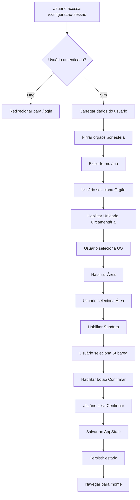
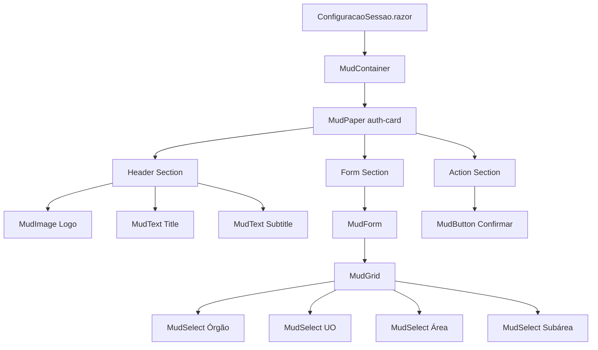
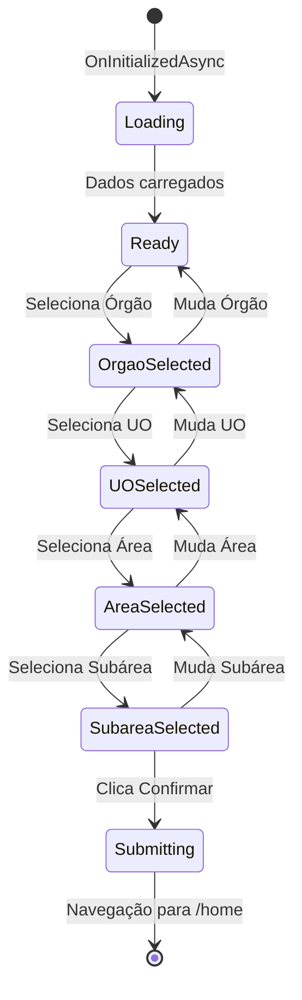

# Documento de Design

## Introdução

Este documento especifica o design técnico para a refatoração da interface de usuário da tela de Configuração de Sessão (ConfiguracaoSessao.razor). O objetivo é modernizar a UI seguindo o design system estabelecido, remover código redundante, melhorar a acessibilidade e garantir consistência visual com as demais telas do aplicativo.

## Visão Geral

A refatoração transformará a tela ConfiguracaoSessao.razor de uma implementação com estilos inline e CSS redundante para uma implementação limpa que utiliza o design system existente (theme.css, components.css, app.css) e segue os padrões estabelecidos em Login.razor e Home.razor.

### Objetivos Principais

1. Remover todos os estilos CSS inline e substituir por classes do design system
2. Padronizar componentes MudBlazor com configurações consistentes
3. Melhorar feedback visual de estados (disabled, focus, hover)
4. Corrigir hierarquia visual e espaçamento usando o sistema de spacing
5. Garantir responsividade mobile-first
6. Melhorar acessibilidade (WCAG AA)
7. Adicionar estados de carregamento apropriados

## Arquitetura

### Estrutura de Componentes

```
ConfiguracaoSessao.razor
├── MudContainer (MaxWidth.Small)
│   └── MudPaper (auth-card style)
│       ├── Header Section
│       │   ├── Logo (MudImage)
│       │   ├── Title (MudText)
│       │   └── Subtitle (MudText)
│       ├── Form Section (MudForm)
│       │   └── MudGrid
│       │       ├── MudSelect (Órgão)
│       │       ├── MudSelect (Unidade Orçamentária)
│       │       ├── MudSelect (Área)
│       │       └── MudSelect (Subárea)
│       └── Action Section
│           └── MudButton (Confirmar)
```

### Padrão de Design Aplicado

O design seguirá o padrão "auth-card" estabelecido em Login.razor:
- Container centralizado com MaxWidth.Small
- Card com elevação mínima e bordas arredondadas
- Espaçamento consistente usando variáveis CSS do theme.css
- Tipografia padronizada com MudText
- Inputs com Variant.Outlined e Margin.Dense

## Componentes e Interfaces

### 1. Container Principal

**Componente:** `MudContainer`

**Propriedades:**
- `MaxWidth="MaxWidth.Small"` - Largura máxima para mobile-first
- `Class="auth-container"` - Classe do design system

**CSS Aplicado (theme.css):**
```css
.auth-container {
    min-height: 100vh;
    display: flex;
    align-items: center;
    justify-content: center;
    padding: var(--spacing-lg);
    padding-bottom: calc(var(--spacing-xl) + env(safe-area-inset-bottom));
}
```

### 2. Card Principal

**Componente:** `MudPaper`

**Propriedades:**
- `Class="auth-card"` - Reutiliza estilo de Login.razor
- `Elevation="0"` - Sem sombra (borda define o card)

**CSS Aplicado (app.css):**
```css
.auth-card {
    background: var(--surface-color);
    border: 1px solid var(--divider-color);
    border-radius: var(--radius-lg);
    padding: var(--spacing-xl);
    box-shadow: var(--shadow-sm);
    width: 100%;
}
```

### 3. Header Section

**Logo:**
- `MudImage` com src="images/aspec_logo.png"
- Classe: `app-logo` (centralizado, margin-bottom)
- Dimensões: 64x64px, border-radius 12px

**Título:**
- `MudText Typo="Typo.h5"` 
- Classe: `app-title`
- Texto: "Configuração da Sessão"

**Subtítulo:**
- `MudText Typo="Typo.body2"`
- Classe: `app-subtitle`
- Texto: "Selecione as informações contábeis para iniciar o trabalho."

### 4. Form Section

**Componente:** `MudForm`

**Grid Layout:**
- `MudGrid Spacing="3"` - Espaçamento consistente entre campos
- Cada campo em `MudItem xs="12"` - Full width em mobile

**MudSelect Padrão:**

Configuração padronizada para todos os 4 selects:

```razor
<MudSelect T="[Type]" 
           Label="[Label]" 
           @bind-Value="[Property]"
           Variant="Variant.Outlined" 
           Margin="Margin.Dense"
           FullWidth="true"
           Disabled="@[Condition]"
           Class="form-select">
    @foreach (var item in [Collection])
    {
        <MudSelectItem Value="@item">@item.[DisplayProperty]</MudSelectItem>
    }
</MudSelect>
```

**Propriedades Removidas:**
- `AnchorOrigin` - Usar comportamento padrão do MudBlazor
- `TransformOrigin` - Usar comportamento padrão do MudBlazor
- Estilos inline - Substituídos por classes CSS

**Estados:**
- **Normal:** Border cinza (#CBD5E1), background branco
- **Hover:** Border cinza escuro (#94A3B8)
- **Focus:** Border primary color, shadow sutil
- **Disabled:** Background cinza claro, opacity reduzida, cursor not-allowed

### 5. Action Button

**Componente:** `MudButton`

**Propriedades:**
- `Variant="Variant.Filled"`
- `Color="Color.Primary"`
- `Size="Size.Large"`
- `FullWidth="true"`
- `Disabled="@(SelectedSubarea == null || isLoading)"`
- `Class="btn-primary-action"`

**CSS Aplicado:**
```css
.btn-primary-action {
    margin-top: var(--spacing-lg);
    min-height: var(--touch-target-min);
    border-radius: var(--radius-lg);
    font-weight: var(--font-weight-medium);
    text-transform: none;
}
```

### 6. Loading State

**Componente:** `MudProgressCircular`

Exibido durante:
- Inicialização do componente (carregamento de dados)
- Submissão do formulário (confirmação da sessão)

**Implementação:**
```razor
@if (isLoading)
{
    <div class="loading-overlay">
        <MudProgressCircular Color="Color.Primary" Indeterminate="true" Size="Size.Large" />
    </div>
}
```

## Modelos de Dados

Não há alterações nos modelos de dados. A refatoração é puramente de UI/UX.

**Modelos Utilizados:**
- `Orgao` - Órgão selecionado
- `UnidadeOrcamentaria` - Unidade Orçamentária selecionada
- `Area` - Área selecionada
- `Subarea` - Subárea selecionada
- `Usuario` - Usuário autenticado
- `AppState` - Estado global da aplicação

## Correctness Properties

*A property is a characteristic or behavior that should hold true across all valid executions of a system-essentially, a formal statement about what the system should do. Properties serve as the bridge between human-readable specifications and machine-verifiable correctness guarantees.*


### Property Reflection

Após análise do prework, identifiquei as seguintes propriedades testáveis e suas relações:

**Propriedades de Consistência de Componentes:**
- 2.1: MudSelect com Variant/Margin consistentes (property)
- 2.3: MudSelect com FullWidth (property)
- 5.1: MudText com Typo consistente (property)
- 9.1: Form fields com labels (property)

Estas propriedades são independentes e testam aspectos diferentes, portanto todas devem ser mantidas.

**Propriedades de Acessibilidade:**
- 9.2: Navegação por teclado (property)
- 9.3: ARIA labels (property)
- 9.4: Visibilidade de foco (property)
- 9.5: Contraste de cores WCAG AA (property)

Estas propriedades cobrem aspectos diferentes de acessibilidade e devem ser mantidas separadamente.

**Propriedades de Responsividade:**
- 6.1: Display correto em 320px-1920px (property)
- 6.3: Touch targets >= 44px (property)

Estas são independentes - uma testa layout geral, outra testa tamanho de elementos interativos.

**Redundâncias Identificadas:**
- 3.4 (disabled state consistente) é coberta por 2.1 (MudSelect consistente) quando aplicamos a mesma configuração a todos os selects
- Múltiplos critérios "example" sobre remoção de propriedades específicas (11.2, 2.2) podem ser combinados em uma única verificação de "propriedades desnecessárias removidas"

**Propriedades Finais (após eliminação de redundâncias):**
1. Consistência de configuração MudSelect (combina 2.1, 2.3, 3.4)
2. Consistência de tipografia MudText (5.1)
3. Associação de labels em form fields (9.1)
4. Navegação por teclado completa (9.2)
5. ARIA labels apropriados (9.3)
6. Visibilidade de foco (9.4)
7. Contraste de cores WCAG AA (9.5)
8. Responsividade em múltiplos tamanhos de tela (6.1)
9. Touch targets mínimos (6.3)

### Correctness Properties

### Property 1: MudSelect Configuration Consistency

*For any* MudSelect component in ConfiguracaoSessao, it should have Variant="Variant.Outlined", Margin="Margin.Dense", and FullWidth="true", ensuring consistent appearance and behavior across all dropdown fields.

**Validates: Requirements 2.1, 2.3, 3.4**

### Property 2: Typography Consistency

*For any* MudText component used for headings or labels in ConfiguracaoSessao, it should use consistent Typo property values that match the typography hierarchy defined in the design system (h5 for titles, body2 for subtitles).

**Validates: Requirements 5.1**

### Property 3: Form Field Label Association

*For any* form input component (MudSelect, MudTextField, etc.) in ConfiguracaoSessao, it should have an associated label either through the Label property or aria-label attribute, ensuring screen reader accessibility.

**Validates: Requirements 9.1**

### Property 4: Keyboard Navigation Support

*For any* interactive element in ConfiguracaoSessao (buttons, selects, links), it should be reachable via Tab key navigation and respond appropriately to keyboard events (Enter, Space, Arrow keys), ensuring full keyboard accessibility.

**Validates: Requirements 9.2**

### Property 5: ARIA Labels Presence

*For any* interactive element that lacks visible text or has ambiguous purpose in ConfiguracaoSessao, it should have appropriate ARIA attributes (aria-label, aria-describedby, role) to provide context for screen readers.

**Validates: Requirements 9.3**

### Property 6: Focus Visibility

*For any* interactive element in ConfiguracaoSessao, when it receives keyboard focus, it should display a visible focus indicator (outline or border) that meets WCAG visibility requirements.

**Validates: Requirements 9.4**

### Property 7: Color Contrast Compliance

*For any* text element in ConfiguracaoSessao, the contrast ratio between text color and background color should be at least 4.5:1 for normal text and 3:1 for large text, meeting WCAG AA standards.

**Validates: Requirements 9.5**

### Property 8: Responsive Layout Integrity

*For any* viewport width between 320px and 1920px, ConfiguracaoSessao should render without horizontal scrolling, with all content visible and properly laid out, ensuring responsive design across all device sizes.

**Validates: Requirements 6.1**

### Property 9: Touch Target Minimum Size

*For any* interactive element (buttons, select fields, links) in ConfiguracaoSessao, it should have a minimum touch target size of 44x44 pixels, ensuring comfortable touch interaction on mobile devices.

**Validates: Requirements 6.3**

## Tratamento de Erros

### Cenários de Erro

1. **Usuário não autenticado**
   - Detecção: `_usuario == null` em `OnInitializedAsync`
   - Tratamento: Redirecionamento para `/login`
   - Feedback: Navegação automática sem mensagem (usuário não deveria estar na página)

2. **Esfera não configurada**
   - Detecção: `string.IsNullOrEmpty(appState.EsferaAtual)`
   - Tratamento: Usar esfera do usuário como fallback
   - Feedback: Silencioso (correção automática)

3. **Nenhum órgão disponível**
   - Detecção: `Orgaos.Count == 0`
   - Tratamento: Exibir mensagem informativa
   - Feedback: MudAlert com mensagem "Nenhum órgão disponível para sua esfera"

4. **Erro ao salvar sessão**
   - Detecção: Exception em `appState.SaveStateAsync()`
   - Tratamento: Capturar exceção, exibir mensagem de erro
   - Feedback: MudSnackbar com mensagem de erro e opção de tentar novamente

### Estados de Carregamento

1. **Inicialização**
   - Indicador: `MudProgressCircular` centralizado
   - Duração: Até `OnInitializedAsync` completar
   - Comportamento: Form desabilitado durante carregamento

2. **Submissão**
   - Indicador: Botão com spinner e texto "Confirmando..."
   - Duração: Até `ConfirmarSessao` completar
   - Comportamento: Form desabilitado, botão com loading state

### Validação

1. **Validação de Cascata**
   - Órgão selecionado → Habilita Unidade Orçamentária
   - UO selecionada → Habilita Área
   - Área selecionada → Habilita Subárea
   - Subárea selecionada → Habilita botão Confirmar

2. **Reset de Seleções**
   - Ao mudar Órgão → Reset UO, Área, Subárea
   - Ao mudar UO → Reset Área, Subárea
   - Ao mudar Área → Reset Subárea

## Estratégia de Testes

### Abordagem Dual de Testes

A estratégia de testes combina testes unitários e testes baseados em propriedades para garantir cobertura abrangente:

**Testes Unitários:**
- Exemplos específicos de configuração de componentes
- Casos extremos (edge cases) de estados visuais
- Integração entre componentes
- Condições de erro específicas

**Testes Baseados em Propriedades:**
- Propriedades universais que devem valer para todos os inputs
- Cobertura abrangente através de randomização
- Validação de invariantes do sistema

### Configuração de Testes Baseados em Propriedades

**Biblioteca:** Para C#/Blazor, utilizaremos **FsCheck** ou **CsCheck** para property-based testing.

**Configuração:**
- Mínimo de 100 iterações por teste de propriedade
- Cada teste deve referenciar a propriedade do documento de design
- Formato de tag: `// Feature: configuracao-sessao-ui-refactor, Property {number}: {property_text}`

### Testes Unitários

#### 1. Testes de Configuração de Componentes

```csharp
[Fact]
public void ConfiguracaoSessao_Should_RemoveInlineStyles()
{
    // Verifica que não há atributos style no markup
    // Validates: Requirements 1.1
}

[Fact]
public void ConfiguracaoSessao_Should_UseDesignSystemClasses()
{
    // Verifica que classes usadas existem em theme.css, components.css, app.css
    // Validates: Requirements 1.2
}

[Fact]
public void ConfiguracaoSessao_Should_RemoveAnchorOriginProperties()
{
    // Verifica que MudSelect não tem AnchorOrigin ou TransformOrigin
    // Validates: Requirements 2.2, 11.2
}

[Fact]
public void ConfiguracaoSessao_Should_UseAuthCardClass()
{
    // Verifica que MudPaper usa class="auth-card"
    // Validates: Requirements 12.2
}
```

#### 2. Testes de Estados Visuais (Edge Cases)

```csharp
[Fact]
public void MudSelect_WhenDisabled_Should_ShowVisualIndicator()
{
    // Verifica que CSS para disabled state está aplicado
    // Validates: Requirements 3.1
}

[Fact]
public void MudSelect_WhenFocused_Should_ShowFocusRing()
{
    // Verifica que CSS para focus state está aplicado
    // Validates: Requirements 3.2
}

[Fact]
public void MudButton_WhenDisabled_Should_ShowDisabledState()
{
    // Verifica que botão desabilitado tem visual apropriado
    // Validates: Requirements 7.3
}
```

#### 3. Testes de Carregamento

```csharp
[Fact]
public async Task ConfiguracaoSessao_WhenInitializing_Should_ShowLoadingIndicator()
{
    // Verifica que MudProgressCircular é exibido durante inicialização
    // Validates: Requirements 10.1
}

[Fact]
public async Task ConfiguracaoSessao_WhenLoading_Should_DisableFormInteractions()
{
    // Verifica que form fields são desabilitados quando isLoading=true
    // Validates: Requirements 10.2
}
```

#### 4. Testes de Responsividade

```csharp
[Theory]
[InlineData(320)]
[InlineData(375)]
[InlineData(768)]
[InlineData(1024)]
[InlineData(1920)]
public void ConfiguracaoSessao_Should_RenderProperlyAtWidth(int width)
{
    // Verifica que layout funciona em diferentes larguras
    // Validates: Requirements 6.1
}

[Fact]
public void ConfiguracaoSessao_Should_UseSafeAreaInsets()
{
    // Verifica que padding usa env(safe-area-inset-*)
    // Validates: Requirements 6.4
}
```

### Testes Baseados em Propriedades

#### 1. Property Test: MudSelect Configuration Consistency

```csharp
[Property(Arbitrary = new[] { typeof(Generators) })]
public Property AllMudSelects_Should_HaveConsistentConfiguration()
{
    // Feature: configuracao-sessao-ui-refactor, Property 1: MudSelect Configuration Consistency
    
    return Prop.ForAll<List<MudSelectConfig>>(selects =>
    {
        // Para qualquer lista de MudSelects no componente
        return selects.All(s => 
            s.Variant == Variant.Outlined &&
            s.Margin == Margin.Dense &&
            s.FullWidth == true
        );
    });
}
```

#### 2. Property Test: Typography Consistency

```csharp
[Property]
public Property AllMudTextHeadings_Should_UseConsistentTypo()
{
    // Feature: configuracao-sessao-ui-refactor, Property 2: Typography Consistency
    
    return Prop.ForAll<List<MudTextConfig>>(texts =>
    {
        var headings = texts.Where(t => t.IsHeading);
        var subtitles = texts.Where(t => t.IsSubtitle);
        
        return headings.All(h => h.Typo == Typo.h5) &&
               subtitles.All(s => s.Typo == Typo.body2);
    });
}
```

#### 3. Property Test: Form Field Label Association

```csharp
[Property]
public Property AllFormFields_Should_HaveLabels()
{
    // Feature: configuracao-sessao-ui-refactor, Property 3: Form Field Label Association
    
    return Prop.ForAll<List<FormFieldConfig>>(fields =>
    {
        return fields.All(f => 
            !string.IsNullOrEmpty(f.Label) || 
            !string.IsNullOrEmpty(f.AriaLabel)
        );
    });
}
```

#### 4. Property Test: Keyboard Navigation Support

```csharp
[Property]
public Property AllInteractiveElements_Should_BeKeyboardAccessible()
{
    // Feature: configuracao-sessao-ui-refactor, Property 4: Keyboard Navigation Support
    
    return Prop.ForAll<List<InteractiveElement>>(elements =>
    {
        return elements.All(e => 
            e.TabIndex >= 0 &&
            e.RespondsToKeyboard
        );
    });
}
```

#### 5. Property Test: ARIA Labels Presence

```csharp
[Property]
public Property AllAmbiguousElements_Should_HaveAriaLabels()
{
    // Feature: configuracao-sessao-ui-refactor, Property 5: ARIA Labels Presence
    
    return Prop.ForAll<List<InteractiveElement>>(elements =>
    {
        var ambiguous = elements.Where(e => e.LacksVisibleText);
        return ambiguous.All(e => !string.IsNullOrEmpty(e.AriaLabel));
    });
}
```

#### 6. Property Test: Focus Visibility

```csharp
[Property]
public Property AllInteractiveElements_Should_ShowFocusIndicator()
{
    // Feature: configuracao-sessao-ui-refactor, Property 6: Focus Visibility
    
    return Prop.ForAll<List<InteractiveElement>>(elements =>
    {
        return elements.All(e => 
            e.HasFocusStyle &&
            e.FocusOutlineWidth >= 2
        );
    });
}
```

#### 7. Property Test: Color Contrast Compliance

```csharp
[Property]
public Property AllTextElements_Should_MeetContrastRatio()
{
    // Feature: configuracao-sessao-ui-refactor, Property 7: Color Contrast Compliance
    
    return Prop.ForAll<List<TextElement>>(texts =>
    {
        return texts.All(t =>
        {
            var ratio = CalculateContrastRatio(t.Color, t.BackgroundColor);
            var minRatio = t.IsLargeText ? 3.0 : 4.5;
            return ratio >= minRatio;
        });
    });
}
```

#### 8. Property Test: Responsive Layout Integrity

```csharp
[Property]
public Property Layout_Should_WorkAtAllViewportWidths()
{
    // Feature: configuracao-sessao-ui-refactor, Property 8: Responsive Layout Integrity
    
    return Prop.ForAll(
        Gen.Choose(320, 1920),
        width =>
        {
            var layout = RenderAtWidth(width);
            return !layout.HasHorizontalScroll &&
                   layout.AllContentVisible;
        }
    );
}
```

#### 9. Property Test: Touch Target Minimum Size

```csharp
[Property]
public Property AllInteractiveElements_Should_MeetMinimumTouchSize()
{
    // Feature: configuracao-sessao-ui-refactor, Property 9: Touch Target Minimum Size
    
    return Prop.ForAll<List<InteractiveElement>>(elements =>
    {
        return elements.All(e => 
            e.Width >= 44 && 
            e.Height >= 44
        );
    });
}
```

### Cobertura de Testes

**Testes Unitários:**
- Configuração de componentes específicos
- Estados visuais (disabled, focus, hover)
- Carregamento e inicialização
- Responsividade em breakpoints específicos
- Uso de classes CSS do design system

**Testes de Propriedades:**
- Consistência de configuração em todos os componentes
- Acessibilidade universal (labels, ARIA, keyboard, focus)
- Contraste de cores em todos os elementos de texto
- Responsividade em toda a faixa de larguras
- Touch targets em todos os elementos interativos

### Ferramentas de Teste

1. **bUnit** - Framework de testes para componentes Blazor
2. **FsCheck** ou **CsCheck** - Property-based testing para C#
3. **Playwright** ou **Selenium** - Testes E2E para validação visual
4. **axe-core** - Validação automática de acessibilidade

## Diagramas

### Fluxo de Interação do Usuário



### Hierarquia de Componentes



### Estados do Formulário



## Considerações de Implementação

### Ordem de Implementação

1. **Fase 1: Limpeza de CSS**
   - Remover estilos inline
   - Remover CSS redundante do bloco `<style>`
   - Identificar classes do design system a serem usadas

2. **Fase 2: Padronização de Componentes**
   - Atualizar MudSelect com configuração padrão
   - Atualizar MudText com Typo consistente
   - Atualizar MudButton com estilo padrão
   - Adicionar classes CSS do design system

3. **Fase 3: Estrutura e Layout**
   - Adicionar header section com logo
   - Ajustar espaçamento usando MudGrid
   - Aplicar auth-card class ao MudPaper

4. **Fase 4: Estados e Feedback**
   - Adicionar loading state
   - Melhorar estados disabled/focus/hover
   - Adicionar feedback visual de erro

5. **Fase 5: Acessibilidade**
   - Verificar labels e ARIA attributes
   - Testar navegação por teclado
   - Validar contraste de cores

6. **Fase 6: Responsividade**
   - Testar em múltiplos tamanhos de tela
   - Ajustar padding para mobile
   - Verificar touch targets

### Compatibilidade

**Navegadores Suportados:**
- Chrome/Edge 90+
- Firefox 88+
- Safari 14+
- Mobile Safari (iOS 14+)
- Chrome Mobile (Android 10+)

**Dispositivos:**
- Desktop (1024px+)
- Tablet (768px - 1023px)
- Mobile (320px - 767px)

### Performance

**Otimizações:**
- Usar CSS do design system (já carregado) em vez de estilos inline
- Minimizar re-renders com `StateHasChanged()` apropriado
- Lazy loading de dados (já implementado)

**Métricas Alvo:**
- First Contentful Paint: < 1.5s
- Time to Interactive: < 3s
- Cumulative Layout Shift: < 0.1

### Acessibilidade

**Conformidade WCAG 2.1 Level AA:**
- ✅ Contraste de cores 4.5:1 mínimo
- ✅ Touch targets 44x44px mínimo
- ✅ Navegação por teclado completa
- ✅ Labels e ARIA attributes apropriados
- ✅ Focus indicators visíveis
- ✅ Suporte a leitores de tela

## Referências

### Design System
- `wwwroot/css/theme.css` - Variáveis de tema e cores
- `wwwroot/css/components.css` - Estilos de componentes base
- `wwwroot/css/app.css` - Estilos globais e overrides

### Componentes de Referência
- `Pages/Login.razor` - Padrão auth-card
- `Pages/Home.razor` - Padrão minimal-card e layout
- `Layouts/AuthMinimalLayout.razor` - Layout usado

### Bibliotecas
- **MudBlazor** - https://mudblazor.com/
- **bUnit** - https://bunit.dev/
- **FsCheck** - https://fscheck.github.io/FsCheck/
- **CsCheck** - https://github.com/AnthonyLloyd/CsCheck

### Padrões de Acessibilidade
- **WCAG 2.1** - https://www.w3.org/WAI/WCAG21/quickref/
- **ARIA Authoring Practices** - https://www.w3.org/WAI/ARIA/apg/

## Conclusão

Este design fornece uma refatoração completa da UI de ConfiguracaoSessao.razor, alinhando-a com o design system estabelecido, melhorando acessibilidade, responsividade e manutenibilidade. A implementação seguirá os padrões já estabelecidos em Login.razor e Home.razor, garantindo consistência visual e de código em todo o aplicativo.

A estratégia de testes dual (unitários + property-based) garante cobertura abrangente tanto de casos específicos quanto de propriedades universais, validando que a refatoração mantém a funcionalidade enquanto melhora a qualidade do código.
