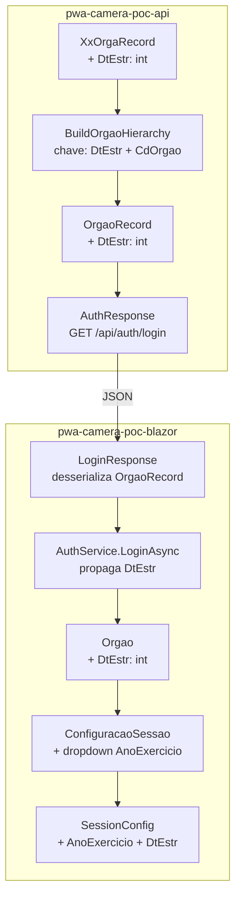
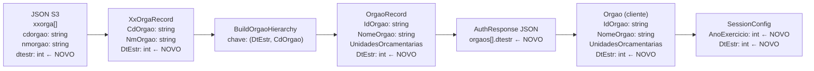

# Documento de Design Técnico

## Feature: orgao-exercicio-refactoring

---

## Visão Geral

Esta refatoração introduz o campo `dtestr` (data de início do exercício fiscal, formato YYYYMMDD) no modelo de órgãos do sistema de inventário patrimonial. O problema central é que o mesmo `cdorgao` pode aparecer em múltiplos exercícios fiscais com nomes distintos, tornando a chave simples `cdorgao` ambígua. A solução adota a chave composta `(dtestr, cdorgao)` na API e propaga o conceito de **Ano de Exercício** até o formulário de sessão do cliente Blazor, onde passa a ser o primeiro nível de seleção.

A abordagem segue princípios de refatoração limpa: mudanças incrementais, sem quebra de comportamento externo, e funções com responsabilidade única.

---

## Arquitetura

O sistema é composto por dois projetos independentes que se comunicam via HTTP/JSON:



O fluxo de dados é unidirecional: o campo `dtestr` nasce no JSON do S3, é lido pela API, propagado no `OrgaoRecord`, desserializado pelo cliente e finalmente persistido no `SessionConfig` após a confirmação do usuário.

---

## Componentes e Interfaces

### API — `XxOrgaRecord` (ApiModels.cs)

Adição do campo `DtEstr` ao record posicional existente:

```csharp
public record XxOrgaRecord(
    [property: JsonPropertyName("cdorgao")] string CdOrgao,
    [property: JsonPropertyName("nmorgao")] string NmOrgao,
    [property: JsonPropertyName("dtestr")]  int DtEstr   // NOVO
);
```

O valor padrão `0` é garantido pela ausência do campo no JSON (o desserializador System.Text.Json atribui `0` para `int` quando a propriedade está ausente).

### API — `OrgaoRecord` (ApiModels.cs)

Adição do campo `DtEstr` ao record posicional existente:

```csharp
public record OrgaoRecord(
    string IdOrgao,
    string NomeOrgao,
    List<UnidadeOrcamentariaRecord> UnidadesOrcamentarias,
    int DtEstr   // NOVO
);
```

### API — `BuildOrgaoHierarchy` (Program.cs)

A função passa a usar a chave composta `(DtEstr, CdOrgao)` para lookup e para identificar órgãos distintos. A lógica de iteração muda de:

```csharp
// ANTES: chave simples
var targetOrgaoCodes = esfera == "A"
    ? tabelas.XxOrga.Select(o => o.CdOrgao).Distinct()
    : filteredTombamento.Select(p => p.CdOrgao).Distinct();

foreach (var orgCode in targetOrgaoCodes)
{
    var orgInfo = tabelas.XxOrga.FirstOrDefault(o => o.CdOrgao == orgCode);
    ...
    orgaos.Add(new OrgaoRecord(orgCode, orgInfo.NmOrgao, uos));
}
```

Para:

```csharp
// DEPOIS: chave composta (DtEstr, CdOrgao)
var targetOrgaoKeys = esfera == "A"
    ? tabelas.XxOrga.Select(o => (o.DtEstr, o.CdOrgao)).Distinct()
    : filteredTombamento
        .Join(tabelas.XxOrga,
              t => t.CdOrgao,
              o => o.CdOrgao,
              (t, o) => (o.DtEstr, t.CdOrgao))
        .Distinct();

foreach (var (dtEstr, orgCode) in targetOrgaoKeys)
{
    var orgInfo = tabelas.XxOrga
        .FirstOrDefault(o => o.DtEstr == dtEstr && o.CdOrgao == orgCode);
    ...
    orgaos.Add(new OrgaoRecord(orgCode, orgInfo.NmOrgao, uos, dtEstr));
}
```

> Decisão de design: para esfera `"A"`, a chave composta é extraída diretamente de `XxOrga`. Para outras esferas, é necessário um `Join` com `XxOrga` para obter o `DtEstr` correspondente ao `CdOrgao` presente nos tombamentos filtrados.

### Cliente — `Orgao` (Models/Usuario.cs)

```csharp
public class Orgao
{
    public string IdOrgao { get; set; } = string.Empty;
    public string NomeOrgao { get; set; } = string.Empty;
    public List<UnidadeOrcamentaria> UnidadesOrcamentarias { get; set; } = new();
    public int DtEstr { get; set; } = 0;   // NOVO
}
```

### Cliente — `SessionConfig` (Models/SessionConfig.cs)

```csharp
public class SessionConfig
{
    // ... propriedades existentes mantidas sem alteração ...
    public int AnoExercicio { get; set; } = 0;   // NOVO — ex: 1997
    public int DtEstr { get; set; } = 0;          // NOVO — ex: 19970101
}
```

### Cliente — `AuthService.LoginAsync` (Services/Auth/AuthService.cs)

O mapeamento de `LoginResponse.Orgaos` para `user.Orgaos` já é feito por atribuição direta (`Orgaos = loginResponse.Orgaos ?? new()`). Como `LoginResponse.Orgaos` é `List<Orgao>` e `Orgao` agora inclui `DtEstr`, a propagação ocorre automaticamente sem alteração de código no `AuthService`, desde que a desserialização do JSON da API preencha o campo corretamente.

> Nota: verificar se `LoginResponse` usa `List<Orgao>` (modelo do cliente) ou um DTO intermediário. Conforme o código atual, `LoginResponse.Orgaos` é `List<Orgao>?`, portanto a desserialização do JSON da API diretamente para `Orgao` já propagará `DtEstr` sem código adicional.

### Cliente — `ConfiguracaoSessao.razor`

Adição do dropdown "Ano de Exercício" como primeiro campo do formulário, com lógica de extração, derivação e filtragem:

**Novos campos de estado:**
```csharp
private List<int> AnosExercicio = new();   // anos distintos derivados de DtEstr
private int? SelectedAnoExercicio;          // ano selecionado
```

**Extração dos anos disponíveis (em `OnInitializedAsync`):**
```csharp
AnosExercicio = _usuario.Orgaos
    .Select(o => o.DtEstr / 10000)
    .Distinct()
    .OrderByDescending(a => a)
    .ToList();
```

**Filtragem de órgãos pelo exercício selecionado:**
```csharp
private List<Orgao> OrgaosFiltrados =>
    SelectedAnoExercicio == null
        ? new()
        : _usuario?.Orgaos
            .Where(o => o.DtEstr / 10000 == SelectedAnoExercicio)
            .ToList() ?? new();
```

**Handler de mudança de exercício:**
```csharp
private void OnAnoExercicioChanged(int? value)
{
    SelectedAnoExercicio = value;
    SelectedOrgao = null;
    SelectedUO = null;
    SelectedArea = null;
    SelectedSubarea = null;
}
```

**Confirmação da sessão (atualização de `ConfirmarSessao`):**
```csharp
appState.SessionConfig = new SessionConfig
{
    // ... campos existentes ...
    AnoExercicio = SelectedOrgao!.DtEstr / 10000,
    DtEstr = SelectedOrgao!.DtEstr
};
```

---

## Modelos de Dados

### Diagrama de fluxo de dados



### Regra de derivação do AnoExercicio

```
AnoExercicio = DtEstr / 10000   (divisão inteira)
```

Exemplos:
| DtEstr   | AnoExercicio |
|----------|-------------|
| 19970101 | 1997        |
| 20030615 | 2003        |
| 0        | 0           |

### Compatibilidade retroativa

Quando `dtestr` está ausente no JSON, `DtEstr` assume `0` em todos os modelos. O sistema trata `DtEstr = 0` como um exercício válido (exercício "legado"), exibindo `0` como opção no dropdown de Ano de Exercício e permitindo a continuidade do fluxo sem exceções.

---

## Propriedades de Correção

*Uma propriedade é uma característica ou comportamento que deve ser verdadeiro em todas as execuções válidas de um sistema — essencialmente, uma declaração formal sobre o que o sistema deve fazer. Propriedades servem como ponte entre especificações legíveis por humanos e garantias de correção verificáveis por máquina.*

### Propriedade 1: Round-trip de desserialização do XxOrgaRecord

*Para qualquer* valor inteiro válido de `dtestr` presente em um objeto JSON de `xxorga`, desserializar o JSON para `XxOrgaRecord` e reserializar deve produzir um objeto com `DtEstr` equivalente ao valor original.

**Valida: Requisitos 1.1, 1.2, 10.1**

---

### Propriedade 2: Chave composta distingue órgãos por exercício

*Para quaisquer* dois registros em `xxorga` com o mesmo `CdOrgao` mas `DtEstr` distintos, a hierarquia produzida por `BuildOrgaoHierarchy` deve conter ambos como entradas separadas na lista de `OrgaoRecord`.

**Valida: Requisitos 2.1, 2.2**

---

### Propriedade 3: Filtragem por esfera é preservada

*Para qualquer* esfera diferente de `"A"` e qualquer conjunto de tombamentos filtrados, todos os `OrgaoRecord` retornados por `BuildOrgaoHierarchy` devem ter seu `IdOrgao` presente na lista de `CdOrgao` dos tombamentos filtrados.

**Valida: Requisito 2.3**

---

### Propriedade 4: Round-trip de OrgaoRecord preserva DtEstr

*Para qualquer* `OrgaoRecord` construído por `BuildOrgaoHierarchy` a partir de um `XxOrgaRecord` com `DtEstr` preenchido, o valor de `DtEstr` no `OrgaoRecord` deve ser igual ao `DtEstr` do `XxOrgaRecord` de origem.

**Valida: Requisitos 3.1, 3.2, 3.3, 10.2**

---

### Propriedade 5: Mapeamento AuthService preserva DtEstr no Orgao do cliente

*Para qualquer* resposta de login da API contendo `OrgaoRecord` com `DtEstr` preenchido, o `Orgao` resultante no cliente após o mapeamento pelo `AuthService` deve ter `DtEstr` igual ao valor recebido da API.

**Valida: Requisitos 4.2, 10.2**

---

### Propriedade 6: Extração de anos distintos é completa e sem duplicatas

*Para qualquer* lista de `Orgao` com valores de `DtEstr` variados, a lista de `AnosExercicio` extraída pela `ConfiguracaoSessao` deve conter exatamente os valores distintos de `DtEstr / 10000` presentes na lista de órgãos — nem mais, nem menos.

**Valida: Requisito 6.1**

---

### Propriedade 7: Derivação de AnoExercicio é correta para qualquer DtEstr

*Para qualquer* valor inteiro `DtEstr` no formato YYYYMMDD (incluindo `0`), o `AnoExercicio` derivado deve ser igual a `DtEstr / 10000` (divisão inteira).

**Valida: Requisito 6.2**

---

### Propriedade 8: Lista de anos está em ordem decrescente

*Para qualquer* lista de `Orgao` com `DtEstr` distintos, a lista de anos exibida pela `ConfiguracaoSessao` deve estar ordenada de forma que cada elemento seja maior ou igual ao próximo.

**Valida: Requisito 6.3**

---

### Propriedade 9: Filtragem de órgãos por exercício é precisa

*Para qualquer* `AnoExercicio` selecionado, todos os `Orgao` exibidos no dropdown de órgão devem satisfazer `DtEstr / 10000 == AnoExercicio`, e nenhum `Orgao` com `DtEstr / 10000 != AnoExercicio` deve aparecer na lista.

**Valida: Requisito 7.2**

---

### Propriedade 10: Mudança de exercício reseta campos dependentes

*Para qualquer* estado do formulário onde Órgão, UO, Área ou Subárea estejam selecionados, ao alterar o `AnoExercicio`, todos esses campos devem ser redefinidos para `null`.

**Valida: Requisito 7.3**

---

### Propriedade 11: Sem exercício selecionado, campos dependentes ficam desabilitados

*Para qualquer* estado do formulário onde `SelectedAnoExercicio` seja `null`, o dropdown de Órgão e o botão "Confirmar Seleção" devem estar desabilitados.

**Valida: Requisitos 7.4, 7.5**

---

### Propriedade 12: Confirmação da sessão preenche AnoExercicio e DtEstr corretamente

*Para qualquer* `Orgao` selecionado com `DtEstr` preenchido, ao confirmar a sessão, `SessionConfig.AnoExercicio` deve ser igual a `Orgao.DtEstr / 10000` e `SessionConfig.DtEstr` deve ser igual a `Orgao.DtEstr`, mantendo todos os demais campos existentes inalterados.

**Valida: Requisitos 8.1, 8.2, 8.3**

---

### Propriedade 13: Ausência de dtestr não causa exceção

*Para qualquer* JSON de entrada onde o campo `dtestr` esteja ausente em todas as entradas de `xxorga`, o fluxo completo de login e configuração de sessão deve ser concluído sem lançar exceções, com `DtEstr = 0` em todos os modelos.

**Valida: Requisitos 9.1, 9.2, 9.3**

---

### Propriedade 14: Round-trip de persistência do SessionConfig

*Para qualquer* `SessionConfig` com `AnoExercicio` e `DtEstr` preenchidos, serializar via `SaveStateAsync` e desserializar deve produzir um objeto com os mesmos valores de `AnoExercicio` e `DtEstr`.

**Valida: Requisito 10.3**

---

## Tratamento de Erros

| Situação | Comportamento esperado |
|---|---|
| `dtestr` ausente no JSON do S3 | `DtEstr = 0` por padrão; fluxo continua normalmente |
| `dtestr` com valor inválido (não-inteiro) | Falha silenciosa do desserializador → `DtEstr = 0`; nenhuma exceção propagada |
| Lista de órgãos vazia após login | `AnosExercicio` vazio; todos os dropdowns desabilitados; botão Confirmar desabilitado |
| `orgInfo` nulo no lookup por chave composta | `continue` (comportamento existente preservado) |
| `SelectedOrgao` nulo ao confirmar sessão | Botão Confirmar permanece desabilitado enquanto `SelectedSubarea == null` |

---

## Estratégia de Testes

### Abordagem dual

Os testes são divididos em duas categorias complementares:

- **Testes unitários**: verificam exemplos concretos, casos de borda e condições de erro
- **Testes de propriedade**: verificam propriedades universais sobre conjuntos de entradas geradas aleatoriamente

### Testes unitários (exemplos e casos de borda)

**API:**
- Desserializar JSON com `dtestr` presente → `XxOrgaRecord.DtEstr` correto
- Desserializar JSON sem `dtestr` → `XxOrgaRecord.DtEstr == 0`
- `BuildOrgaoHierarchy` com dois registros de mesmo `CdOrgao` e `DtEstr` distintos → dois `OrgaoRecord` na saída
- `BuildOrgaoHierarchy` com JSON legado (sem `dtestr`) → hierarquia construída normalmente

**Cliente:**
- `Orgao` com `DtEstr = 0` por padrão
- `SessionConfig` com `AnoExercicio = 0` e `DtEstr = 0` por padrão
- `ConfiguracaoSessao` com lista vazia de órgãos → `AnosExercicio` vazio
- `ConfiguracaoSessao` com `DtEstr = 0` em todos os órgãos → exibe `"0"` como único ano

### Testes de propriedade (property-based testing)

**Biblioteca recomendada:**
- API (.NET): [FsCheck](https://fscheck.github.io/FsCheck/) ou [CsCheck](https://github.com/AnthonyLloyd/CsCheck)
- Cliente (Blazor/.NET): [FsCheck](https://fscheck.github.io/FsCheck/)

**Configuração mínima:** 100 iterações por propriedade.

**Tag de referência:** `// Feature: orgao-exercicio-refactoring, Property {N}: {texto}`

Cada propriedade de correção listada na seção anterior deve ser implementada por um único teste de propriedade:

| Teste de Propriedade | Propriedade | Gerador |
|---|---|---|
| Round-trip XxOrgaRecord | Propriedade 1 | `int` arbitrário para `DtEstr`, string para `CdOrgao`/`NmOrgao` |
| Chave composta distingue órgãos | Propriedade 2 | Dois `XxOrgaRecord` com mesmo `CdOrgao`, `DtEstr` distintos |
| Filtragem por esfera preservada | Propriedade 3 | Esfera aleatória (não `"A"`), lista de tombamentos aleatória |
| Round-trip OrgaoRecord | Propriedade 4 | `XxOrgaRecord` com `DtEstr` arbitrário |
| Mapeamento AuthService | Propriedade 5 | Lista de `OrgaoRecord` com `DtEstr` arbitrários |
| Extração de anos distintos | Propriedade 6 | Lista de `Orgao` com `DtEstr` variados |
| Derivação AnoExercicio | Propriedade 7 | `int` positivo no formato YYYYMMDD |
| Ordem decrescente dos anos | Propriedade 8 | Lista de `Orgao` com `DtEstr` distintos |
| Filtragem por exercício | Propriedade 9 | `AnoExercicio` arbitrário, lista de `Orgao` mista |
| Reset em cascata | Propriedade 10 | Estado de formulário com seleções arbitrárias |
| Campos desabilitados sem exercício | Propriedade 11 | Estado inicial do formulário |
| Confirmação da sessão | Propriedade 12 | `Orgao` com `DtEstr` arbitrário e hierarquia completa |
| Ausência de dtestr sem exceção | Propriedade 13 | JSON sem campo `dtestr` |
| Round-trip SessionConfig | Propriedade 14 | `SessionConfig` com `AnoExercicio` e `DtEstr` arbitrários |
