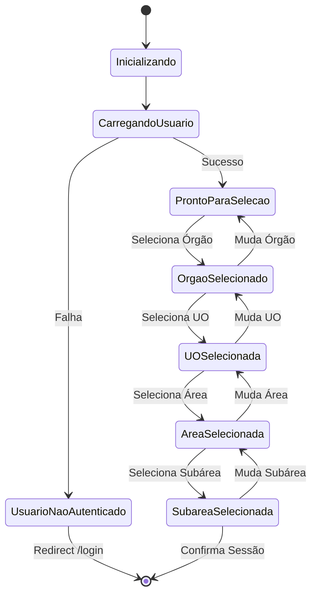

# Documento de Design: Refatoração de Busca de Órgãos por IdOrgao

## Overview

Esta refatoração simplifica a interface e lógica de seleção de sessão no componente `ConfiguracaoSessao.razor`, removendo a dependência do campo `DtEstr` (exercício fiscal) como critério de filtragem. O objetivo é tornar a experiência do usuário mais direta, eliminando a necessidade de selecionar primeiro o "Ano de Exercício" antes de escolher o órgão.

A mudança principal é a transição de uma hierarquia de seleção em 5 níveis (Ano → Órgão → UO → Área → Subárea) para uma hierarquia de 4 níveis (Órgão → UO → Área → Subárea), onde o órgão é filtrado apenas por esfera de acesso do usuário.

### Contexto

A spec anterior `orgao-exercicio-refactoring` introduziu o conceito de exercício fiscal como primeiro nível de seleção, criando uma chave composta `(DtEstr, cdorgao)` para identificar órgãos. Esta abordagem aumentou a complexidade da interface e da lógica de negócio. A presente refatoração reverte essa decisão, retornando a uma abordagem mais simples onde `IdOrgao` é suficiente como identificador único.

### Objetivos

1. Remover o dropdown "Ano de Exercício" da interface
2. Simplificar a lógica de filtragem de órgãos (apenas por esfera)
3. Reduzir a complexidade do estado do componente
4. Manter compatibilidade com dados legados que possuem `DtEstr` preenchido
5. Preservar a filtragem por esfera para controle de acesso

## Architecture

### Componente Afetado

**ConfiguracaoSessao.razor**
- Localização: `pwa-camera-poc-blazor/Pages/ConfiguracaoSessao.razor`
- Tipo: Blazor Page Component
- Responsabilidade: Gerenciar a seleção hierárquica de sessão (Órgão → UO → Área → Subárea)

### Fluxo de Dados Simplificado

```
Usuario (AuthService)
    ↓
AppState.EsferaAtual
    ↓
Filtro por Esfera → Lista de Órgãos
    ↓
Seleção de Órgão → Lista de UOs
    ↓
Seleção de UO → Lista de Áreas
    ↓
Seleção de Área → Lista de Subáreas
    ↓
Seleção de Subárea → Confirmação
    ↓
AppState + SessionConfig (persistência)
```

### Diagrama de Estados do Componente



## Components and Interfaces

### ConfiguracaoSessao.razor

#### Propriedades de Estado (Antes da Refatoração)

```csharp
private Usuario? _usuario;
private List<int> AnosExercicio;           // REMOVER
private int? SelectedAnoExercicio;         // REMOVER
private Orgao? SelectedOrgao;
private UnidadeOrcamentaria? SelectedUO;
private Area? SelectedArea;
private Subarea? SelectedSubarea;
```

#### Propriedades de Estado (Depois da Refatoração)

```csharp
private Usuario? _usuario;
private Orgao? SelectedOrgao;
private UnidadeOrcamentaria? SelectedUO;
private Area? SelectedArea;
private Subarea? SelectedSubarea;
```

#### Propriedades Computadas (Antes da Refatoração)

```csharp
private List<Orgao> OrgaosFiltrados =>
    SelectedAnoExercicio == null
        ? new()
        : _usuario?.Orgaos
            .Where(o => o.DtEstr / 10000 == SelectedAnoExercicio)
            .ToList() ?? new();
```

#### Propriedades Computadas (Depois da Refatoração)

```csharp
private List<Orgao> Orgaos
{
    get
    {
        if (_usuario == null) return new();
        var esfera = appState.EsferaAtual ?? _usuario.Esfera;
        
        // Sem esfera ou esfera "A" (All): retorna todos os órgãos
        if (string.IsNullOrEmpty(esfera) || esfera == "A")
            return _usuario.Orgaos;
        
        // Filtra por esfera (E = Executivo, L = Legislativo)
        return _usuario.Orgaos
            .Where(o => o.UnidadesOrcamentarias.Any(uo => 
                uo.Areas.Any(a => 
                    a.Subareas.Any(s => 
                        esfera == "E" 
                            ? s.NomeSubarea.Contains("Executivo", StringComparison.OrdinalIgnoreCase)
                            : esfera == "L" 
                                ? s.NomeSubarea.Contains("Legislativo", StringComparison.OrdinalIgnoreCase)
                                : false
                    )
                )
            ))
            .ToList();
    }
}
```

#### Event Handlers (Mudanças)

**Remover:**
```csharp
private void OnAnoExercicioChanged(int? value)
{
    SelectedAnoExercicio = value;
    SelectedOrgao = null;
    SelectedUO = null;
    SelectedArea = null;
    SelectedSubarea = null;
}
```

**Manter (sem alterações):**
```csharp
private void OnOrgaoChanged(Orgao value)
{
    SelectedOrgao = value;
    SelectedUO = null;
    SelectedArea = null;
    SelectedSubarea = null;
}

private void OnUOChanged(UnidadeOrcamentaria value)
{
    SelectedUO = value;
    SelectedArea = null;
    SelectedSubarea = null;
}

private void OnAreaChanged(Area value)
{
    SelectedArea = value;
    SelectedSubarea = null;
}

private void OnSubareaChanged(Subarea value)
{
    SelectedSubarea = value;
}
```

#### Método de Confirmação (Mudanças)

**Antes:**
```csharp
private async Task ConfirmarSessao()
{
    if (SelectedOrgao != null && SelectedUO != null && 
        SelectedArea != null && SelectedSubarea != null)
    {
        appState.CurrentOrgao = SelectedOrgao;
        appState.CurrentUO = SelectedUO;
        appState.CurrentArea = SelectedArea;
        appState.CurrentSubarea = SelectedSubarea;
        appState.DtEstr = SelectedOrgao.DtEstr;              // REMOVER
        appState.AnoExercicio = SelectedOrgao.DtEstr / 10000; // REMOVER
        
        await appState.SaveStateAsync();
        Navigation.NavigateTo("/home");
    }
}
```

**Depois:**
```csharp
private async Task ConfirmarSessao()
{
    if (SelectedOrgao != null && SelectedUO != null && 
        SelectedArea != null && SelectedSubarea != null)
    {
        appState.CurrentOrgao = SelectedOrgao;
        appState.CurrentUO = SelectedUO;
        appState.CurrentArea = SelectedArea;
        appState.CurrentSubarea = SelectedSubarea;
        // Não mais popula DtEstr e AnoExercicio
        
        await appState.SaveStateAsync();
        Navigation.NavigateTo("/home");
    }
}
```

#### Inicialização (Mudanças)

**Antes:**
```csharp
protected override async Task OnInitializedAsync()
{
    _usuario = await AuthService.GetCurrentUserAsync();
    if (_usuario == null)
    {
        Navigation.NavigateTo("/login");
        return;
    }

    if (string.IsNullOrEmpty(appState.EsferaAtual))
    {
        appState.EsferaAtual = _usuario.Esfera;
    }

    // REMOVER: Extração de anos de exercício
    AnosExercicio = _usuario.Orgaos
        .Select(o => o.DtEstr / 10000)
        .Distinct()
        .OrderByDescending(a => a)
        .ToList();

    StateHasChanged();
}
```

**Depois:**
```csharp
protected override async Task OnInitializedAsync()
{
    _usuario = await AuthService.GetCurrentUserAsync();
    if (_usuario == null)
    {
        Navigation.NavigateTo("/login");
        return;
    }

    if (string.IsNullOrEmpty(appState.EsferaAtual))
    {
        appState.EsferaAtual = _usuario.Esfera;
    }

    StateHasChanged();
}
```

### Mudanças na UI (Markup Razor)

**Remover:**
```razor
<MudItem xs="12">
    <MudSelect T="int?" 
               Label="Ano de Exercício" 
               Value="@SelectedAnoExercicio" 
               ValueChanged="OnAnoExercicioChanged"
               Variant="Variant.Outlined" 
               Margin="Margin.Dense"
               FullWidth="true">
        @foreach (var ano in AnosExercicio)
        {
            <MudSelectItem Value="@((int?)ano)">
                @(ano == 0 ? "Legado (sem exercício)" : ano.ToString())
            </MudSelectItem>
        }
    </MudSelect>
</MudItem>
```

**Modificar (remover condição de desabilitação):**
```razor
<!-- Antes -->
<MudSelect T="Orgao" 
           Label="Órgão" 
           Value="@SelectedOrgao" 
           ValueChanged="OnOrgaoChanged"
           Disabled="@(SelectedAnoExercicio == null)">
    @foreach (var orgao in OrgaosFiltrados)
    {
        <MudSelectItem Value="@orgao">@orgao.NomeOrgao</MudSelectItem>
    }
</MudSelect>

<!-- Depois -->
<MudSelect T="Orgao" 
           Label="Órgão" 
           Value="@SelectedOrgao" 
           ValueChanged="OnOrgaoChanged">
    @foreach (var orgao in Orgaos)
    {
        <MudSelectItem Value="@orgao">@orgao.NomeOrgao</MudSelectItem>
    }
</MudSelect>
```

**Modificar (condição do botão):**
```razor
<!-- Antes -->
<MudButton Disabled="@(SelectedSubarea == null || SelectedAnoExercicio == null)" 
           OnClick="ConfirmarSessao">
    Confirmar Seleção
</MudButton>

<!-- Depois -->
<MudButton Disabled="@(SelectedSubarea == null)" 
           OnClick="ConfirmarSessao">
    Confirmar Seleção
</MudButton>
```

## Data Models

### Orgao (Sem Alterações)

```csharp
public class Orgao
{
    public string IdOrgao { get; set; } = string.Empty;
    public string NomeOrgao { get; set; } = string.Empty;
    public List<UnidadeOrcamentaria> UnidadesOrcamentarias { get; set; } = new();
    public int DtEstr { get; set; } = 0;   // Mantido para compatibilidade, mas não usado na filtragem
}
```

### SessionConfig (Manter Campos Legados)

```csharp
public class SessionConfig
{
    public string Id { get; set; } = Guid.NewGuid().ToString();
    public string OrgaoId { get; set; } = string.Empty;
    public string OrgaoName { get; set; } = string.Empty;
    public string UnidadeId { get; set; } = string.Empty;
    public string UnidadeName { get; set; } = string.Empty;
    public string AreaId { get; set; } = string.Empty;
    public string AreaName { get; set; } = string.Empty;
    public string? SubareaId { get; set; }
    public string? SubareaName { get; set; }
    public DateTime CreatedAt { get; set; } = DateTime.UtcNow;
    public string UserId { get; set; } = string.Empty;
    
    // Campos legados - mantidos para compatibilidade, mas não populados
    public int AnoExercicio { get; set; } = 0;
    public int DtEstr { get; set; } = 0;
}
```

### AppState (Manter Campos Legados)

```csharp
public class AppState : INotifyPropertyChanged
{
    // ... outras propriedades ...
    
    // Campos legados - mantidos para compatibilidade, mas não populados
    public string? EsferaAtual { get; set; }
    public Orgao? CurrentOrgao { get; set; }
    public UnidadeOrcamentaria? CurrentUO { get; set; }
    public Area? CurrentArea { get; set; }
    public Subarea? CurrentSubarea { get; set; }
    public int AnoExercicio { get; set; } = 0;      // Não mais populado
    public int DtEstr { get; set; } = 0;            // Não mais populado
    
    // ... métodos ...
}
```

### Estratégia de Compatibilidade

Os campos `AnoExercicio` e `DtEstr` são mantidos nas classes `SessionConfig` e `AppState` para:
1. Evitar quebra de serialização/deserialização de dados existentes
2. Permitir rollback da refatoração se necessário
3. Manter compatibilidade com código que possa ler esses campos (mesmo que não sejam mais populados)

## Correctness Properties

*Uma propriedade é uma característica ou comportamento que deve ser verdadeiro em todas as execuções válidas de um sistema - essencialmente, uma declaração formal sobre o que o sistema deve fazer. As propriedades servem como ponte entre especificações legíveis por humanos e garantias de correção verificáveis por máquina.*


### Property 1: Sphere filtering applies to all users

*For any* authenticated user with a defined sphere (E or L), the Orgaos list should only contain organs that have at least one subarea matching that sphere (Executivo for E, Legislativo for L).

**Validates: Requirements 2.1, 2.4, 8.3, 8.4**

### Property 2: Sphere "A" shows all organs

*For any* authenticated user with sphere "A" or null, the Orgaos list should contain all organs from the user without any sphere filtering.

**Validates: Requirements 2.3, 8.2**

### Property 3: Dropdown cascade enables correctly

*For any* valid selection state, the UO dropdown should be enabled when Órgão is selected, the Área dropdown should be enabled when UO is selected, and the Subárea dropdown should be enabled when Área is selected.

**Validates: Requirements 4.2, 4.3, 4.4**

### Property 4: Confirm button requires all selections

*For any* combination of selections, the "Confirmar Seleção" button should only be enabled when all four fields (Órgão, UO, Área, Subárea) have non-null values.

**Validates: Requirements 4.5**

### Property 5: Legacy fields not populated on confirmation

*For any* session confirmation, the fields AnoExercicio and DtEstr should not be populated in either SessionConfig or AppState (should remain at default value 0).

**Validates: Requirements 5.1, 5.2, 5.3, 5.4**

### Property 6: Session fields correctly populated

*For any* valid session confirmation with selected Órgão, UO, Área, and Subárea, the AppState should be populated with the correct OrgaoId, OrgaoName, UnidadeId, UnidadeName, AreaId, AreaName, SubareaId, and SubareaName values matching the selected entities.

**Validates: Requirements 5.5**

### Property 7: All organs displayed regardless of DtEstr

*For any* set of organs with varying DtEstr values (including 0), all organs should appear in the Orgaos list (subject to sphere filtering).

**Validates: Requirements 6.1**

### Property 8: Selection resets dependent fields

*For any* selection change at a given level (Órgão, UO, or Área), all dependent fields at lower levels should be reset to null.

**Validates: Requirements 7.1, 7.2, 7.3**

### Property 9: UO sphere filtering matches organ filtering

*For any* selected Órgão and user sphere (E or L), the UnidadesOrcamentarias list should only contain UOs that have at least one subarea matching that sphere.

**Validates: Requirements 8.5**

## Error Handling

### Autenticação

**Cenário**: Usuário não autenticado tenta acessar a página
- **Comportamento**: Redirecionamento imediato para `/login`
- **Implementação**: Verificação em `OnInitializedAsync` com `AuthService.GetCurrentUserAsync()`

### Dados Ausentes

**Cenário**: Usuário autenticado sem órgãos
- **Comportamento**: Dropdown de Órgão vazio, mas sem erro
- **Implementação**: Lista vazia retornada pela propriedade `Orgaos`

**Cenário**: Órgão sem unidades orçamentárias
- **Comportamento**: Dropdown de UO vazio após seleção de órgão
- **Implementação**: Lista vazia retornada pela propriedade `UnidadesOrcamentarias`

### Valores Legados

**Cenário**: Órgão com `DtEstr = 0`
- **Comportamento**: Órgão exibido normalmente, sem exceções
- **Implementação**: Nenhuma operação de divisão ou comparação com `DtEstr`

**Cenário**: Múltiplos órgãos com mesmo `IdOrgao` mas diferentes `DtEstr`
- **Comportamento**: Todos os órgãos são exibidos no dropdown
- **Implementação**: Nenhuma deduplicação por `IdOrgao`

### Estado Inconsistente

**Cenário**: `appState.EsferaAtual` é null
- **Comportamento**: Usar `_usuario.Esfera` como fallback
- **Implementação**: Operador de coalescência nula na propriedade `Orgaos`

**Cenário**: Seleção parcial (ex: Órgão selecionado mas UO null)
- **Comportamento**: Botão "Confirmar Seleção" permanece desabilitado
- **Implementação**: Condição `Disabled="@(SelectedSubarea == null)"` no botão

## Testing Strategy

### Abordagem Dual de Testes

Esta refatoração requer uma combinação de testes unitários e testes baseados em propriedades:

- **Testes Unitários**: Verificam exemplos específicos, casos extremos e condições de erro
- **Testes de Propriedades**: Verificam propriedades universais através de múltiplas entradas geradas

Ambos são complementares e necessários para cobertura abrangente.

### Testes Unitários

Os testes unitários devem focar em:

1. **Exemplos Específicos**:
   - Usuário com esfera "A" vê todos os órgãos
   - Usuário não autenticado é redirecionado para /login
   - Dropdown de Órgão está habilitado após inicialização
   - UI não contém referências a "Ano de Exercício"

2. **Casos Extremos**:
   - Órgãos com `DtEstr = 0` são exibidos sem exceções
   - Múltiplos órgãos com mesmo `IdOrgao` são todos exibidos
   - Usuário sem órgãos resulta em lista vazia

3. **Integração entre Componentes**:
   - Interação entre ConfiguracaoSessao e AuthService
   - Persistência de estado via AppState.SaveStateAsync()
   - Navegação após confirmação de sessão

### Testes Baseados em Propriedades

**Framework Recomendado**: Para C# e Blazor, recomendamos usar **FsCheck** ou **CsCheck** como biblioteca de property-based testing.

**Configuração**:
- Mínimo de 100 iterações por teste de propriedade
- Cada teste deve referenciar a propriedade do documento de design
- Formato de tag: `// Feature: sessao-orgao-id-refactoring, Property {number}: {property_text}`

**Propriedades a Testar**:

1. **Property 1**: Sphere filtering applies to all users
   - Gerar usuários aleatórios com esferas E/L
   - Verificar que todos os órgãos retornados têm subareas correspondentes

2. **Property 2**: Sphere "A" shows all organs
   - Gerar usuários aleatórios com esfera "A"
   - Verificar que todos os órgãos do usuário são retornados

3. **Property 3**: Dropdown cascade enables correctly
   - Gerar estados de seleção aleatórios
   - Verificar que dropdowns são habilitados conforme a cascata

4. **Property 4**: Confirm button requires all selections
   - Gerar combinações aleatórias de seleções
   - Verificar que botão só está habilitado quando todos os campos estão preenchidos

5. **Property 5**: Legacy fields not populated on confirmation
   - Gerar seleções aleatórias válidas
   - Confirmar sessão e verificar que AnoExercicio e DtEstr permanecem 0

6. **Property 6**: Session fields correctly populated
   - Gerar seleções aleatórias válidas
   - Confirmar sessão e verificar que todos os campos são populados corretamente

7. **Property 7**: All organs displayed regardless of DtEstr
   - Gerar órgãos com valores aleatórios de DtEstr
   - Verificar que todos aparecem na lista (sujeito a filtragem por esfera)

8. **Property 8**: Selection resets dependent fields
   - Gerar mudanças aleatórias de seleção
   - Verificar que campos dependentes são resetados

9. **Property 9**: UO sphere filtering matches organ filtering
   - Gerar órgãos e UOs aleatórios
   - Verificar que filtragem por esfera é consistente

### Estratégia de Geração de Dados

Para testes baseados em propriedades, os geradores devem produzir:

**Usuários**:
- Esferas: "A", "E", "L", null
- Órgãos: 0 a 10 órgãos por usuário
- Cada órgão com 0 a 5 UOs
- Cada UO com 0 a 3 Áreas
- Cada Área com 1 a 5 Subáreas
- Nomes de subáreas incluindo "Executivo" e "Legislativo" aleatoriamente

**Órgãos**:
- IdOrgao: strings aleatórias
- NomeOrgao: strings aleatórias
- DtEstr: valores entre 0 e 20241231 (incluindo 0 para casos legados)

**Estados de Seleção**:
- Combinações válidas e inválidas de Órgão, UO, Área, Subárea
- Valores null e não-null

### Testes de Regressão

Após a refatoração, executar os seguintes testes de regressão:

1. **Fluxo Completo de Seleção**:
   - Autenticar usuário
   - Selecionar Órgão, UO, Área, Subárea
   - Confirmar sessão
   - Verificar navegação para /home
   - Verificar que AppState contém dados corretos

2. **Filtragem por Esfera**:
   - Testar com usuários de cada esfera (A, E, L)
   - Verificar que apenas órgãos/UOs apropriados são exibidos

3. **Compatibilidade com Dados Legados**:
   - Testar com órgãos que têm DtEstr = 0
   - Testar com órgãos que têm DtEstr preenchido
   - Verificar que ambos funcionam sem exceções

### Cobertura de Código

Objetivo de cobertura:
- **Linhas**: Mínimo 80%
- **Branches**: Mínimo 75%
- **Propriedades Computadas**: 100% (Orgaos, UnidadesOrcamentarias, Areas, Subareas)
- **Event Handlers**: 100% (OnOrgaoChanged, OnUOChanged, OnAreaChanged, OnSubareaChanged, ConfirmarSessao)

### Testes de UI (Blazor Component Testing)

Usar **bUnit** para testes de componentes Blazor:

1. **Renderização Inicial**:
   - Verificar que dropdown de Órgão está presente e habilitado
   - Verificar que dropdown de "Ano de Exercício" NÃO está presente
   - Verificar que outros dropdowns estão desabilitados

2. **Interações do Usuário**:
   - Simular seleção de Órgão → verificar que UO é habilitado
   - Simular seleção de UO → verificar que Área é habilitado
   - Simular seleção de Área → verificar que Subárea é habilitado
   - Simular seleção de Subárea → verificar que botão é habilitado

3. **Reset de Campos**:
   - Selecionar hierarquia completa
   - Mudar Órgão → verificar que UO, Área, Subárea são resetados
   - Mudar UO → verificar que Área, Subárea são resetados
   - Mudar Área → verificar que Subárea é resetado

### Exemplo de Teste de Propriedade (CsCheck)

```csharp
using CsCheck;
using Xunit;

public class ConfiguracaoSessaoPropertyTests
{
    // Feature: sessao-orgao-id-refactoring, Property 1: Sphere filtering applies to all users
    [Fact]
    public void Property_SphereFiltering_AppliesCorrectly()
    {
        Gen.Select(
            Gen.Const("E", "L"),
            UserGenerator.WithSphere()
        )
        .Sample((sphere, user) =>
        {
            // Arrange
            var appState = new AppState(mockLocalStorage);
            appState.EsferaAtual = sphere;
            var component = CreateComponent(user, appState);
            
            // Act
            var orgaos = component.Instance.Orgaos;
            
            // Assert
            var expectedKeyword = sphere == "E" ? "Executivo" : "Legislativo";
            Assert.All(orgaos, orgao =>
            {
                Assert.True(
                    orgao.UnidadesOrcamentarias.Any(uo =>
                        uo.Areas.Any(a =>
                            a.Subareas.Any(s =>
                                s.NomeSubarea.Contains(expectedKeyword, StringComparison.OrdinalIgnoreCase)
                            )
                        )
                    ),
                    $"Organ {orgao.NomeOrgao} should have at least one subarea with '{expectedKeyword}'"
                );
            });
        }, iter: 100);
    }
    
    // Feature: sessao-orgao-id-refactoring, Property 5: Legacy fields not populated on confirmation
    [Fact]
    public void Property_LegacyFields_NotPopulated()
    {
        Gen.Select(
            UserGenerator.WithCompleteHierarchy(),
            Gen.Int[0, 20241231]
        )
        .Sample(async (user, dtEstr) =>
        {
            // Arrange
            var appState = new AppState(mockLocalStorage);
            var component = CreateComponent(user, appState);
            
            // Select complete hierarchy
            var orgao = user.Orgaos.First();
            orgao.DtEstr = dtEstr;
            component.Instance.OnOrgaoChanged(orgao);
            component.Instance.OnUOChanged(orgao.UnidadesOrcamentarias.First());
            component.Instance.OnAreaChanged(orgao.UnidadesOrcamentarias.First().Areas.First());
            component.Instance.OnSubareaChanged(orgao.UnidadesOrcamentarias.First().Areas.First().Subareas.First());
            
            // Act
            await component.Instance.ConfirmarSessao();
            
            // Assert
            Assert.Equal(0, appState.AnoExercicio);
            Assert.Equal(0, appState.DtEstr);
        }, iter: 100);
    }
}
```

### Checklist de Testes

Antes de considerar a refatoração completa, verificar:

- [ ] Todos os testes unitários passam
- [ ] Todos os testes de propriedades passam (100 iterações cada)
- [ ] Testes de regressão passam
- [ ] Cobertura de código atinge os objetivos
- [ ] Testes de UI (bUnit) passam
- [ ] Teste manual do fluxo completo em navegador
- [ ] Teste com dados legados (DtEstr = 0)
- [ ] Teste com diferentes esferas (A, E, L)
- [ ] Verificação de que não há referências a "Ano de Exercício" na UI

---

## Conclusão

Esta refatoração simplifica significativamente a interface e a lógica de seleção de sessão, removendo a complexidade introduzida pela filtragem por exercício fiscal. A abordagem mantém compatibilidade com dados legados ao preservar os campos `AnoExercicio` e `DtEstr` nas classes de modelo, mas não os popula mais durante a seleção de sessão.

A estratégia de testes dual (unitários + propriedades) garante que a refatoração não introduza regressões e que as propriedades de correção sejam verificadas através de múltiplas entradas geradas aleatoriamente.
