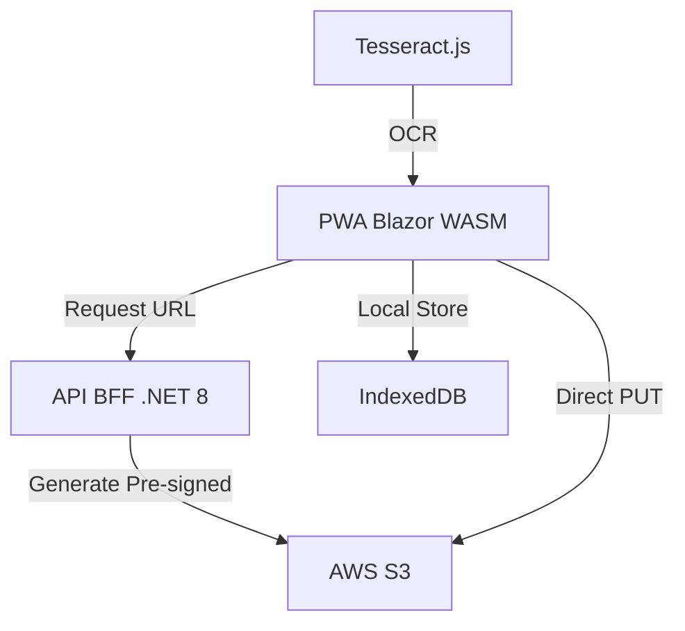

# ASPEC Capture - PWA Camera POC

Uma aplicação Progressiva Web (PWA) desenvolvida em **Blazor WebAssembly** focada na captura offline de inventário, integração com hardware de câmera e sincronização com AWS S3 via API BFF.


## 📚 Documentação Principal

- **[CHANGELOG](CHANGELOG.md)** - Histórico de versões e mudanças (v1.5.0: Arquitetura S3-Centric & Auth Offline)
- **[Migration Guide v1.4 → v1.5](MIGRATION_GUIDE_v1.4_to_v1.5.md)** - Como atualizar de v1.4.1
- **[API JSON Schemas](docs/API_JSON_SCHEMAS.md)** - Modelos JSON completos com exemplos
- **[Arquitetura do Sistema](docs/ARCHITECTURE.md)** - Decisões arquiteturais e fluxos de dados
- **[Guia de Componentes](COMPONENT_USAGE_GUIDE.md)** - Como usar componentes do sistema
- **[Guia de Gestos](GESTURE_GUIDE.md)** - Interações touch e gestos

### 📖 Documentação v1.5.0

- **[Implementation Status](IMPLEMENTATION_STATUS.md)** - Rastreamento de implementação de Fase 1 & 2
- **[Frontend Integration Testing](FRONTEND_INTEGRATION_TESTING.md)** - Testes da PWA
- **[API v2 Testing Guide](../pwa-camera-poc-api/API_V2_TESTING_GUIDE.md)** - Testes de endpoints
- **[Quick Reference](QUICK_REFERENCE.md)** - Referência rápida de arquivos

## 🎯 Objetivo

O projeto visa criar uma aplicação web que funcione offline, permitindo aos usuários fazer login, capturar itens via câmera, registrar inventário de patrimônio via OCR e sincronizar dados quando online. É direcionado para cenários de inventário móvel em ambientes com conectividade limitada.

## ✨ Funcionalidades

### v1.5.0 Novo (Arquitetura S3-Centric)

- **🔐 Autenticação Offline com Argon2id**:
  - Download de usuários autorizados via Pre-Signed URLs (S3)
  - Validação Argon2id local (m=65536, t=3, p=4) - 100% offline
  - Sem chamadas de servidor após provisioning inicial
  - Suporta múltiplas Unidades Gestoras

- **📦 Provisioning de Dados**:
  - `/api/v2/inventario/carga/{ugId}` - Download de inventário oficial
  - `/api/v2/auth/usuarios/{ugId}` - Download de usuários autorizados
  - Pre-Signed URLs com expiração de 30 minutos
  - Dados armazenados em IndexedDB com rastreamento de origem

- **🔍 Busca Inteligente com Merge**:
  - Dois tipos de dados: CargaOficial (provisioned) + CapturaLocal (user-created)
  - Deduplicação por `código` - sem duplicatas
  - CapturaLocal prioritário - edições do usuário nunca sombreadas
  - Suporte a busca por múltiplos campos

- **🔄 Sincronização Bidirecional**:
  - **PUSH Phase**: Upload de CapturaLocal para `capturas/{username}/{ugId}/`
  - **PULL Phase**: Download de CargaOficial atualizada de `cargas/`
  - Items marcados como `Sincronizado=true` sem deleção (permite resolução de conflitos)
  - Rastreamento de `DataUltimaSincronizacao`

### Funcionalidades Existentes (v1.4.1+)

- **Autenticação Local**: Login e registro de usuários
- **Captura de Imagens**: Integração com câmera do dispositivo
- **Scanner OCR com Validação Contextual**: Leitura de placas patrimoniais usando Tesseract.js
- **Gerenciamento de Inventário**: Adição, edição e visualização de itens
- **Armazenamento Offline**: IndexedDB para dados, localStorage para sessão
- **Exportação de Dados**: Exportação do inventário local para CSV
- **PWA Real**: Instalável, offline-first, com suporte a Maskable Icons
- **Temas Dinâmicos**: Modo claro/escuro com salvamento de preferência
- **Responsividade Mobile-First**: Bottom Navigation e menu lateral
- **UI de Alta Fidelidade**: MudBlazor Material Design

## 🏗️ Arquitetura v1.5.0

```
┌─────────────────────────────────────────────────────────────────┐
│                     ASPEC Capture v1.5.0                         │
├─────────────────────────────────────────────────────────────────┤
│                                                                   │
│  ┌────────────────────────┐      ┌──────────────────────────┐   │
│  │   Blazor PWA (WASM)    │      │   Backend API (ASP.NET)  │   │
│  ├────────────────────────┤      ├──────────────────────────┤   │
│  │ • Login.razor          │      │ • /api/v2/...            │   │
│  │ • ProvisioningService  │◄────►│ • ApiKeyAuthMiddleware   │   │
│  │ • SearchMergeService   │      │ • S3 Pre-Signed URLs     │   │
│  │ • SyncService          │      │ • ProvisioningDtos       │   │
│  │ • IndexedDB            │      │                          │   │
│  └────────────────────────┘      └──────────────────────────┘   │
│           ▲                                   ▲                   │
│           │                                   │                   │
│           └───────────────────────────────────┘                   │
│                   AWS S3 Pre-Signed URLs                          │
│                                                                   │
│  ┌────────────────────────────────────────────────────────────┐  │
│  │                    AWS S3 Buckets                           │  │
│  ├────────────────────────────────────────────────────────────┤  │
│  │  cargas/                          capturas/                │  │
│  │  ├─ ug_1_users.json  (Download)  ├─ username/...          │  │
│  │  ├─ ug_1_itens.json  (Download)  └─ itemid.json (Upload)  │  │
│  │  └─ ug_2_*.json                                            │  │
│  └────────────────────────────────────────────────────────────┘  │
└─────────────────────────────────────────────────────────────────┘

Data Flow:
  Login → Provisioning (users + items) → IndexedDB
  Search → Merge (CapturaLocal + CargaOficial) → Deduplicate
  Sync → PUSH (upload) → PULL (download) → Merge
```

## Stack Tecnológica

- **Frontend**: Blazor WebAssembly (.NET 8)
- **Backend**: ASP.NET Core Web API (BFF Pattern) - Projeto `pwa-camera-poc-api`
- **UI Framework**: MudBlazor 8.0.0 (Material Design)
- **Database**: 
  - IndexedDB (offline storage - items, users)
  - localStorage (sessions, preferences)
  - AWS S3 (authoritative source of truth)
- **Security**:
  - Argon2id hashing (m=65536, t=3, p=4)
  - X-Api-Key middleware (v2 endpoints)
  - Pre-Signed URLs (S3 access)
- **Integrations**: AWS S3, OCR (Tesseract.js), Barcode scanning (ZXing)

## 📋 Requisitos

- **.NET 8 SDK** (ou superior)
- **Node.js** (para build e npm dependencies via Blazor)
- **Visual Studio 2022** ou **VS Code** + CLI
- **AWS Credentials** (para S3 provisioning)
- **Modern Browser** (Chrome, Firefox, Edge, Safari)

## 🚀 Quick Start

### 1. Clone o Repositório
```bash
git clone <repository-url>
cd pwa-camera-poc-blazor
```

### 2. Configure Variáveis de Ambiente

**Backend API** (`pwa-camera-poc-api/appsettings.Development.json`):
```json
{
  "AWS": {
    "Region": "us-east-2",
    "BucketName": "aspec-capture",
    "AccessKey": "your-key",
    "SecretKey": "your-secret",
    "S3Paths": {
      "Cargas": "cargas",
      "Capturas": "capturas"
    }
  },
  "Api": {
    "ApiKey": "aspec-pwa-v2-dev-key-2026"
  }
}
```

### 3. Upload Test Data to S3

```bash
# Upload users provisioning file
aws s3 cp pwa-camera-poc-api/S3_TEST_DATA_ug_1_users.json s3://aspec-capture/cargas/ug_1_users.json

# Upload items provisioning file
aws s3 cp pwa-camera-poc-api/S3_TEST_DATA_ug_1_itens.json s3://aspec-capture/cargas/ug_1_itens.json
```

### 4. Start Backend API
```bash
cd pwa-camera-poc-api
dotnet run
# API runs on http://localhost:5069
```

### 5. Start Frontend PWA (nova aba)
```bash
cd pwa-camera-poc-blazor
dotnet run
# PWA runs on http://localhost:5000
```

### 6. Test Login
- Navigate to http://localhost:5000/login
- Username: `admin`
- Password: `admin`
- Observe: Provisioning loads users & inventory
- Redireted to /home with data synced

## 📖 Uso

### Login & Autenticação
```
1. Acesse /login
2. Digite credenciais (admin/admin para teste)
3. Provisioning automático: Users + Inventory baixados
4. Redirected to /home com dados sincronizados
```

### Buscar Itens
```
1. Na página /home
2. Use search bar
3. Busque por nome, código, localização, categoria
4. Resultados deduplicated e prioritizados (CapturaLocal primeiro)
```

### Criar Novo Item
```
1. Vá para Camera page
2. Preencha dados do item
3. Tire foto(s) - opcional
4. Clique "Capturar"
5. Item armazenado com origem = 'CapturaLocal'
```

### Sincronizar Dados
```
1. Vá para Sync page
2. Clique "Sincronizar Agora"
3. PUSH Phase: Items enviados para S3
4. PULL Phase: CargaOficial atualizada baixada
5. Items marcados como Sincronizado
```

## 🧪 Testes

### Backend API Tests
```bash
cd pwa-camera-poc-api

# Test v2 endpoints with valid API key
curl -X GET http://localhost:5069/api/v2/inventario/carga/1 \
  -H "X-Api-Key: aspec-pwa-v2-dev-key-2026"

# See API_V2_TESTING_GUIDE.md for more tests
```

### Frontend Tests
```
Refer to FRONTEND_INTEGRATION_TESTING.md for:
- Authentication tests
- Provisioning tests
- Search & merge tests
- Sync tests
- Offline capabilities
```

## 📂 Estrutura do Projeto

```
pwa-camera-poc-blazor/
├── Models/
│   ├── ItemPatrimonio.cs          (Extended: Origem, EstaRemoto, ...)
│   ├── Usuario.cs
│   ├── UnidadeGestora.cs
│   └── ...
├── Services/
│   ├── Auth/AuthService.cs        (Extended: Argon2id methods)
│   ├── Provisioning/
│   │   ├── IProvisioningService.cs (NEW)
│   │   └── ProvisioningService.cs (NEW - 240+ lines)
│   ├── Search/
│   │   ├── ISearchMergeService.cs (NEW)
│   │   └── SearchMergeService.cs  (NEW - 180+ lines)
│   ├── Scanning/
│   │   ├── ISyncService.cs        (NEW)
│   │   └── SyncService.cs         (NEW - 280+ lines)
│   ├── Storage/
│   ├── Camera/
│   └── ...
├── Pages/
│   ├── Login.razor                (Extended: Provisioning)
│   ├── Home.razor
│   ├── Camera.razor
│   └── ...
├── Components/
│   ├── Layout/
│   └── Shared/
├── wwwroot/
│   ├── manifest.json              (PWA manifest)
│   ├── offline.html               (Offline fallback)
│   ├── service-worker.js
│   └── ...
├── Program.cs                     (Extended: New service registration)
├── CHANGELOG.md                   (NEW: v1.5.0 comprehensive)
├── MIGRATION_GUIDE_v1.4_to_v1.5.md (NEW)
└── ...

pwa-camera-poc-api/
├── Middleware/
│   └── ApiKeyAuthMiddleware.cs    (NEW)
├── Models/
│   └── ProvisioningDtos.cs        (NEW - 3 DTOs)
├── Program.cs                     (Extended: v2 endpoints)
├── appsettings.json               (Extended: Api key, S3 paths)
└── ...
```

## 🔐 Segurança

### v1.5.0 Melhorias
- ✅ Argon2id em vez de hash simples
- ✅ Pre-Signed URLs com expiração (30 min)
- ✅ X-Api-Key validation para /api/v2/*
- ✅ Credenciais AWS no servidor, nunca no cliente
- ✅ Validação local (100% offline)

### Recomendações Produção
- Usar HTTPS sempre
- Rotar API keys regularmente
- Configurar S3 bucket policies restrictivas
- Habilitar encryption no S3
- Implementar audit logging
- Usar IAM roles em vez de Access Keys

## 🐛 Troubleshooting

### Offline login não funciona
```
→ Primeiro fazer login online para provisioning
→ Depois testar offline
→ Verificar IndexedDB com DevTools
```

### API retorna 401
```
→ Verificar X-Api-Key header configurada
→ Confirmar appsettings.json com Api:ApiKey
```

### S3 download falha
```
→ Confirmar test data uploaded
→ Verificar AWS credentials
→ Testar Pre-Signed URL manualmente
```

Refer to MIGRATION_GUIDE_v1.4_to_v1.5.md para mais troubleshooting.

## 📈 Roadmap

- **v1.6.0**: Sincronização incremental, compressão WebP
- **v2.0.0**: GraphQL API, multi-device sync, UI de resolução de conflitos

## 📄 Licença

Proprietary - ASPEC 2026

## 👥 Autores

Desenvolvido por ASPEC Team - February 2026


### Principais Arquivos

- `Program.cs`: Configuração de serviços e inicialização.
- `App.razor`: Layout principal da aplicação.
- `wwwroot/index.html`: Página HTML principal.
- `wwwroot/js/`: Scripts JavaScript para interop.
- `wwwroot/manifest.json`: Manifesto PWA.
- `wwwroot/service-worker.js`: Service worker para offline.

## Como Executar

### Pré-requisitos

- .NET 8 SDK
- Navegador moderno com suporte a PWA (Chrome, Edge, etc.)

### Dependências

O projeto utiliza as seguintes bibliotecas principais:

#### UI Component Libraries

- **MudBlazor 7.20.0** (Gratuita, MIT License)
  - **Propósito**: Biblioteca de componentes Material Design para Blazor
  - **Instalação**: `dotnet add package MudBlazor --version 7.20.0`
  - **Recursos**:
    - +60 componentes prontos para uso
    - Sistema de temas customizável
    - Responsividade mobile-first
    - Grids, Cards, Dialogs, Snackbars, DataTables
    - Documentação completa: https://mudblazor.com
  - **Motivo**: Proporcionar UI moderna, profissional e responsiva seguindo Material Design guidelines

#### Fontes e Ícones (CDN - Gratuitas)

- **Google Fonts - Roboto**: Tipografia Material Design
  - Pesos: 300, 400, 500, 700
  - Licença: Apache 2.0
  
- **Material Icons**: Conjunto completo de ícones do Google
  - 5 variantes: Filled, Outlined, Two Tone, Round, Sharp
  - Licença: Apache 2.0
  - +2000 ícones disponíveis

### Passos

1. Clone o repositório.
2. Navegue para a pasta do projeto: `cd pwa-camera-poc-blazor`
3. Execute: `dotnet run`
4. Abra o navegador em `http://localhost:5230`
5. Para login, use as credenciais padrão: usuário `admin`, senha `admin`

### Build para Produção

```bash
dotnet publish -c Release
```

Os arquivos publicados estarão em `bin/Release/net8.0/publish/wwwroot`.

## Testes

Atualmente, o projeto não possui testes automatizados implementados. Para adicionar testes:

- Use xUnit ou NUnit para testes unitários em C#.
- Para testes de UI, considere Playwright ou Selenium.
- Execute testes com `dotnet test`.

## Arquitetura de Dados e Modelos

### Modelo de Item

O modelo `InventoryItem` (localizado em `Models/Item.cs`) representa um item de inventário no sistema:

| Propriedade | Tipo | Obrigatório | Descrição |
|-------------|------|-------------|-----------|
| Id | string | Sim | Identificador único (GUID gerado automaticamente) |
| Name | string | Sim | Nome do item |
| Code | string | Sim | Código único do item |
| Category | string | Não | Categoria do item (padrão: "Geral") |
| Location | string | Sim | Localização do item |
| Observations | string | Não | Observações adicionais |
| Timestamp | DateTime | Sim | Data/hora de criação (padrão: DateTime.Now) |
| Synced | bool | Não | Indica se o item foi sincronizado (padrão: false) |
| UnitId | int? | Não | ID da unidade gestora associada |
| Photos | List<string> | Não | Lista de fotos em base64 (removido após sincronização) |
| RemoteUrls | List<string> | Não | Lista de URLs persistentes no AWS S3 |
| CoverImage | string? | Não | Retorna a primeira `RemoteUrl` se disponível, senão a primeira `Photo` |

**Validações aplicadas:**
- `Name`, `Code` e `Location` são obrigatórios via `[Required]`.
- Outros campos são opcionais.

**Exemplo de objeto InventoryItem:**
```json
{
  "id": "550e8400-e29b-41d4-a716-446655440000",
  "name": "Notebook Dell",
  "code": "NB001",
  "category": "Eletrônicos",
  "location": "Sala 101",
  "observations": "Em bom estado",
  "timestamp": "2025-12-24T10:00:00Z",
  "synced": false,
  "unitId": 1,
  "photos": [
    "data:image/jpeg;base64,/9j/4AAQSkZJRgABAQAAAQ...",
    "data:image/jpeg;base64,/9j/4AAQSkZJRgABAQAAAQ..."
  ]
}
```

### Armazenamento de Dados

#### IndexedDB para Inventário
- **Nome da Store:** `items`
- **Chave Primária:** `id` (string, GUID)
- **Índices:** 
  - `name` (não único)
  - `code` (não único)
  - `category` (não único)
  - `timestamp` (não único)
  - `unitId` (não único)
- **Limites:** Depende do navegador (geralmente 50MB-1GB por origem). Não há limite explícito no código, mas grandes volumes podem impactar performance.

#### localStorage para Autenticação
- **Chave de Sessão:** `pwa-inventory-session` (objeto UserSession com Username e UnitId)
- **Usuários:** Armazenados por username (ex: chave "admin" para User object)
- **Limites:** ~5-10MB por origem, dependendo do navegador.

#### Estratégia de Sincronização (Via BFF)
O projeto utiliza uma arquitetura segura com API Backend for Frontend (BFF) para intermediar o acesso ao S3, eliminando a necessidade de credenciais no cliente.

1. **Autenticação**: O usuário é validado localmente para garantir acesso offline.
2. **Sincronização**: O App solicita uma URL assinada (Pre-Signed URL) para a API BFF.
3. **Upload Direto**: O App faz upload do binário da imagem/JSON diretamente para o S3 usando a URL assinada.
4. **Segurança**: As credenciais AWS ficam protegidas no servidor (API).
5. **Limpeza Local**: Após o sucesso, os dados Base64 são removidos do IndexedDB para otimizar espaço.
6. **Legado**: O sistema Harbour consome os diretórios do S3 seguindo a estrutura `{itemId}/foto-n.jpg` e `{itemId}/metadata.json`.

## 🏗️ Arquitetura do Sistema



## ⚙️ Configuração do Ambiente

O projeto utiliza o arquivo `wwwroot/appsettings.json` para configurar a conexão com a API BFF.

```json
{
  "Aws": {
    "Region": "us-east-1",
    "BucketName": "pwa-inventory-uploads"
  },
  "ApiBaseUrl": "http://localhost:5069"
}
```

### Segurança e Próximos Passos
A versão atual já elimina chaves fixas no client-side através do uso de Pre-Signed URLs geradas pelo BFF.

Próximos passos incluem:
- Autenticação JWT integrada entre Blazor e API.
- Validação robusta de tipos de arquivo na API.

> **Importante:** O Bucket S3 deve ter políticas de **CORS** habilitadas para aceitar requisições `PUT`, `GET` e `DELETE` da origem da aplicação (localhost e domínio de produção).

### Gerenciamento de Imagens (Estado Atual)

- **Campo de Imagem:** `Photos` (List<string> de base64 data URLs).
- **Captura:** Via `CameraService.TakePhotoAsync()`, que retorna `canvas.toDataURL('image/jpeg', 0.9)` (base64 JPEG com 90% qualidade).
- **Armazenamento:** Junto ao item no IndexedDB (store `items`).
- **Formato e Compressão:** JPEG com compressão de 90%. Resolução baseada na câmera (ideal 1280x720).
- **Limites:** Sem limite explícito por imagem, mas base64 aumenta tamanho em ~33%. Recomendado <1MB por imagem para performance.

### Fluxo de Dados Atual

### Fluxo de Dados Atual (Sincronização PWA → S3 → Desktop)

1. **Navegação para Câmera:** Usuário acessa `/camera`.
2. **Captura e Metadados:** Usuário tira fotos e preenche dados (Nome, Código e Localização).
3. **Salvamento Local (IndexedDB):** 
   - Item salvo com status `Synced = false`.
   - Propriedade `CreatedBy` recebe o usuário logado para isolamento.
4. **Visualização (Home/Sync):**
   - Itens pendentes aparecem com **Nuvem Cinza**.
   - A lista é filtrada para mostrar apenas itens do usuário atual.
5. **Sincronização (Sync):**
   - Usuário clica em "Sincronizar Tudo".
   - **Upload Imagem:** Capa enviada para `capturas/{itemId}.jpg`.
   - **Upload Metadados:** JSON enviado para `capturas/{itemId}.json` (inclui `usuarioEnvio`).
   - **Confirmação:** Se sucesso, status muda para `Synced = true` (**Nuvem Verde**) e fotos locais são removidas.
6. **Consumo Desktop:** Aplicação Desktop lê os JSONs/JPGs do bucket S3.
9. **Páginas/Componentes Envolvidos:** Camera.razor, Home.razor, Stats.razor, Sync.razor, Footer.razor.
10. **Serviços:** CameraService, IndexedDbService, AuthService, ToastService, AppState.

### Serviços e Interoperabilidade JavaScript

#### CameraService
- `StartCameraAsync(string videoElementId, bool useFrontCamera)`: Inicia câmera no elemento video.
- `TakePhotoAsync(string videoElementId)`: Retorna string (base64 JPEG).
- `StopCameraAsync(string videoElementId)`: Para câmera.

#### IndexedDbService
- `AddAsync<T>(string storeName, T item)`: Adiciona item à store.
- `GetAsync<T>(string storeName, object key)`: Obtém por chave.
- `GetFromIndexAsync<T>(string storeName, string indexName, object value)`: Busca por índice.
- `UpdateAsync<T>(string storeName, T item)`: Atualiza item.
- Tratamento de erros: Console.Error.WriteLine para falhas.

#### AuthService
- `LoginAsync(string username, string password)`: Retorna User ou null.
- `RegisterAsync(string username, string password, List<int> unitIds)`: Cria usuário.
- `LogoutAsync()`: Limpa sessão.
- `GetCurrentUserAsync()`: Obtém usuário atual.

#### Funções JavaScript Interop
- `cameraInterop.startCamera(videoElementId, facingMode)`: Inicia stream de câmera.
- `cameraInterop.takePhoto(videoElementId)`: Captura foto como base64.
- `cameraInterop.stopCamera(videoElementId)`: Para stream.
- `dbInterop.init()`: Inicializa IndexedDB.
- `dbInterop.add(storeName, item)`: Adiciona à store.
- `dbInterop.get(storeName, key)`: Obtém por chave.
- `dbInterop.getFromIndex(storeName, indexName, value)`: Busca por índice.

### Considerações de Performance

- **Limites de Imagem:** Recomendado <500KB por imagem (base64 ~750KB). Compressão JPEG 90% reduz tamanho sem perder qualidade visível.
- **Grandes Volumes:** IndexedDB suporta milhares de itens, mas queries em listas grandes podem ser lentas. Use índices para buscas.
- **Cache do Service Worker:** Imagens são armazenadas localmente; service worker pode cachear assets estáticos, mas dados dinâmicos ficam em IndexedDB.

## Contribuição

1. Fork o projeto.
2. Crie uma branch para sua feature: `git checkout -b feature/nova-funcionalidade`
3. Commit suas mudanças: `git commit -m 'Adiciona nova funcionalidade'`
4. Push para a branch: `git push origin feature/nova-funcionalidade`
5. Abra um Pull Request.

## Licença

Este projeto é para fins educacionais e de demonstração. Não possui licença específica.

## Notas Adicionais

- O projeto foi migrado de uma versão JavaScript pura para Blazor.
- Para compatibilidade, a autenticação usa localStorage em vez de IndexedDB.
- A câmera requer permissões do navegador.
- Em produção, considere usar um backend para sincronização de dados.

## Melhorias Recentes

### Integração MudBlazor
- **Componentes Modernos**: Substituição de elementos HTML nativos por componentes MudBlazor (MudTextField, MudButton, MudSelect, MudCard) para interface mais profissional e alinhada ao Material Design.
- **Consistência Visual**: Padronização de design com sistema de temas do MudBlazor.
- **Acessibilidade**: Componentes MudBlazor seguem padrões de acessibilidade.

### Sistema de Layout e Responsividade
- **Flexbox/Grid Consistente**: Implementação uniforme de Flexbox e CSS Grid em todo o aplicativo para alinhamento perfeito.
- **Design Responsivo**: Media queries otimizadas para tablet (≤768px) e mobile (≤480px), garantindo usabilidade em todos os dispositivos.
- **Container Centralizado**: Adição de container de conteúdo no MainLayout para melhor organização visual.
- **Estados Visuais**: Estilos para estados vazios e paginação melhoram a experiência do usuário.

### Correções Técnicas
- **Build Estável**: Resolução de erros de compilação, incluindo qualificações de namespace e correções de sintaxe.
- **Performance**: Layout otimizado reduz reflows e melhora performance em dispositivos móveis.
