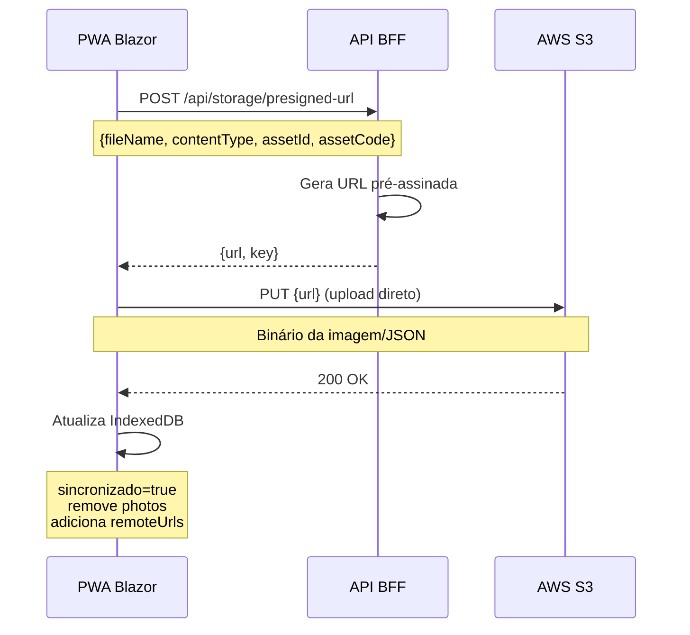

# API JSON Schemas - ASPEC Capture PWA

Documentação completa dos modelos JSON utilizados na comunicação entre o PWA Blazor e a API BFF, bem como os formatos de dados armazenados localmente no IndexedDB.

## 📋 Índice

- [Modelos de Domínio](#modelos-de-domínio)
- [Modelos de API](#modelos-de-api)
- [Modelos de Autenticação](#modelos-de-autenticação)
- [Modelos de Sincronização](#modelos-de-sincronização)
- [Exemplos de Uso](#exemplos-de-uso)

---

## Modelos de Domínio

### ItemPatrimonio

Modelo principal que representa um item de patrimônio capturado pelo PWA.

**Armazenamento:** IndexedDB (store: `items`)

```json
{
  "Id": "550e8400-e29b-41d4-a716-446655440000",
  "Nome": "Notebook Dell Inspiron 15",
  "Codigo": "PAT-2024-001234",
  "Categoria": "Equipamentos de Informatica",
  "Localizacao": "Sala 101 - Departamento de TI",
  "Observacoes": "Em bom estado de conservacao. Teclado com tecla 'A' desgastada.",
  "Situacao": "ativo",
  "DataHora": "2024-02-09T14:30:00Z",
  "Sincronizado": false,
  "UnidadeGestoraId": 1,
  "CriadoPor": "fiscal.silva",
  "Fotos": [
    "data:image/jpeg;base64,/9j/4AAQSkZJRgABAQAAAQABAAD...",
    "data:image/jpeg;base64,/9j/4AAQSkZJRgABAQAAAQABAAD..."
  ],
  "UrlsRemotas": [],
  "ImagemCapa": "data:image/jpeg;base64,/9j/4AAQSkZJRgABAQAAAQABAAD..."
}
```

**Campos:**

| Campo | Tipo | Obrigatório | Descrição |
|-------|------|-------------|-----------|
| `Id` | string (GUID) | Sim | Identificador unico gerado automaticamente |
| `Nome` | string | Sim | Nome descritivo do item |
| `Codigo` | string | Sim | Codigo patrimonial (ex: PAT-2024-001234) |
| `Categoria` | string | Não | Categoria do item (padrao: "Geral") |
| `Localizacao` | string | Sim | Localizacao fisica do item |
| `Observacoes` | string | Não | Observacoes adicionais sobre o item |
| `Situacao` | string | Não | Situacao do item (padrao: "ativo") |
| `DataHora` | DateTime | Sim | Data/hora de criacao (ISO 8601) |
| `Sincronizado` | boolean | Sim | Indica se foi sincronizado com S3 |
| `UnidadeGestoraId` | int? | Não | ID da unidade gestora associada |
| `CriadoPor` | string | Sim | Username do usuario que criou |
| `Fotos` | string[] | Não | Array de imagens em base64 (local) |
| `UrlsRemotas` | string[] | Não | Array de URLs do S3 (apos sync) |
| `ImagemCapa` | string? | Não | URL ou base64 da imagem de capa |

**Estados de Sincronizacao:**
- `Sincronizado: false` + `Fotos.length > 0` = Pendente de sincronizacao (icone nuvem cinza)
- `Sincronizado: true` + `UrlsRemotas.length > 0` = Sincronizado (icone nuvem verde)

---

### ItemMetadata

Modelo de metadados enviado para o S3 junto com as imagens. Compatível com o módulo Desktop Harbour.

**Armazenamento:** S3 (`capturas/{itemId}.json`)

```json
{
  "Id": "550e8400-e29b-41d4-a716-446655440000",
  "Nome": "Notebook Dell Inspiron 15",
  "Codigo": "PAT-2024-001234",
  "Categoria": "Equipamentos de Informatica",
  "Localizacao": "Sala 101 - Departamento de TI",
  "Observacoes": "Em bom estado de conservacao",
  "Situacao": "ativo",
  "Timestamp": "2024-02-09T14:30:00Z",
  "UnidadeGestoraId": 1,
  "UsuarioEnvio": "fiscal.silva",
  "DataEnvio": "2024-02-09T14:35:22Z"
}
```

**Campos:**

| Campo | Tipo | Obrigatório | Descrição |
|-------|------|-------------|-----------|
| `Id` | string | Sim | ID do item (mesmo do ItemPatrimonio) |
| `Nome` | string | Sim | Nome do item |
| `Codigo` | string | Sim | Codigo patrimonial |
| `Categoria` | string | Sim | Categoria do item |
| `Localizacao` | string | Sim | Localizacao fisica |
| `Observacoes` | string | Não | Observacoes adicionais |
| `Situacao` | string | Sim | Situacao (padrao: "ativo") |
| `Timestamp` | DateTime | Sim | Data/hora de criacao original |
| `UnidadeGestoraId` | int? | Não | ID da unidade gestora |
| `UsuarioEnvio` | string | Sim | Username do fiscal que enviou |
| `DataEnvio` | DateTime | Sim | Data/hora do envio para S3 |

---

### UnitInventoryItem

Modelo que representa um item do inventário oficial da Unidade Gestora. Usado para validação de códigos escaneados via OCR.

**Armazenamento:** S3 (`inventarios/{unidadeId}.json`)

```json
{
  "Codigo": "PAT-2024-001234",
  "Nome": "Notebook Dell Inspiron 15",
  "Categoria": "Equipamentos de Informatica",
  "Localizacao": "Sala 101",
  "Situacao": "ativo"
}
```

**Campos:**

| Campo | Tipo | Descrição |
|-------|------|-----------|
| `Codigo` | string | Codigo patrimonial oficial |
| `Nome` | string | Nome do item no inventario |
| `Categoria` | string | Categoria oficial |
| `Localizacao` | string | Localizacao registrada |
| `Situacao` | string | Situacao no inventario |

**Arquivo de Inventario Completo:**

```json
{
  "UnidadeGestoraId": 230440001,
  "UnidadeGestoraNome": "Prefeitura Municipal de Fortaleza",
  "Estado": {
    "Id": "CE",
    "Nome": "Ceara",
    "Sigla": "CE",
    "Regiao": "Nordeste"
  },
  "Cidade": {
    "Id": 2304400,
    "Nome": "Fortaleza",
    "EstadoId": "CE"
  },
  "DataAtualizacao": "2024-02-01T00:00:00Z",
  "TotalItens": 1250,
  "Itens": [
    {
      "Codigo": "PMF-2024-001234",
      "Nome": "Notebook Dell Inspiron 15",
      "Categoria": "Equipamentos de Informatica",
      "Localizacao": "Sala 101",
      "Situacao": "ativo"
    },
    {
      "Codigo": "PMF-2024-001235",
      "Nome": "Mesa de Escritorio",
      "Categoria": "Mobiliario",
      "Localizacao": "Sala 102",
      "Situacao": "ativo"
    }
  ]
}
```

---

## Modelos de Autenticação

### Usuario

Modelo de usuário do sistema.

**Armazenamento:** localStorage (chave: `user-{username}`)

```json
{
  "Id": 1,
  "NomeUsuario": "fiscal.silva",
  "PrimeiroNome": "Joao",
  "UltimoNome": "Silva",
  "HashSenha": "$argon2id$v=19$m=65536,t=3,p=4$...",
  "IdsUnidadesGestoras": [230440001, 230440002, 230440005],
  "UnidadeGestoraAtualId": 230440001,
  "DataCriacao": "2024-01-15T08:00:00Z",
  "UltimoLogin": "2024-02-09T14:25:00Z"
}
```

**Campos:**

| Campo | Tipo | Obrigatório | Descrição |
|-------|------|-------------|-----------|
| `Id` | long | Sim | ID unico do usuario |
| `NomeUsuario` | string | Sim | Username (login) |
| `PrimeiroNome` | string | Sim | Primeiro nome |
| `UltimoNome` | string | Sim | Sobrenome |
| `HashSenha` | string | Sim | Hash Argon2id da senha (m=65536, t=3, p=4) |
| `IdsUnidadesGestoras` | int[] | Sim | IDs das unidades que o usuario pode acessar |
| `UnidadeGestoraAtualId` | int? | Não | ID da unidade atualmente selecionada |
| `DataCriacao` | DateTime | Sim | Data de criacao da conta |
| `UltimoLogin` | DateTime? | Não | Data/hora do ultimo login |

### Sessão de Usuário

**Armazenamento:** localStorage (chave: `pwa-inventory-session`)

```json
{
  "NomeUsuario": "fiscal.silva",
  "UnidadeGestoraId": 230440001
}
```

---

## Modelos de API

### PresignedUrlRequest

Request para obter URL pré-assinada para upload no S3.

**Endpoint:** `POST /api/storage/presigned-url`

```json
{
  "NomeArquivo": "foto-1.jpg",
  "TipoConteudo": "image/jpeg",
  "ItemId": "550e8400-e29b-41d4-a716-446655440000",
  "CodigoItem": "PMF-2024-001234",
  "NomeUsuario": "fiscal.silva",
  "NomeUnidade": "Prefeitura-Municipal-Fortaleza"
}
```

**Campos:**

| Campo | Tipo | Obrigatório | Descrição |
|-------|------|-------------|-----------|
| `NomeArquivo` | string | Sim | Nome do arquivo (ex: foto-1.jpg) |
| `TipoConteudo` | string | Sim | MIME type (ex: image/jpeg) |
| `ItemId` | string | Sim | ID do item (usado como pasta no S3) |
| `CodigoItem` | string | Sim | Codigo patrimonial (metadata) |
| `NomeUsuario` | string | Sim | Username do usuario |
| `NomeUnidade` | string | Sim | Nome da unidade (para organizacao) |

### PresignedUrlResponse

Response com URL pré-assinada para upload.

```json
{
  "Url": "https://bucket.s3.amazonaws.com/capturas/550e8400-e29b-41d4-a716-446655440000/foto-1.jpg?X-Amz-Algorithm=AWS4-HMAC-SHA256&X-Amz-Credential=...",
  "Chave": "capturas/550e8400-e29b-41d4-a716-446655440000/foto-1.jpg"
}
```

**Campos:**

| Campo | Tipo | Descrição |
|-------|------|-----------|
| `Url` | string | URL pre-assinada valida por 10 minutos |
| `Chave` | string | Caminho completo do objeto no S3 |

### CheckObjectExistsResponse

Response para verificação de existência de objeto no S3.

**Endpoint:** `GET /api/storage/exists/{filePath}`

```json
{
  "Existe": true,
  "Chave": "capturas/550e8400-e29b-41d4-a716-446655440000/foto-1.jpg",
  "Url": "https://bucket.s3.us-east-1.amazonaws.com/capturas/550e8400-e29b-41d4-a716-446655440000/foto-1.jpg"
}
```

**Campos:**

| Campo | Tipo | Descrição |
|-------|------|-----------|
| `Existe` | boolean | Indica se o objeto existe no S3 |
| `Chave` | string | Caminho do objeto |
| `Url` | string? | URL publica do objeto (se Existe=true) |

---

## Modelos de Sincronização

### Estrutura de Diretórios no S3

```
bucket-name/
├── capturas/
│   ├── {itemId}/
│   │   ├── foto-1.jpg
│   │   ├── foto-2.jpg
│   │   └── metadata.json
│   └── {itemId}/
│       ├── foto-1.jpg
│       └── metadata.json
└── inventarios/
    ├── 1.json  (Prefeitura Municipal Fortaleza)
    ├── 2.json  (Prefeitura Municipal Natal)
    └── 5.json  (Fundo Municipal de Saúde)
```

### Fluxo de Sincronização



---

## Exemplos de Uso

### 1. Criar Novo Item Localmente

```javascript
const novoItem = {
  Id: crypto.randomUUID(),
  Nome: "Cadeira de Escritorio",
  Codigo: "PMF-2024-005678",
  Categoria: "Mobiliario",
  Localizacao: "Sala 205",
  Observacoes: "Cadeira giratoria com regulagem de altura",
  Situacao: "ativo",
  DataHora: new Date().toISOString(),
  Sincronizado: false,
  UnidadeGestoraId: 230440001,
  CriadoPor: "fiscal.silva",
  Fotos: ["data:image/jpeg;base64,..."],
  UrlsRemotas: [],
  ImagemCapa: null
};

// Salvar no IndexedDB
await dbInterop.add("items", novoItem);
```

```csharp
// 1. Solicitar URL pre-assinada
var request = new PresignedUrlRequest(
    NomeArquivo: "foto-1.jpg",
    TipoConteudo: "image/jpeg",
    ItemId: item.Id,
    CodigoItem: item.Codigo,
    NomeUsuario: currentUser.NomeUsuario,
    NomeUnidade: "Prefeitura-Municipal-Fortaleza"
);

var response = await httpClient.PostAsJsonAsync("/api/storage/presigned-url", request);
var presignedUrl = await response.Content.ReadFromJsonAsync<PresignedUrlResponse>();

// 2. Upload direto para S3
var imageBytes = Convert.FromBase64String(item.Fotos[0].Split(',')[1]);
var uploadResponse = await httpClient.PutAsync(presignedUrl.Url, new ByteArrayContent(imageBytes));

// 3. Atualizar item local
if (uploadResponse.IsSuccessStatusCode)
{
    item.Sincronizado = true;
    item.UrlsRemotas.Add($"https://bucket.s3.amazonaws.com/{presignedUrl.Chave}");
    item.Fotos.Clear(); // Limpar base64 local
    await dbService.UpdateAsync("items", item);
}
```

```csharp
// 1. Solicitar URL pré-assinada
var request = new PresignedUrlRequest(
    FileName: "foto-1.jpg",
    ContentType: "image/jpeg",
    AssetId: item.Id,
    AssetCode: item.Codigo,
    Username: currentUser.NomeUsuario,
    UnitName: "Prefeitura-Municipal-Fortaleza"
);

var response = await httpClient.PostAsJsonAsync("/api/storage/presigned-url", request);
var presignedUrl = await response.Content.ReadFromJsonAsync<PresignedUrlResponse>();

// 2. Upload direto para S3
var imageBytes = Convert.FromBase64String(item.Photos[0].Split(',')[1]);
var uploadResponse = await httpClient.PutAsync(presignedUrl.Url, new ByteArrayContent(imageBytes));

// 3. Atualizar item local
if (uploadResponse.IsSuccessStatusCode)
{
    item.Sincronizado = true;
    item.RemoteUrls.Add($"https://bucket.s3.amazonaws.com/{presignedUrl.Key}");
    item.Photos.Clear(); // Limpar base64 local
    await dbService.UpdateAsync("items", item);
}
```

### 3. Validar Código via OCR

```csharp
// 1. Carregar inventario da unidade
var inventoryJson = await httpClient.GetStringAsync($"https://bucket.s3.amazonaws.com/inventarios/{unidadeGestoraId}.json");
var inventory = JsonSerializer.Deserialize<UnitInventoryResponse>(inventoryJson);

// 2. Validar codigo escaneado
var codigoEscaneado = "PMF-2024-001234";
var itemOficial = inventory.Itens.FirstOrDefault(i => i.Codigo == codigoEscaneado);

if (itemOficial == null)
{
    // Codigo nao pertence ao inventario oficial
    ShowError("Item nao identificado ou nao pertence a esta Unidade");
}
else
{
    // Codigo valido - preencher formulario
    PreencherFormulario(itemOficial);
}
```

### 4. Registro de Novo Usuário

```csharp
var novoUsuario = new Usuario
{
    Id = DateTimeOffset.UtcNow.ToUnixTimeSeconds(),
    NomeUsuario = "fiscal.santos",
    PrimeiroNome = "Maria",
    UltimoNome = "Santos",
    HashSenha = Argon2id.HashPassword("senha123", new Argon2idConfig { MemoryCost = 65536, TimeCost = 3, Parallelism = 4 }),
    IdsUnidadesGestoras = [230440001, 230440002],
    UnidadeGestoraAtualId = 230440001,
    DataCriacao = DateTime.UtcNow,
    UltimoLogin = null
};

await authService.RegisterAsync(
    novoUsuario.PrimeiroNome,
    novoUsuario.UltimoNome,
    novoUsuario.NomeUsuario,
    "senha123",
    novoUsuario.IdsUnidadesGestoras
);
```

---

## Regionalizacao Norte/Nordeste

### Estados Suportados

| Id | Nome | Sigla | Regiao | Codigo IBGE |
|----|------|-------|--------|-------------|
| CE | Ceara | CE | Nordeste | 23 |
| RN | Rio Grande do Norte | RN | Nordeste | 24 |
| PA | Para | PA | Norte | 15 |
| MA | Maranhao | MA | Nordeste | 21 |

### Cidades Principais

| Id | Nome | EstadoId | Codigo IBGE |
|----|------|----------|-------------|
| 2304400 | Fortaleza | CE | 2304400 |
| 2408102 | Natal | RN | 2408102 |
| 1501402 | Belem | PA | 1501402 |
| 2111300 | Sao Luis | MA | 2111300 |

### Unidades Gestoras

| Id | Nome | Sigla | CidadeId | Tipo |
|----|------|-------|----------|------|
| 230440001 | Prefeitura Municipal de Fortaleza | PMF | 2304400 | Prefeitura |
| 240810201 | Prefeitura Municipal de Natal | PMN | 2408102 | Prefeitura |
| 150140201 | Prefeitura Municipal de Belem | PMB | 1501402 | Prefeitura |
| 211130001 | Prefeitura Municipal de Sao Luis | PMSL | 2111300 | Prefeitura |

### Formato de Codigos Patrimoniais

| Unidade | Formato | Exemplo | Prefixos Validos |
|---------|---------|---------|------------------|
| PMF | PMF-{ANO}-{SEQ} | PMF-2024-001234 | PMF, PMF-CE, PMF-CE-FOR |
| PMN | PMN-{ANO}-{SEQ} | PMN-2024-005678 | PMN, PMN-RN, PMN-RN-NAT |
| PMB | PMB-{ANO}-{SEQ} | PMB-2024-009012 | PMB, PMB-PA, PMB-PA-BEL |
| PMSL | PMSL-{ANO}-{SEQ} | PMSL-2024-003456 | PMSL, PMSL-MA, PMSL-MA-SLZ |

---

## Notas de Implementacao

### Seguranca
- **Senhas**: Sempre usar Argon2id com parametros (m=65536, t=3, p=4)
- **URLs Pre-assinadas**: Validas por apenas 10 minutos
- **CORS**: Configurado na API e no S3 para aceitar origens especificas
- **Validacao**: Sempre validar tipos de arquivo e tamanhos no servidor

### Performance
- **Imagens**: Comprimir para JPEG 90% antes de armazenar
- **Base64**: Remover após sincronização para economizar espaço
- **IndexedDB**: Usar índices para queries rápidas
- **Batch Operations**: Sincronizar múltiplos itens em paralelo (max 5 simultâneos)

### Compatibilidade
- **Datas**: Sempre usar ISO 8601 (UTC)
- **Encoding**: UTF-8 para todos os textos
- **IDs**: GUIDs v4 para garantir unicidade
- **Nomes de Arquivo**: Sanitizar (remover acentos, espacos → hifens)
- **Regionalizacao**: Suporte a CE, RN, PA, MA com codigos IBGE

---

**Última Atualização:** 2024-02-09  
**Versão da API:** 1.0.0  
**Versão do PWA:** 1.4.1
