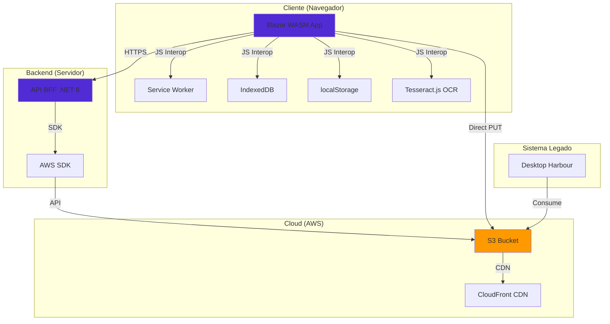
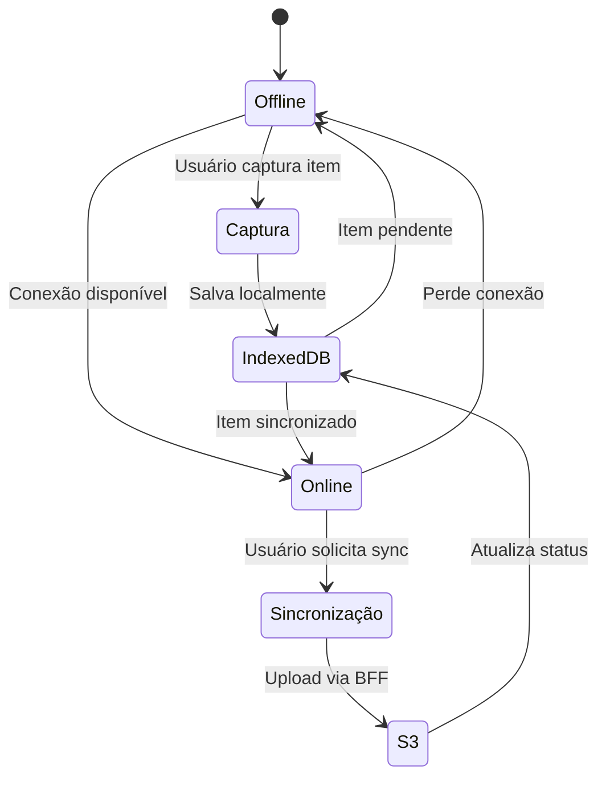
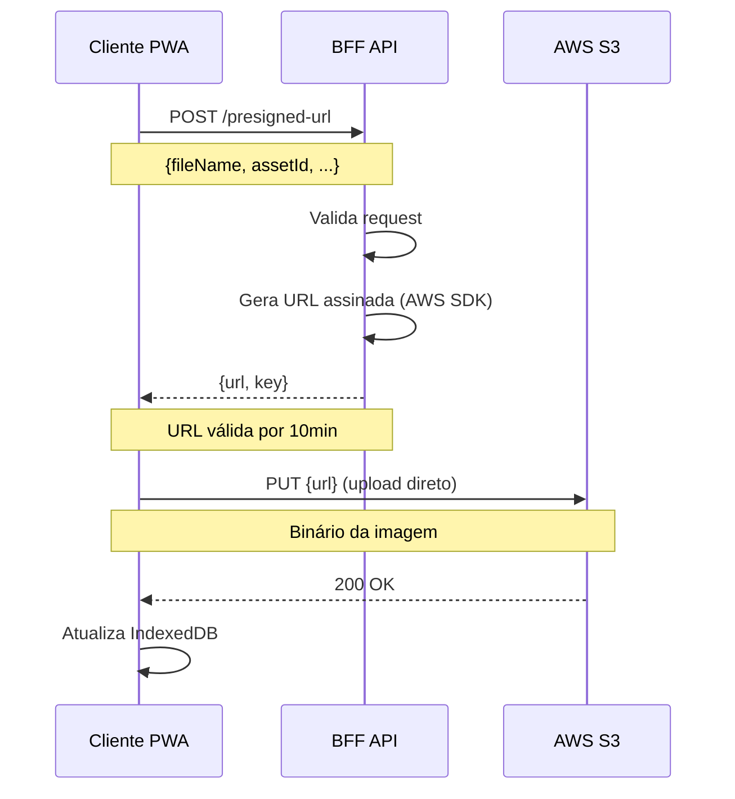
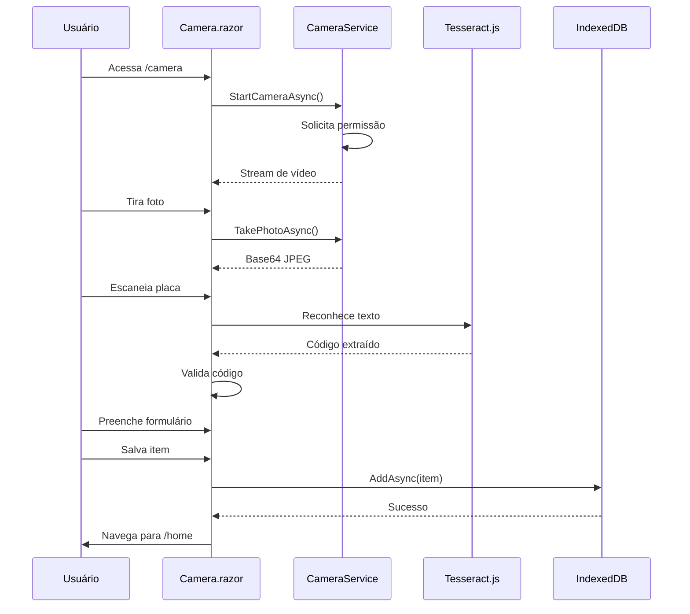
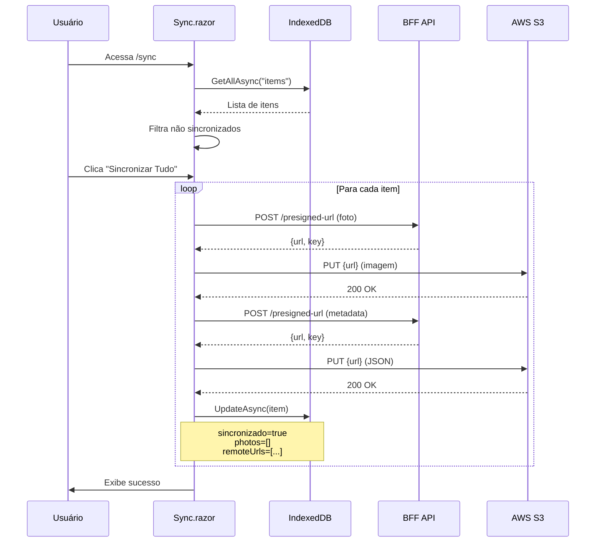
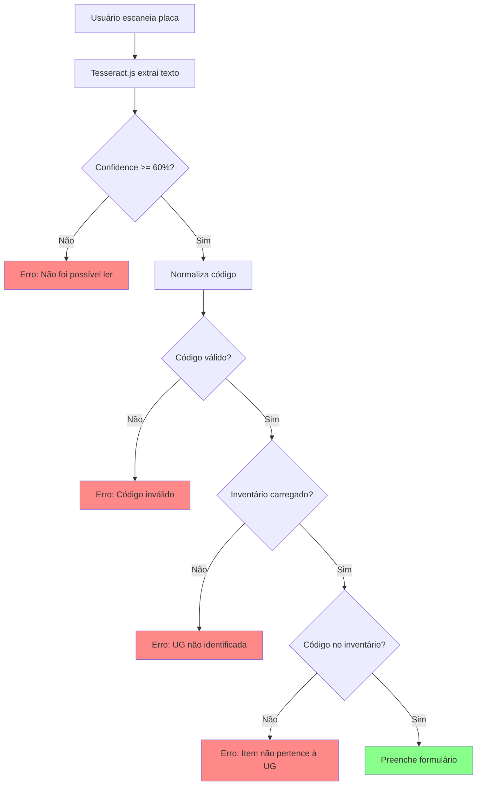
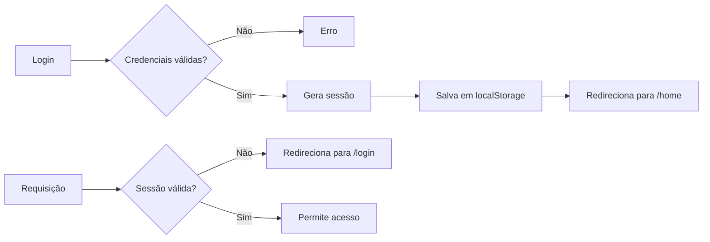

# Arquitetura do Sistema - ASPEC Capture PWA

Documentação completa da arquitetura do sistema ASPEC Capture, incluindo decisões técnicas, padrões utilizados e fluxos de dados.

## 📋 Índice

- [Visão Geral](#visão-geral)
- [Arquitetura de Alto Nível](#arquitetura-de-alto-nível)
- [Camadas da Aplicação](#camadas-da-aplicação)
- [Padrões Arquiteturais](#padrões-arquiteturais)
- [Fluxos de Dados](#fluxos-de-dados)
- [Decisões Arquiteturais](#decisões-arquiteturais)
- [Segurança](#segurança)
- [Performance e Escalabilidade](#performance-e-escalabilidade)

---

## Visão Geral

O ASPEC Capture é uma Progressive Web Application (PWA) desenvolvida para captura offline de inventário patrimonial, com sincronização posterior para AWS S3. O sistema utiliza uma arquitetura **offline-first** com padrão **BFF (Backend for Frontend)** para operações sensíveis.

### Tecnologias Principais

| Camada | Tecnologia | Versao | Proposito |
|--------|-----------|--------|-----------|
| **Frontend** | Blazor WebAssembly | .NET 8.0 | SPA com C# no navegador |
| **UI Framework** | MudBlazor | 7.20.0 | Componentes Material Design |
| **Backend** | ASP.NET Core Minimal API | .NET 8.0 | BFF (envelopes, pre-signed URLs) |
| **Auth** | Argon2id + HMAC-SHA256 | - | Validacao local, assinatura servidor |
| **Armazenamento Local** | IndexedDB | - | Persistencia offline |
| **Armazenamento Remoto** | AWS S3 | - | Armazenamento JSON/imagens |
| **OCR** | Tesseract.js | 4.x | Leitura de placas patrimoniais |
| **PWA** | Service Worker | - | Cache e offline support |

---

## Arquitetura de Alto Nível



### Componentes Principais

#### 1. **PWA Blazor (Frontend)**
- **Responsabilidade**: Interface do usuário, captura de dados, armazenamento local
- **Tecnologias**: Blazor WASM, MudBlazor, JavaScript Interop
- **Armazenamento**: IndexedDB (itens), localStorage (sessão/tema)
- **Offline**: Service Worker para cache de assets estáticos

#### 2. **API BFF (Backend)**
- **Responsabilidade**: Geracao de URLs pre-assinadas, envelopes de autenticacao, validacao
- **Tecnologias**: ASP.NET Core Minimal API, AWS SDK (server-side only)
- **Endpoints**: 
  - `POST /api/storage/presigned-url` - Gera URL para upload
  - `GET /api/storage/exists/{path}` - Verifica existencia de objeto
  - `GET /api/auth/envelope` - Download de envelope de credenciais assinado

#### 3. **AWS S3 (Storage)**
- **Responsabilidade**: Armazenamento persistente de imagens, metadados e envelopes de autenticacao
- **Estrutura**:
  - `capturas/{itemId}/foto-n.jpg` - Imagens
  - `capturas/{itemId}/metadata.json` - Metadados
  - `inventarios/{unidadeId}.json` - Inventarios oficiais
  - `auth/envelopes/{unidadeId}.json` - Envelopes de credenciais assinados

#### 4. **Desktop Harbour (Legado)**
- **Responsabilidade**: Consumo dos dados sincronizados
- **Integração**: Lê JSONs e imagens do S3

---

## Camadas da Aplicação

### Frontend (Blazor WASM)

```
pwa-camera-poc-blazor/
├── Pages/                    # Páginas da aplicação (Rotas)
│   ├── Home.razor           # Dashboard principal
│   ├── Camera.razor         # Captura de fotos
│   ├── Login.razor          # Autenticação
│   ├── Register.razor       # Cadastro de usuários
│   ├── ItemDetails.razor    # Detalhes do item
│   ├── Stats.razor          # Estatísticas
│   └── Sync.razor           # Sincronização
│
├── Components/              # Componentes reutilizáveis
│   ├── Layout/             # Layouts (MainLayout, AuthLayout)
│   ├── Shared/             # Componentes compartilhados
│   └── Camera/             # Componentes de câmera
│
├── Services/               # Camada de serviços
│   ├── Auth/              # Autenticação
│   ├── Storage/           # IndexedDB, localStorage
│   ├── Camera/            # Captura de imagens
│   ├── UnidadesGestoras/  # Gestão de unidades
│   └── Toast/             # Notificações
│
├── Models/                # Modelos de dados
│   ├── ItemPatrimonio.cs
│   ├── Usuario.cs
│   ├── UnidadeGestora.cs
│   └── ApiDtos.cs
│
└── wwwroot/              # Assets estáticos
    ├── js/               # JavaScript Interop
    ├── css/              # Estilos
    ├── images/           # Imagens
    ├── manifest.json     # PWA Manifest
    └── service-worker.js # Service Worker
```

### Backend (API BFF)

```
pwa-camera-poc-api/
├── Program.cs            # Configuração e endpoints
├── appsettings.json      # Configurações
└── Properties/
    └── launchSettings.json
```

---

## Padrões Arquiteturais

### 1. **Offline-First Architecture**

O sistema prioriza funcionamento offline, sincronizando quando online.



**Benefícios:**
- ✅ Funciona sem internet
- ✅ Dados não são perdidos
- ✅ Sincronização transparente
- ✅ UX consistente

### 2. **Backend for Frontend (BFF)**

API intermediária que protege credenciais AWS e simplifica operações do cliente.



**Benefícios:**
- ✅ Credenciais AWS protegidas no servidor
- ✅ Cliente faz upload direto (performance)
- ✅ Validação centralizada
- ✅ Logs e auditoria no servidor

### 3. **Repository Pattern**

Abstração do acesso a dados através de serviços.

```csharp
// Interface
public interface IIndexedDbService
{
    Task AddAsync<T>(string storeName, T item);
    Task<T?> GetAsync<T>(string storeName, object key);
    Task UpdateAsync<T>(string storeName, T item);
    Task DeleteAsync(string storeName, object key);
    Task<List<T>> GetAllAsync<T>(string storeName);
}

// Implementação com JS Interop
public class IndexedDbService : IIndexedDbService
{
    private readonly IJSRuntime _jsRuntime;
    
    public async Task AddAsync<T>(string storeName, T item)
    {
        await _jsRuntime.InvokeVoidAsync("dbInterop.add", storeName, item);
    }
    // ...
}
```

### 4. **Dependency Injection**

Todos os serviços são registrados no container DI do Blazor.

```csharp
// Program.cs
builder.Services.AddScoped<IAuthService, AuthService>();
builder.Services.AddScoped<IIndexedDbService, IndexedDbService>();
builder.Services.AddScoped<ICameraService, CameraService>();
builder.Services.AddScoped<IToastService, ToastService>();
builder.Services.AddSingleton<AppState>();
```

### 5. **State Management**

Estado global gerenciado via `AppState` singleton.

```csharp
public class AppState
{
    public bool IsDarkMode { get; set; }
    public Usuario? CurrentUser { get; set; }
    public UnidadeGestora? CurrentUnit { get; set; }
    
    public event Action? OnChange;
    
    public void NotifyStateChanged() => OnChange?.Invoke();
}
```

---

## Fluxos de Dados

### Fluxo 1: Captura de Item



### Fluxo 2: Sincronização com S3



### Fluxo 3: Validação OCR



---

## Decisões Arquiteturais

### ADR-001: Blazor WebAssembly vs JavaScript SPA

**Contexto:** Necessidade de PWA com funcionalidade offline robusta.

**Decisão:** Usar Blazor WebAssembly.

**Razões:**
- ✅ C# end-to-end (compartilhar modelos com backend)
- ✅ Tipagem forte reduz bugs
- ✅ Ecossistema .NET maduro
- ✅ Performance comparável após carregamento inicial
- ✅ Interop com JavaScript quando necessário

**Consequências:**
- ⚠️ Tamanho inicial maior (~2MB)
- ⚠️ Tempo de carregamento inicial maior
- ✅ Manutenção mais fácil
- ✅ Menos bugs de runtime

### ADR-002: IndexedDB vs localStorage

**Contexto:** Necessidade de armazenar itens com imagens base64.

**Decisão:** IndexedDB para itens, localStorage para sessão/tema.

**Razões:**
- ✅ IndexedDB suporta objetos complexos
- ✅ Limite maior (~50MB-1GB vs ~5-10MB)
- ✅ Queries com índices
- ✅ Transações ACID
- ⚠️ localStorage para dados simples (mais rápido)

**Consequências:**
- ✅ Pode armazenar milhares de itens
- ✅ Performance de queries
- ⚠️ Requer JavaScript Interop

### ADR-003: JSON S3 Assinado vs PostgreSQL/RDS

**Contexto:** Necessidade de autenticacao centralizada sem custos de banco de dados.

**Decisao:** Usar JSON S3 Assinado com Argon2id + HMAC-SHA256.

**Razoes:**
- ✅ Zero custo adicional (IIS + S3 ja provisionados)
- ✅ Validacao local no cliente (sem latencia de rede)
- ✅ Assinatura HMAC-SHA256 garante integridade
- ✅ TTL 24h e lista negra para revogacao
- ✅ Argon2id resistente a ataques GPU/ASIC

**Consequencias:**
- ✅ Custo operacional minimo
- ✅ Performance de validacao local
- ⚠️ Requer sincronizacao periodica de envelopes
- ⚠️ Lista negra deve ser verificada antes de validar

### ADR-004: MudBlazor vs Blazorise vs Radzen

**Contexto:** Necessidade de UI framework Material Design.

**Decisão:** MudBlazor 7.20.0.

**Razões:**
- ✅ Licença MIT (gratuita)
- ✅ +60 componentes prontos
- ✅ Material Design nativo
- ✅ Documentação excelente
- ✅ Comunidade ativa
- ✅ Performance otimizada

**Consequências:**
- ✅ UI profissional e consistente
- ✅ Desenvolvimento mais rápido
- ✅ Acessibilidade built-in
- ⚠️ Dependência de biblioteca externa

### ADR-005: Service Worker Caching Strategy

**Contexto:** PWA precisa funcionar offline.

**Decisão:** Cache-First para assets, Network-First para dados.

**Razões:**
- ✅ Assets estáticos raramente mudam
- ✅ Dados dinâmicos precisam estar atualizados
- ✅ Fallback para cache se offline
- ✅ Performance de carregamento

**Consequências:**
- ✅ Carregamento instantâneo após primeira visita
- ✅ Funciona offline
- ⚠️ Requer estratégia de invalidação de cache

---

## Segurança

### Autenticação



**Implementacao:**
- Senhas hasheadas com Argon2id (m=65536, t=3, p=4)
- Envelope assinado com HMAC-SHA256
- TTL 24h com lista negra de revogacao
- Validacao local no cliente
- Logout limpa sessao e adiciona a lista negra

### Autorização

**Isolamento de Dados:**
- Cada item tem campo `criadoPor` (username)
- Queries filtram por usuário atual
- Unidades gestoras vinculadas ao usuário

**Validação de Upload:**
- API valida tipos de arquivo
- Limites de tamanho (5MB por imagem)
- Sanitização de nomes de arquivo
- URLs pré-assinadas com expiração (10min)

### CORS

**API BFF:**
```csharp
builder.Services.AddCors(options =>
{
    options.AddPolicy("AllowSpecificOrigins", corsBuilder =>
    {
        corsBuilder.SetIsOriginAllowed(origin => 
        {
            if (builder.Environment.IsDevelopment()) return true;
            return origin == "https://pwa-camera-poc-blazor.pages.dev";
        })
        .AllowAnyMethod()
        .AllowAnyHeader()
        .AllowCredentials();
    });
});
```

**S3 Bucket:**
```json
{
  "AllowedOrigins": ["*"],
  "AllowedMethods": ["GET", "PUT", "POST", "HEAD", "DELETE"],
  "AllowedHeaders": ["*"],
  "ExposeHeaders": ["ETag", "x-amz-meta-asset-code"],
  "MaxAgeSeconds": 3000
}
```

---

## Performance e Escalabilidade

### Otimizações de Performance

| Área | Otimização | Impacto |
|------|-----------|---------|
| **Imagens** | Compressão JPEG 90% | -40% tamanho |
| **Imagens** | Resolução máxima 1280x720 | -60% tamanho |
| **Imagens** | Remoção de base64 após sync | -70% IndexedDB |
| **Queries** | Índices em IndexedDB | 10x mais rápido |
| **Rendering** | Virtualização de listas | Suporta 10k+ itens |
| **Assets** | Service Worker cache | Carregamento instantâneo |
| **Upload** | Upload direto para S3 | Sem gargalo no servidor |
| **Upload** | Batch paralelo (max 5) | 5x mais rápido |

### Limites e Capacidade

| Recurso | Limite | Observação |
|---------|--------|------------|
| **IndexedDB** | ~50MB-1GB | Depende do navegador |
| **Imagem** | 5MB | Validado na API |
| **Itens** | Ilimitado | Performance degrada após 10k |
| **Upload simultâneo** | 5 | Evita sobrecarga |
| **URL pré-assinada** | 10min | Tempo suficiente para upload |

### Escalabilidade

**Horizontal:**
- ✅ PWA é stateless (roda no cliente)
- ✅ API BFF é stateless (pode escalar horizontalmente)
- ✅ S3 escala automaticamente

**Vertical:**
- ⚠️ IndexedDB tem limites por navegador
- ⚠️ Performance degrada com muitos itens locais
- ✅ Sincronização limpa dados locais

---

## Monitoramento e Observabilidade

### Logs

**Frontend (Console):**
```javascript
console.log("[DEBUG] Estados carregados: 4");
console.error("[ERROR] Falha ao carregar inventário");
```

**Backend (Structured Logging):**
```csharp
Console.WriteLine($"✅ S3 CORS Configured for bucket {bucketName}");
Console.WriteLine($"DEBUG: Generated Key: {key}");
```

### Métricas

**Sugeridas para Produção:**
- Taxa de sucesso de sincronização
- Tempo médio de upload
- Erros de OCR
- Itens pendentes por usuário
- Uso de armazenamento local

---

## Próximos Passos

### Melhorias Planejadas

1. **Autenticacao JSON S3 Assinado**
   - Integrar envelopes assinados entre PWA e API
   - Validacao Argon2id local
   - TTL e revogacao via lista negra

2. **Sincronização Incremental**
   - Sincronizar apenas itens modificados
   - Delta sync
   - Conflict resolution

3. **Compressão de Imagens**
   - WebP format
   - Lazy loading
   - Progressive JPEG

4. **Observabilidade**
   - Application Insights (opcional)
   - Logs estruturados
   - Analytics de uso

5. **Testes**
   - Unit tests (xUnit)
   - Integration tests
   - E2E tests (Playwright)

---

**Última Atualização:** 2024-02-09  
**Versão:** 1.4.1  
**Autor:** Equipe ASPEC
