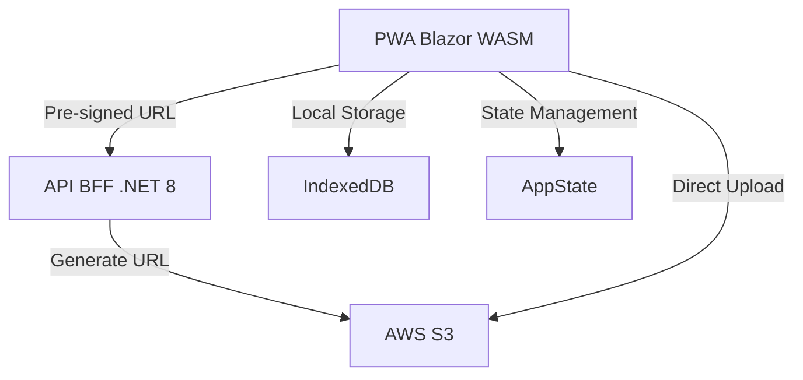

# Arquitetura Técnica - ASPEC Capture

Esta documentação descreve a estrutura técnica e o fluxo de dados da aplicação Blazor WebAssembly e sua integração com o Backend for Frontend (BFF).

## 🏗️ Visão Geral da Arquitetura

A aplicação segue uma arquitetura **Offline-First**, onde a maioria das operações de captura e armazenamento de metadados ocorre localmente no navegador, sendo sincronizada posteriormente.

## 🔌 Estrutura de Serviços (Dependency Injection)

A aplicação utiliza Injeção de Dependência (DI) escopada (`Scoped`) para gerenciar os serviços principais:

| Serviço | Interface | Responsabilidade |
|---------|-----------|------------------|
| **AuthService** | `IAuthService` | Gestão de login, registro, logout e atualização de perfil. |
| **IndexedDbService** | `IIndexedDbService` | Interoperação com o banco de dados local do navegador. |
| **LocalStorageService** | `ILocalStorageService` | Persistência simples para tokens de sessão e preferências. |
| **AwsStorageService** | `IAwsStorageService` | Integração com o API BFF para uploads no S3 via Pre-signed URLs. |
| **CameraService** | - | Controle de hardware da câmera via JS Interop. |
| **OcrService** | - | Processamento de imagens para extração de texto (Patrimônio) via Tesseract.js. |
| **AppState** | - | Gestão de estado global compartilhado (ex: contador de sincronização). |

## 🔍 Sistema de Scanner OCR

O sistema de scanner automatiza a leitura de etiquetas de patrimônio utilizando o motor do Tesseract.js integrado via JS Interop.

### Validação Contextual em Três Camadas:
1. **Infraestrutura**: Verifica a disponibilidade dos arquivos de dicionário e inventário da unidade.
2. **Negócio**: Valida se o código lido pertence ao inventário oficial (`UnitInventoryItem`) da Unidade Organizadora selecionada.
3. **Local**: Verifica se o item já foi capturado e está pendente de sincronização no IndexedDB.

## 🔐 Sistema de Autenticação e Segurança

A autenticação é híbrida para suportar cenários 100% offline:
1. **Local**: O usuário é validado contra o banco local (`users`) para permitir acesso offline.
2. **Sessão**: O `CustomAuthStateProvider` gerencia o estado de autenticação baseado no `localStorage`.
3. **Segurança AWS**: O cliente **não possui** credenciais AWS. Elas residem exclusivamente no **BFF**, que gera URLs assinadas temporárias para upload direto do navegador para o S3.

## 💿 Persistência de Dados (IndexedDB)

Utilizamos o IndexedDB para armazenar dados volumosos:
- **`users`**: Perfis e senhas (hashed).
- **`units` / `items`**: Inventários locais e oficiais sincronizados.
- **`states` / `cities`**: Dados geográficos para o cadastro.
- **`unit_inventory`**: Cache do inventário oficial da unidade para validação offline do OCR.

## 🚀 Ciclo de Vida e Sincronização

1. **Captura**: Câmera -> OCR -> Validação -> IndexedDB (Local).
2. **Sincronização**:
   - O cliente solicita URL ao BFF.
   - O BFF retorna uma URL PUT assinada pelo S3.
   - O cliente faz o upload do binário diretamente para o S3.
   - O item é marcado como "Sincronizado" e o armazenamento local é otimizado.
